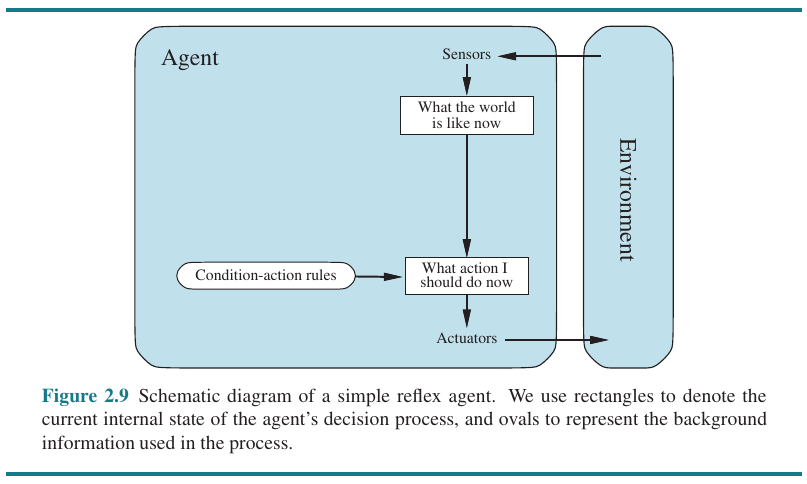
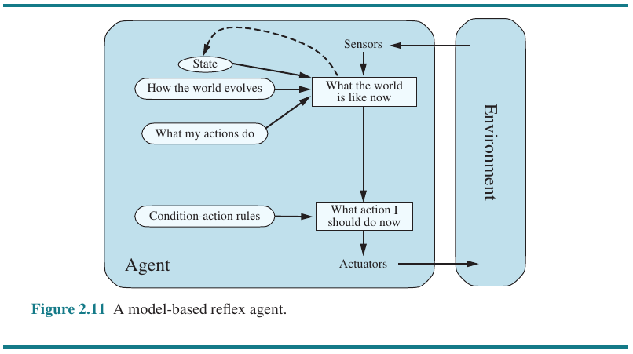
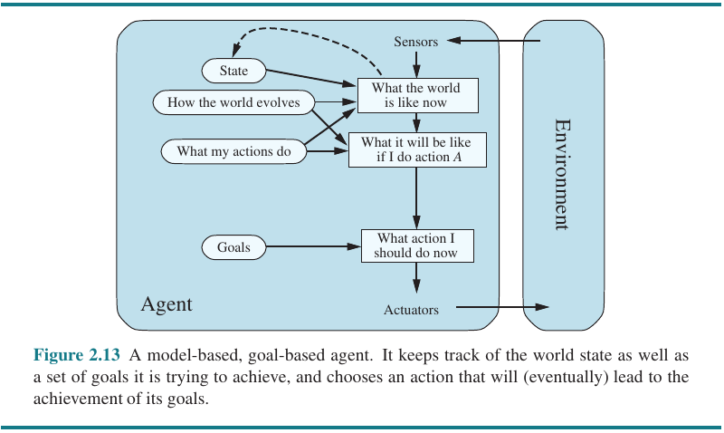
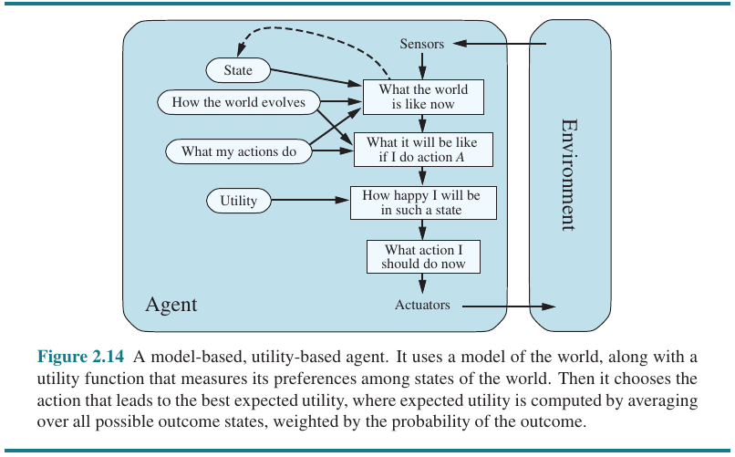
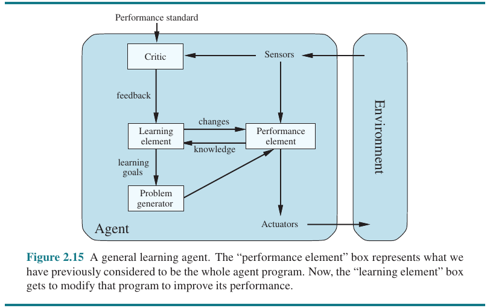
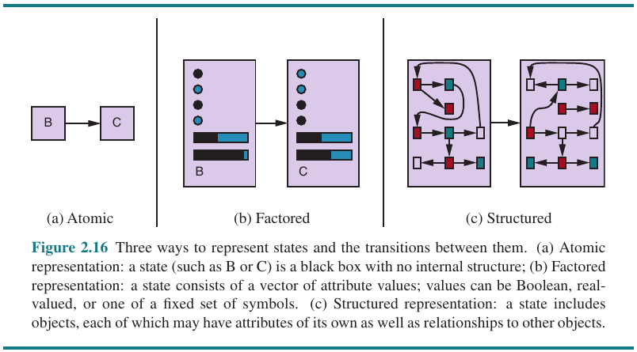

- [Chapter 2: Intelligent Agents](#chapter-2-intelligent-agents)
  - [2.1 Agents and Environments](#21-agents-and-environments)
  - [2.2 Good Behavior: The Concept of Rationality](#22-good-behavior-the-concept-of-rationality)
    - [2.2.1 Performance Measures](#221-performance-measures)
    - [2.2.2 Rationality](#222-rationality)
    - [2.2.3 Omniscience, learning, and autonomy](#223-omniscience-learning-and-autonomy)
  - [2.3 The Nature of Environments](#23-the-nature-of-environments)
    - [2.3.1 Specifying the task environment](#231-specifying-the-task-environment)
    - [2.3.2 Properties of task environments](#232-properties-of-task-environments)
  - [2.4 The Structure of Agents](#24-the-structure-of-agents)
    - [2.4.1 Agent programs](#241-agent-programs)
    - [2.4.6 Learning agents](#246-learning-agents)
    - [2.4.7 How the components of agent programs work](#247-how-the-components-of-agent-programs-work)

---
# Chapter 2: Intelligent Agents

## 2.1 Agents and Environments

> An **agent** is anything that can be viewed as perceiving its **environment** through **sensors** and acting on it through **actuators**.

> **Percept** is the content of an agent's sensor. The **percept sequence** is the complete history of everything the agent has ever perceived.

> In general, an agent’s choice of action at any given instant can depend on its built-in knowledge and on the entire percept sequence observed to date, but not on anything it hasn’t perceived.

> The agent's behavior is described by an **agent function** that maps any percept sequence to an action.
> 
> For artificial agents, this function is implemented by an **agent program**.

## 2.2 Good Behavior: The Concept of Rationality

> A **rational agent** is one that does the right thing.
 
### 2.2.1 Performance Measures

There are many possibilites in defining the *right thing*, for AI, in general, it is defined by **consequentialism**: the agent's behavior consequences.

A **performance measure** evaluates any given sequence of environment states. 

>  *As a general rule, it is better to design performance measures according to what one actually wants to be achieved in the environment, rather than according to how one thinks the agent should behave.*

### 2.2.2 Rationality

A *rational* action at any given time dependes on:

- The performance measure that defines the criterion of success;
- The agent's prior knowledge of the environment;
- The actions that the agent can perform;
- The agent's percept sequence to date.

Thus, an agent agent is one that acts by the following:

> *For each possible percept sequence, a rational agent should select an action that is expected to maximize its performance measure, given the evidence provided by the percept sequence and whatever built-in knowledge the agent has.*

### 2.2.3 Omniscience, learning, and autonomy

> An omniscient agent knows the actual outcome of its actions and can act accordingly; but omniscience is impossible in reality.
> 
> Rationality **maximizes expected** performance, while perfection maximizes *actual* performance.

> **Information gathering** is acting to modify future percepts. **Exploration** is an example of information gathering.

> Our definition requires a rational agent not only to gather information but also to **learn** as much as possible from what it perceives.

> To the extent that an agent relies on the prior knowledge of its designer rather than on its own percepts and learning processes, we say that the agent lacks **autonomy**. 

## 2.3 The Nature of Environments

### 2.3.1 Specifying the task environment

> A **task environment** defines the problems which rational agents solve. In general, task environments are **PEAS (Performance, Environment, Actuators, Sensors)** descriptions.

### 2.3.2 Properties of task environments

- **Fully observable** (sensors provides access to the complete state of the environment, or those that are *relevant* for acting) vs **Partially observable** (sensors don't capture all relevant information for acting).
- **Single-agent** vs **Multiagent**.
- **Deterministic** (the next state is completely determined by the current state and action)  vs **Nondeterministic**.
- **Static** vs **Dynamic** (the environment changes while the agent is deliberating).
- **Discrete** vs **Continuous**: applied to the state, time, percepts and actions.
- **Known** vs **Unknown**: prior knowledge.

## 2.4 The Structure of Agents

> The job o AI is to design an **agent program** which implements an agent function.
> 
> *agent = architecture + program*

### 2.4.1 Agent programs

> *The key challenge for AI is to find out how to write programs that, to the extent possible, produce rational behavior from a smallish program rather than from a vast table.*

There are four basic kinds of agent programs:

- Simple reflex agent: uses only the current percept to select an action;
- Model-based reflex agent: keeps an *internal state*, with help of models (e.g., transition, sensor), of the environment that depends on the percept history;
- Goal-based reflex agents;
- Utility-based agents: uses an *utility function*;

### 2.4.6 Learning agents

> [...] The most important distinction is between the learning element, which is responsible for making improvements, and the performance element, which is responsible for selecting external actions.

### 2.4.7 How the components of agent programs work

