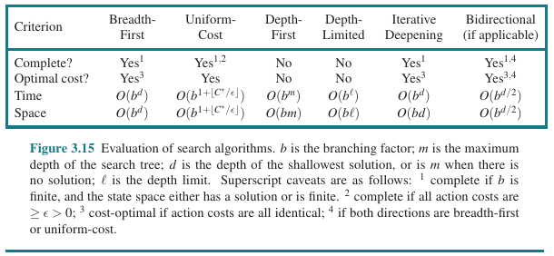

- [Chapter 3: Solving Problems by Searching](#chapter-3-solving-problems-by-searching)
  - [3.1 Problem-Solving Agents](#31-problem-solving-agents)
    - [3.1.1 Search problems and solutions](#311-search-problems-and-solutions)
    - [3.1.2 Formulating problems](#312-formulating-problems)
  - [3.2 Example Problems](#32-example-problems)
  - [3.3 Search Algorithm](#33-search-algorithm)
    - [3.3.1 Best-first search](#331-best-first-search)
    - [3.3.2 Search data structures](#332-search-data-structures)
    - [3.3.3 Redundant Path](#333-redundant-path)
    - [3.3.4 Measuring problem-solving performance](#334-measuring-problem-solving-performance)
  - [3.4 Uninformed Search Strategies](#34-uninformed-search-strategies)
    - [3.4.1 Breadth-first search](#341-breadth-first-search)
    - [3.4.2 Dijkstra's algorithm or uniform-cost search](#342-dijkstras-algorithm-or-uniform-cost-search)
    - [3.4.3 Depth-first search and the problem of memory](#343-depth-first-search-and-the-problem-of-memory)
    - [3.4.4 Depth-limited and iterative deepening search](#344-depth-limited-and-iterative-deepening-search)
    - [3.4.5 Bidirectional search](#345-bidirectional-search)
    - [3.4.6 Comparing uninformed search algorithms](#346-comparing-uninformed-search-algorithms)
  - [3.5 Informed (Heuristic) Search Strategies](#35-informed-heuristic-search-strategies)
    - [3.5.1 Greedy best-first search](#351-greedy-best-first-search)
    - [3.5.2 $\\text{A}^{\*}$ search](#352-texta-search)
    - [3.5.3 Search contours](#353-search-contours)
    - [3.5.4 Satisficing search: Inadmissible heuristics and weighted $\\text{A}^{\*}$](#354-satisficing-search-inadmissible-heuristics-and-weighted-texta)
    - [3.5.5 Memory-bounded search](#355-memory-bounded-search)
    - [3.5.6 Bidirectional heuristic search](#356-bidirectional-heuristic-search)
  - [3.6 Heuristic Functions](#36-heuristic-functions)

---
# Chapter 3: Solving Problems by Searching

> When the correct action to take is not immediately obvious, an agent may need to to plan ahead: to consider a sequence of actions that form a path to a goal state. Such an agent is called a **problem-solving agent**, and the computational process it undertakes is called **search**.

Problem-solving agents use **atomic** representations, that is, the states of the world are considered wholes, with no internal structure visible to the algorithms. Planning agents use **factored** or **structured** representations of states.

## 3.1 Problem-Solving Agents

In general, a problem-solving agent follows a four-phase process:

1. Goal formulation
2. Problem formulation
3. Search
4. Execution

> It is an important property that in a fully observable, deterministic, known environment, the solution  to any problem is a fixed sequence of actions.
> 
> An **open-loop** system enables to ignore the percepts once a solution has been found. A **closed-loop** system still requires the percept to execute the solution.

### 3.1.1 Search problems and solutions

Formally, a search **problem** is formally defined as follows:

- A set of possible states (**state space**) that the environment can be in;
- The **initial state**;
- A set of one or more **goal states**;
- The set of **actions** available to the agent (usually a function that maps a state to the power set of actions);
- A **transition model**, which describes what each action does;
- An **action cost function**, which gives the numerical cost of executing an action in a given state.

> A sequence of actions forms a **path**, and a **solution** is a path from the initial state to a goal state. We assume that action costs are additive; that is, the total cost of a path is the sum of the individual action costs. An **optimal solution** has the lowest path cost among all solutions.

### 3.1.2 Formulating problems

> A **model** is an abstraction, usually in mathematical form, of something.
> 
> The process of removing detail from a representation is called **abstraction**. An abstraction is *valid* if we can elaborate any abstract solution into a solution in the more detailed world.

## 3.2 Example Problems

> A **standardized problem** is intended to illustrate or exercise various problem-solving methods. In contrast, a **real-world problem** is one whose solution are used and whose formulation is idiosyncratic (particular, individual). 

## 3.3 Search Algorithm

> A **search algorithm** takes a search problem as input and returns a solution, or an indication of failure. A possibility to implement search algorithms is to search for paths that lead to goal states in a **search tree**, where each **node** corresponds to a state, and the edges correspond to actions.

### 3.3.1 Best-first search

Defines how to **expand** a node in the *search tree*. Specifically, in **best-first search**, we always choose a node $n^*$ such that $n^* = \argmin f(n)$, where $g$ is an **evaluation function**.

### 3.3.2 Search data structures

Search algorithms usually require data structures to represent the search tree (e.g., **node**, and **frontier**).

### 3.3.3 Redundant Path

> Redundant path: *algorithms that cannot remember the past are doomed to repeat it*.

In order to avoid redundant paths, algorithms can: (i) remember all previously reached states; (ii) problem formulations that avoid for two paths to reach the same state; (iii) check for cycles but not for redundant paths in general.

> A **graph search algorithm** checks for redundant paths, and a **tree-like search** does not. 

### 3.3.4 Measuring problem-solving performance

- **Completeness**: Is there a guarantee to find a solution (when it exists) or report a failure (when it does not)?
- **Cost optimality**: Does it find the solution with lowest path cost of all solutions?
- **Time complexity**: How long does it take to find a solution?
- **Space complexity**: How much memory is required to perform the search?

> To be complete, a search algorithm must be **systematic** in the way it explores an infinite state space, making sure it can eventually reach any state that is connected to the initial state.

## 3.4 Uninformed Search Strategies

### 3.4.1 Breadth-first search

> When all actions have the same cost, an appropriate strategy is **breadth-first search**, in which the root node is expanded first, then all the successors of the root node are expanded next, then their successors, and so on. This is a systematic search strategy that is therefore complete even on infinite state spaces.

### 3.4.2 Dijkstra's algorithm or uniform-cost search

> When actions have different costs, an obvious choice is to use best-first search where the evaluation function is the cost of the path from the root to the current node. This is called Dijkstra’s algorithm or uniform-cost search.

### 3.4.3 Depth-first search and the problem of memory

> **Depth-first search** always expands the deepest node in the frontier first.

### 3.4.4 Depth-limited and iterative deepening search

> To keep depth-first search from wandering down an infinite path, we can use **depth-limited search**, a version of depth-first search in which we supply a depth limit, $l$, and treat all nodes at depth $l$ as if they had no successors
> 
> **Iterative deepening search** solves the problem of picking a good value for $l$ by trying all values until either a solution is found, or the depth-limited search returns the failure value rather than the cutoff value.

### 3.4.5 Bidirectional search

> The algorithms we have covered so far start at an initial state and can reach any one of multiple possible goal states. An alternative approach called **bidirectional search** simultaneously searches forward from the initial state and backwards from the goal state(s), hoping that the two searches will meet. 

### 3.4.6 Comparing uninformed search algorithms

## 3.5 Informed (Heuristic) Search Strategies

> Informed search algorithms use domain-specific hints about the location of goals. This hint come in the form of a **heuristic function** $h(n)$:
> 
> $h(n) = \text{estimated cost of the cheapest path from the state at node} \;n\; \text{to a goal state}$

### 3.5.1 Greedy best-first search

> **Greedy best-first search** is a form of best-first search that expands first the node with the lowest $h(n)$ value.

### 3.5.2 $\text{A}^{*}$ search

> The $\text{A}^{*}$ search is a best-first search that uses the evaluation function $f(n) = g(n) + h(n)$, where $g(n)$ is the path cost from initial state to node $n$, and $h(n)$ is the estimated cost of the shortest path from $n$ to a goal state.  

> *An **admissible heuristic** is one that never overestimates the cost to reach a goal.*
> 
> A heuristic $h(n)$ is consistent if, for every node $n$ and every successor $n'$ of $n$ generated by an action $a$, we have: $h(n) \leq c(n,a,n') + h(n')$.

### 3.5.3 Search contours

> A useful way to visualize a search is to draw **contours** in the state space, just like the contours in a topographic map.

### 3.5.4 Satisficing search: Inadmissible heuristics and weighted $\text{A}^{*}$

> **Satisficing solutions** are solutions that are suboptimal, but are "good enough" for the problem at hand.

> The **weighted $\text{A}^{*}$** values more the heuristic function, that is, $f(n) = g(n) + W \times h(n)$, for some $W > 1$.

### 3.5.5 Memory-bounded search

TODO

### 3.5.6 Bidirectional heuristic search

TODO

## 3.6 Heuristic Functions

> The performance of heuristic search algorithms depends on the quality of the heuristic function. One can sometimes construct good heuristics by **relaxing** the problem definition, by storing **precomputed** solution costs for subproblems in a pattern database, by defining **landmarks**, or by **learning** from experience with the problem class.