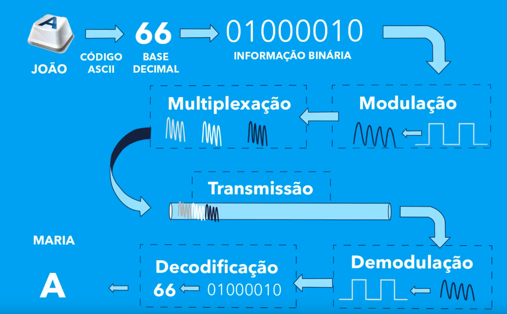

# Introdução

- História e contextualização dos computadores:
  - Mainframes e necessidade de compartilhamento de dados. Primeira abordagem utilizou linhas telefônicas para troca de informações entre computadores. Nesse contexto, surgiu a necessidade de conversão entre analógico e digital.
  - Ethernet surge juntamente com a noção de *redes locais* (LAN).
  - Surgiu a necessidade de padronização entre os dispositivos de redes, assim, foi-se criado o modelo de referência OSI (camadas que se preocupam com diferentes problemas e possuem uma série de protocolos).
    - Analogia com a comunicação entre várias pessoas e várias dificuldades que surgem para algo simples:
      - (1) ruídos; (2) compreensão da mensagem; (3) identificação; (4) garantia de entrega; (5) qual linguagem?; (6) comunicação com várias línguas; (7) necessidade de sincronismo.
      - Podemos trazer esses problemas para o mundo dos computadores!
      - Em conjunto, esses problemas são chamados de *problema de comunicação*.
      - Protocolos determinam como resolver cada um dos problemas em particular.
- Conceitos Básicos
  - Protocolos: processos que implementam um conjunto de regras para resolver algum problema de comunicação.
  - Codificação em 0's e 1's da informação.
  - Sinais: contínuos vs discretos (de tempos em tempos);
  - Onda de Sinal: possuem características (amplitude, frequência, comprimento, fase) conhecidas.
    - Ajuste de características para transporte;
    - Modulação (AmpSK, FreqSK) é o processo de alterar características da onda portadora para transmitir informações;
    - Demodulação é o processo de identificar as alterações e converter para a informação;
    - Meios físicos (canal) transmitem ondas;
    - Banda passante vs Largura de Banda;
  - Multiplexação (FDM, TDM, CDM) permite compartilhar um canal para uso simultâneo;

- Modos de Transmissão
  - Simplex: único sentido
  - Half-Duplex: duplo sentido, 1 por vez
  - Full-Duplex: duplo sentido, simultâneo
  - Serial: bit a bit no mesmo canal
  - Paralelo: byte a byte, múltiplos canais enviando 1 bit por vez
  - Unicast: único receptor
  - Multicast: todos de um grupo específico de receptores
  - Anycast: qualquer um de um grupo específico
  - Broadcast: todos receptores
  - Ponto-a-ponto: para 1 equipamento por vez
  - Multi-ponto: múltiplos equipamentos por vez
- Topologia de Rede
  - Barramento: como controlar o acesso ao meio?
  - Anel: de um equipamento para outro, necessita de um token. Se quebrar um equipamento, a rede pode parar.
  - Estrela: baseado em um concentrador e múltiplos dispositivos conectados.
  - Hibrídas
- Geografia
  - WAN: continente
  - MAN: cidade(s)
  - CAN: campus area network
  - LAN: sala/conjunto de salas
  - PAN: equipamentos que usamos no corpo
  - SAN: storage area network, área de armazenamento distribuído
- Equipamentos
  - Repetidor: camada 1, amplifica sinais para mandar em distâncias maior
  - Bridge: camada 2, conecta múltiplas tecnologias de rede
  - Hub: camada 1, faz com que múltiplos meios funcionem como um barramento
  - Switch: camada 2, possui várias entradas e não usa barramento (utiliza uma malha de circuitos). Só olha o MAC para escolher a porta.
  - Roteador: camada 3, manipula IPs para descobrir onde uma informação deve ser mandada (sair da rede local).

# Camada Física e Enlace

- Como a camada física e de enlace interagem?
- Host/Node: todo equipamento que transmite informações (acessa a rede) numa rede através de um NIC (placa de rede).
- Diversas tecnologias foram desenvolvidas, como se comunicar entre elas? IEEE padroniza.
- Camada Física: compatibilidade entre conectores e cabos para serem utilizados em uma rede de computadores. Ademais, multiplexação, modulação, etc. Definem as características mecânicas, elétricas e funcionais, bem como procedimentos para iniciar, manter e desativar comunicação bit a bit.
- IEEE 802: várias padronizações para redes locais e metropolitanas para as camadas físicas e enlace.
  - IEEE 802.3: Ethernet
  - IEEE 802.11: Wi-Fi
  - IEEE 802.15: Bluetooth
- Cabeadas (Coaxial -> Par-Trançado, Fibra-Óptica) vs Não-Cabeadas (Wi-Fi)
- NICs
  - Possuem um endereço MAC (Ethernet) único utilizado para permitir que informações sejam enviados para uma dada placa específica.
  - Camada 3 -> Camada 2: encapsular *pacotes* em *frames* (quadros) através da agregação do cabeçalho e criação do payload.
    - Quadro Ethernet: MAC destino, MAC origem, total do pacote, payload, pad (tamanho mínimo), FCS para checagem de erros no quadro. 
    - Antes de enviar um quadro Ethernet, criamos um sincronismo através de um preâmbulo.
- Precisamos controlar o acesso ao meio:
  - CSMA/CD permite iniciar a transmissão apenas quando o canal está *idle*. Caso ocorra colisão, para a transmissão e tenta novamente.

> A principal tarefa da camada de *enlace* é fazer com que o meio de transmissão seja transparente para a camada de *rede* (i.e., não precisa se preocupar com o meio físico).

---
Adicionais

> https://www.techtarget.com/searchnetworking/reference/IEEE-802-Wireless-Standards-Fast-Reference
> 
> https://grouper.ieee.org/groups/
> 
> https://grouper.ieee.org/groups/802/index.shtml