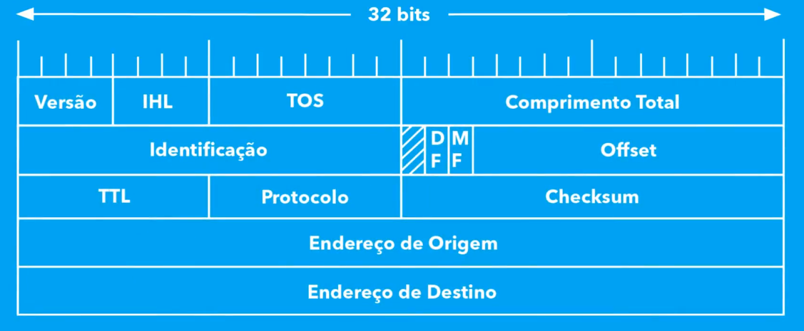
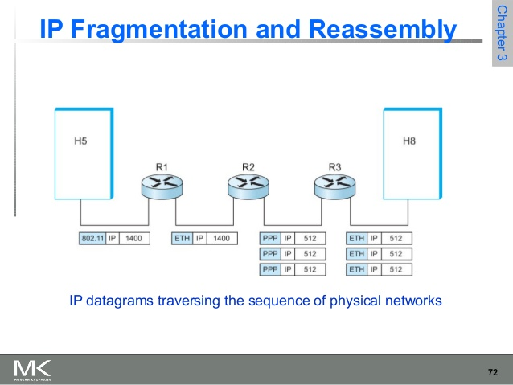

# Camada de Redes

## Revisão

- O protocolo IP é um datagrama, envia informações sem se preocupar se essa será recebida ou não. Outros protocolos podem prover tal garantia, mas o IP não.
- Procolo IP também permite fragmentar informações para lidar com diferentes MTUs (maximum transmission unit).
- O protocolo IP só checa erros dos cabeçalhos, erro em dados são protocolos de camadas superiores. 

- Versão: IPv4? IPv6?
- IHL: tamanho do cabeçalho em números de bytes.
- TOS: tipo do serviço que pode ser usado pelo roteador para priorização (na prática, ignorado).
- Comprimento Total: comprimento do datagrama em bytes (máximo de 64Kb com cabeçalhos).
- Identificação: identificar fragmentos.
- Flags: sinalizadores (3 bits) sobre o pacote (primeiro reservado, segundo "don't fragment?", terceiro "more fragments?").
- Offset: como ordenar os fragmentos?
- TTL: time-to-live, cada hop (roteador) decrementa.
- Protocolo: qual protocolo da camada superior? onde devemos mandar o payload?
- Checksum: checagem apenas do cabeçalho.
- Endereço Origem e Destino: 32-bits.
- Podem ser inseridos outros campos de informação ao final.

- Fragmentação IP:
  - Na prática, o tamanho máximo é definido de acordo com o hardware da rede. Na teoria, 64KB é o máximo.
  - MTU determina o máximo que um meio consegue enviar. Assim, em diferentes momentos é necessário fragmentar o pacote para ser passado dentro de uma rede.

## Endereçamento IP

- Uma das principais características é o endereçamento lógico: identificação de redes e *hosts*.
- Para o IPv4, utilizamos 32-bits para representação dos endereços.
  - Representamos endereços IP utilizando a notação `A.B.C.D`,
  - Inicialmente, eram utilizadas classes para definir como diferenciar *hosts* de *redes*. Cada uma dessas classes reservavam uma quantidade bits iniciais e definia a quantidade de bits que deveriam ser utilizadas para identificação das redes e hosts.
    - Classe A: `Rede.Host.Host.Host`
      - 126 redes possíveis, com 16.8Mi hosts;
    - Classe B: `Rede.Rede.Host.Host`
      - 16K redes, 65.5K hosts;
    - Classe C: `Rede.Rede.Rede.Host`
      - 2M redes, 256 hosts;
- Existem endereços especiais:
  - Endereços onde hosts tem todos os bits em `0` representam uma rede.
  - Endereços onde hosts tem todos bits `1` representam *broadcast*.
  - A rede `127.0.0.1` é reservada para loopback.
- Como funciona o encaminhamento de datagramas?
  - Cada pacote tem um endereço de destino
  - Se já estamos na rede destino, encaminhar diretamente para o *host* (Tabela ARP)
  - Se não estamos, encaminhar para algum *roteador*.
  - Todo *host* possui um *default gateway* (endereço do roteador padrão).
  - O *roteador* tem responsabilidade de manter uma tabela de encaminhamento e deve enviar essa informação para a próxima rede.
- Algoritmo simples de encaminhamento de datagramas:

> 1. Se, `endereço destino` == `endereço transmissor`: *loopback*
> 2. Se, `rede destino` == `rede atual`: ARP
> 3. Se `rede destino` != `rede atual`: enviar para *gateway* (ARP + MAC) endereçado para o endereço destino.

## Sub-rede IP

- Existem diferentes motivos para a criação de sub-redes, a solução para isso é utilizar os bits de *host* para divisão em sub-redes.
- Sub-redes só são visíveis dentro da rede atual.
- Usamos uma **máscara de sub-rede** para definição da *sub-rede* e *hosts*.
- Quando usamos sub-redes, não utilizamos as **máscaras de rede padrão**.
- De forma análogo, temos alguns endereços reservados para sub-redes:
  - Quando o valor do *host* é `0`, essa é a identificação da rede;
  - O último endereço da sub-rede é o *broadcast*.
  - Uma possibilidade para evitar ambiguidade (e.g., endereços reservados da própria rede aparecendo como endereços reservados de sub-redes) é limitar o espaço endereçável de sub-redes.

## ICMP

- Protocolo que permite o uso *feedbacks* para ambientes de comunicação onde o IP não é confiável.
- Uma mensagem ICMP é enviada dentro do cabeçalho de um datagrama IP.
- Os erros são detectados em:
  - Roteador (e.g., endereço inalcançável, descarte por necessitar fragmentação, tempo excedido)
  - Host (e.g., protocolo não ativo, porta não configurada, remontagem e tempo excedido)

## Roteamento

- Roteadores aprendem caminhos, recebem pacotes e enviam caminhos. Esse processo é chamado *roteamento*.
- Rotas estáticas identificam manualmente possíveis caminhos. Rotas automáticas identificam caminhos de acordo com os dispositivos conectados. Roteamento dinâmico troca informação com roteadores vizinhos.
- RIB: Routing Information Base
  - Contém as redes conhecidas, seu endereço (prefixo), e o próximo roteador que consegue chegar a essa rede (next hop).
- FIB: Forwarding Information Base
  - Apenas as melhores rotas são gravadas, além de armazenar as interfaces que devem receber esse pacote.
  - A escolha da "melhor rota" depende de múltiplos fatores: topologia da rede, políticas de roteamento, modo de aprendizado, métricas.
  - Escolha da rota mais específica.
- Tráfego de entrada em uma rede depende de como a rede destino determinou esse processo (*informações de roteamento*).
- Protocolos de roteamento interno (IGP) e externo (EGP).
- Alternativas para IGP: OSPF e ISIS.
  - Possuem a menor tabela possível.
  - Apenas ensinam aos roteadores dentro de uma rede como se comunicarem entre si.
- Alternativas EGP: BGP
  - Entre ASs.
  - Rotas para internet.
  - Clientes dentro da própria rede.
  - Não deve depender da topologia interna de um AS (autonomous system).
  - Configuração manual.
- Quando lidamos com IPv6 e IPv4, podemos ter pilhas duplas: manter tabelas para IPv6 e outras para IPv4.

# Wireshark e Shell

- `ip address show` para obtermos uma lista das interfaces e seus respectivos IPs e endereços MAC.
  - `enpXsY`: interface Ethernet (e.g., enp12s0).
  - `wlpXsYfZ`: interface Wi-Fi (e.g., wlp0s20f3).
  - `lo`: interface loopback.
- `ip neighbour show` para obtermos a tabela ARP.
- `io route`
- No lugar de utilizarmos os comandos básicos para *sniffing*, melhor usar o Wireshark.
- Iniciando Wireshark para uma dada interface: `wireshark -i {interface} -k`
  - Para sistemas Linux, adicionar o usuário ao grupo `wireshark`.

---

OBS:.

> A principal tarefa da camada de *enlace* é fazer com que o meio de transmissão seja transparente para a camada de *rede* (i.e., não precisa se preocupar com o meio físico).
> 
> As principais tarefa da camada de *rede* são: endereçamento lógico e fragmentação.