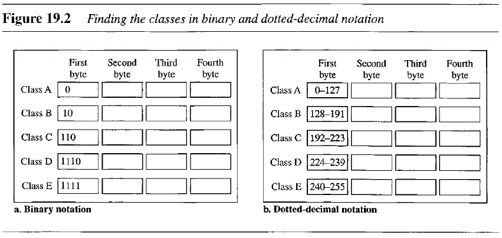

- [Chapter 19: Network Layer: Logical Addressing](#chapter-19-network-layer-logical-addressing)
  - [19.1 IPv4 Addresses](#191-ipv4-addresses)
    - [Classful Addressing](#classful-addressing)
    - [Classless Addressing](#classless-addressing)

---
# Chapter 19: Network Layer: Logical Addressing

## 19.1 IPv4 Addresses

### Classful Addressing

> In classful addressing, the address space is divided into five classes: A, B, C, D, and E.
> 
> In classful addressing, a large part of the available addresses were wasted.

In such addressing, an IP address in class A, B, or C is divided into **netid** (network address) and **hostid** (host address).

Although the length of the netid and hostid is predetermined in classful addressing, we can also use a **mask** (32-bit number made of contiguous 1s followed by contiguous 0s).

| Class | Dotted | CIDR |
| ------------- | ------------- | --------- |
| A  | 255.0.0.0  | /8 |
| B  | 255.255.0.0  | /16 |
| C  | 255.255.255.0  | /24 |

### Classless Addressing

> In this scheme, there are no classes but addresses are still granted in blocks.
> 
> There are, however, 3 restrictions:
> 
> 1. The addresses in a block must be contiguous;
> 2. The number of addresses in a block must be a power of 2;
> 3. The first address must be evenly divisible by the number of addresses.

A better way to define a block of addresses is to select any address in the block and the mask. In classless addressing, the mask for a block can take any value from 0 to 32.