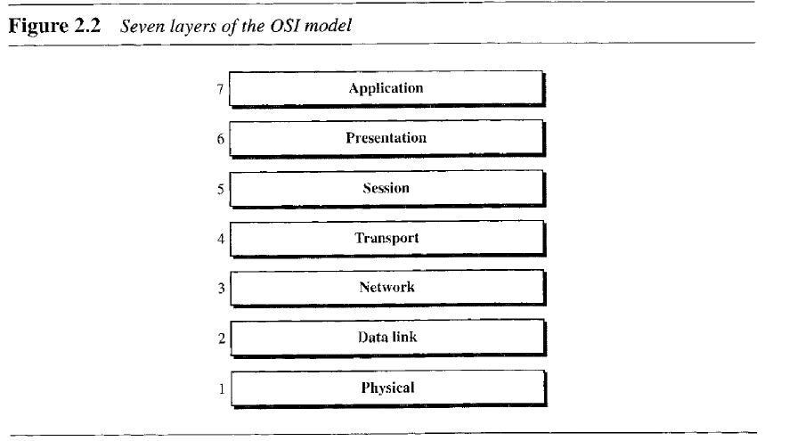
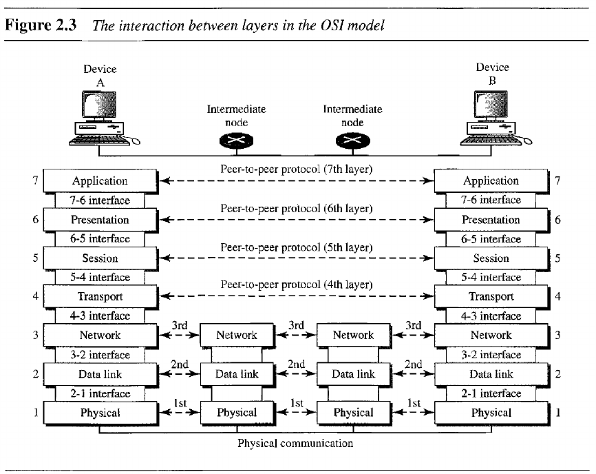
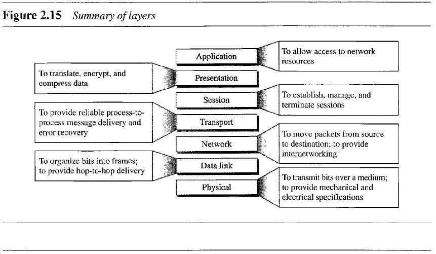
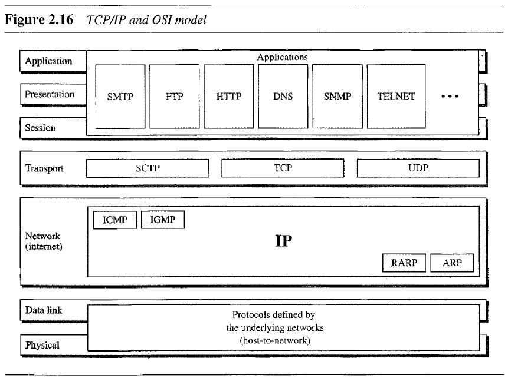

- [Chapter 2: Network Models](#chapter-2-network-models)
  - [2.2 The OSI Model](#22-the-osi-model)
  - [2.3 Layers in the OSI Model](#23-layers-in-the-osi-model)
  - [2.4 TCP/IP Protocol Suite](#24-tcpip-protocol-suite)

---
# Chapter 2: Network Models

## 2.2 The OSI Model

> The OSI model is a layered framework for the design of network systems that allows communication between all types of computer systems.

## 2.3 Layers in the OSI Model

- **Physical Layer**: coordinates the functions required to carry a bit stream over a physical medium.
  - Concerned with *physical characteristic of interfaces and medium*, *bi representation*, *data rate*, *synchronization of bits*, *line configuration*, *physical topology*, and *transmission mode*.
- **Data Link Layer**: makes the physical layer appear error-free to the upper layer.
  - Responsible for *framing*, *physical addressing*, *flow control*, *error control*, and *access control*.
- **Network Layer**: responsible for the source-to-destination delivery of a packet.
  - Concerned with *logical addressing*, *routing*.
- **Transport Layer**: responsible for process-to-process delivery of the entire message.
  - Responsible for *service-point addressing*, *segmentation and reassembly*, *connection control*, *flow control*, *error control*.
- **Session Layer**: establishes, maintains, and synchronizes the interaction among communication systems.
  - Responsible for *dialog control*, *synchronization*.
- **Presentation Layer**: concerned with the syntax and semantics of the information exchanged.
  - Responsible for *translation*, *encryption*, and *compression*.
- **Application Layer**: high-level support for network applications.
  - *Network virtual terminal*, *File transfer, access and management*, *mail services*, *directory services*.

## 2.4 TCP/IP Protocol Suite

> The TCP/IP protocol suite was developed prior to the OSI model, thus its layers don't exactly match those in the OSI model.
> 
> This model was defined with 4 layers: host-to-network, internet, transport, and application.

