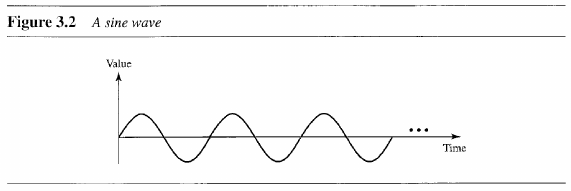

- [Chapter 3: Data and Signals](#chapter-3-data-and-signals)
  - [3.1 Analog and Digital](#31-analog-and-digital)
    - [Analog and Digital Signals](#analog-and-digital-signals)
    - [Periodic and Non-periodic Signals](#periodic-and-non-periodic-signals)
  - [3.2 Periodic Analog Signals](#32-periodic-analog-signals)
    - [Sine Wave](#sine-wave)
    - [Composite Signals](#composite-signals)
  - [3.3 Digital Signals](#33-digital-signals)
    - [Digital Signal as a Composite Analog Signal](#digital-signal-as-a-composite-analog-signal)
    - [Transmission of Digital Signals](#transmission-of-digital-signals)

---
# Chapter 3: Data and Signals

## 3.1 Analog and Digital

> **Analog data** refers to information that is continuous; **Digital data** refers to information that has discrete states.

### Analog and Digital Signals

> An **analog signal** has infinitely many levels of intensity over a period of time. A **digital signal** can only have a limited number of defined values.

### Periodic and Non-periodic Signals

> A **periodic singal** completes a pattern within a measurable time frame, and repeats this pattern over subsequent identical periods. 
> 
> A **non-periodic signal** changes without exhibiting a patter or cycle that repeats over time.

## 3.2 Periodic Analog Signals

> A simple periodic analog (**sine wave**) signal can't be decomposed into simpler signals. In contrast, composite periodic signals are composed of multiple sine waves.

### Sine Wave

There are 3 parameters that fully describe a sine wave:

- **Peak amplitude**: highest intensity.
- **Period and Frequency**: amount of time needed to complete 1 cycle and number of cycles in 1s.
- **Phase**: the position of the waveform relative to time 0.

> **Wavelength** is another characteristic of a signal traveling through a transmission medium, it binds the period or frequency of a simple sine wave to the **propagation speed** of the medium.

### Composite Signals

> A single-frequency sine wave is not useful for data communication, to send information we require a composite signal.
> 
> Composite signals are combination of multiple sine waves with different frequency, phase and peak.
> 
> Periodic composite signals decomposes into a series of sine waves with discrete frequencies. Non-periodic composite signals decomposes into a series of sine waves with continuous frequencies.

> **Bandwidth** is the range of frequencies contained in a composite signal.

## 3.3 Digital Signals

> The **bit rate** (bps) is the number of bits sent in 1s.
> 
> The **bit length** is the distance one bit occupies in the transmission medium.

### Digital Signal as a Composite Analog Signal

> Based on Fourier analysis, a digital signal is a composite analog signal with infinite bandwidth.

### Transmission of Digital Signals

> **Baseband transmission** means sending a signal over a channel without changing the digital signal to an analog signal.