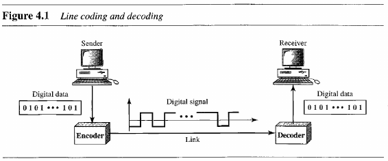
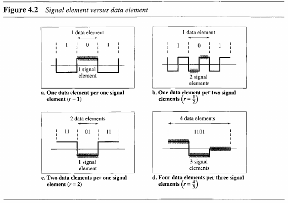
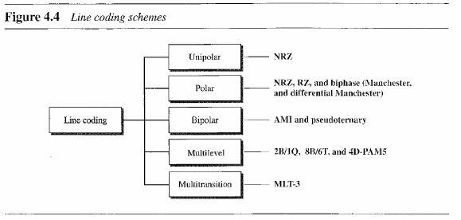
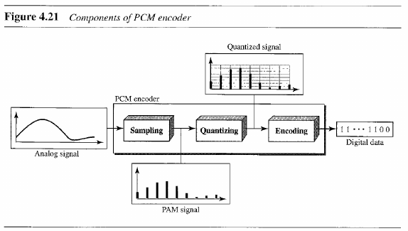
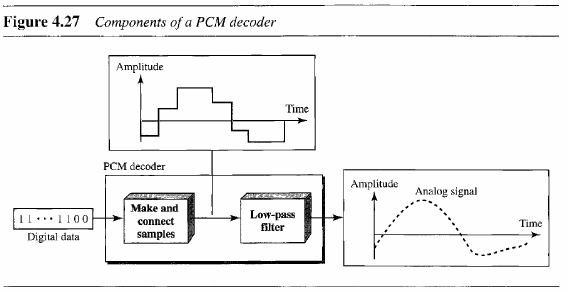
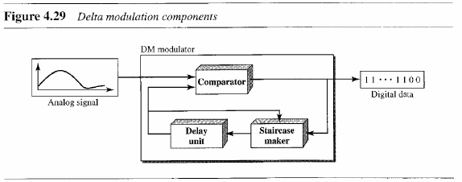
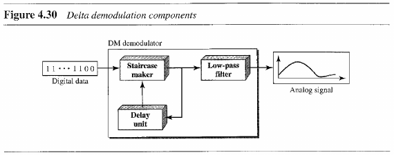

- [Chapter 4: Digital Transmission](#chapter-4-digital-transmission)
  - [4.1 Digital-to-Digital Conversion](#41-digital-to-digital-conversion)
    - [Line Coding Schemes](#line-coding-schemes)
  - [4.2 Analog-to-Digital Conversion](#42-analog-to-digital-conversion)
    - [Pulse Code Modulation (PCM)](#pulse-code-modulation-pcm)
    - [Delta Modulation (DM)](#delta-modulation-dm)
  - [4.3 Transmission Modes](#43-transmission-modes)

---
# Chapter 4: Digital Transmission

> Hosts in a computer network send information through either digital or analog signals.

## 4.1 Digital-to-Digital Conversion

> **Line coding** is the process of converting digital data to digital signals. It converts a sequence of bits into a digital signal.

> A **data element** is the smallest entity that can represent a piece of information (bit). A **signal element** carries data elements.

### Line Coding Schemes

## 4.2 Analog-to-Digital Conversion

### Pulse Code Modulation (PCM)

> A PCM encoder has three process: **sampling** (pulse amplitude modulation, PAM), **quantizing** and **encoding**.
>
> The recovery of the original signal requires the PCM decoder.

### Delta Modulation (DM)

## 4.3 Transmission Modes

- **Parallel Transmission**: send multiple bits as a group, can be implemented through multiple "wires" or lines.
- **Serial Transmission**: send one bit after the other, reducing the cost to have multiple channels/lines.

- **Asynchronous transmission**: the timing of the signal in unimportant.
  - Send 1 start bit at the beginning and 1 or mor stop bits at the end of the byte. It mean *asynchronous at byte level*.
- **Synchronous transmission**: bits are sent one after another without start or stop bit or gaps. The receiver must group the bits.
- **Isochronous transmission**: guarantees that the data arrive at a fixed rate.