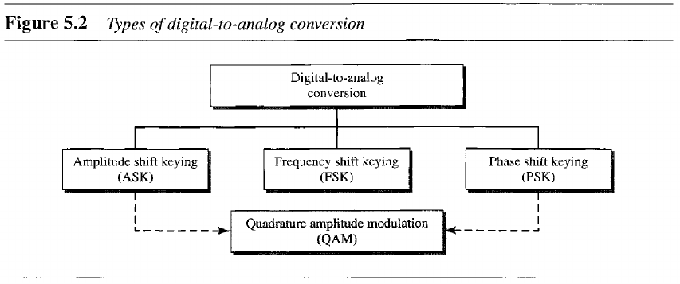

- [Chapter 5: Analog Transmission](#chapter-5-analog-transmission)
  - [5.1 Digital-to-Analog Conversion](#51-digital-to-analog-conversion)
  - [5.2 Analog-to-Analog Conversion](#52-analog-to-analog-conversion)

---
# Chapter 5: Analog Transmission

## 5.1 Digital-to-Analog Conversion

> **Digital-to-analog conversion** is the process of changing one of the characteristics of an analog signal based on the information in digital data.

- **Amplitude Shift Keying (ASK)**: the amplitude of the carrier signal is varied to create signal elements.
- **Frequency Shift Keying (FSK)**: the frequency of the carrier signal is varied to represent data.
- **Phase Shift Keying (PSK)**: the phase of the carrier is varied to represent two or more different signal elements.

## 5.2 Analog-to-Analog Conversion

> Analog-to-analog conversion, or analog modulation, is the representation of analog information by an analog signal. Modulation is needed if the medium is bandpass in nature or if only a bandpass channel is available.

- **Amplitude Modulation**: the carrier signal is modulated so that its amplitude varies with the changing amplitude of the modulating signal.
- **Frequency Modulation**
- **Phase Modulation**