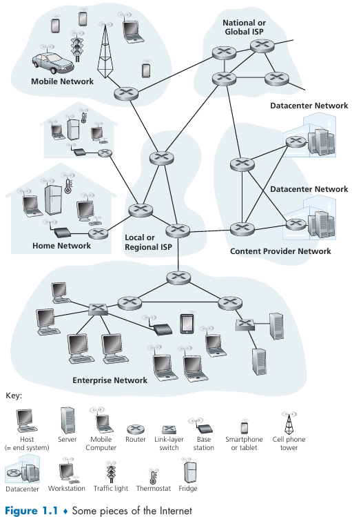
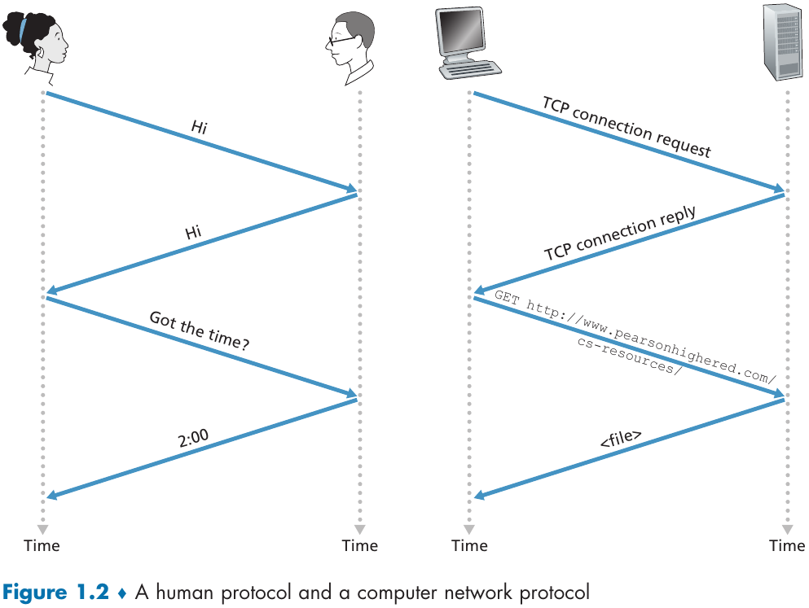
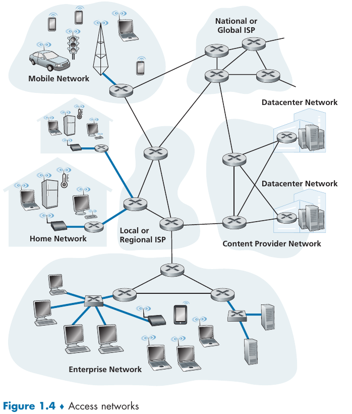
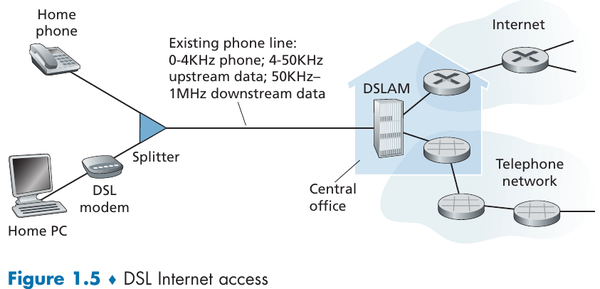
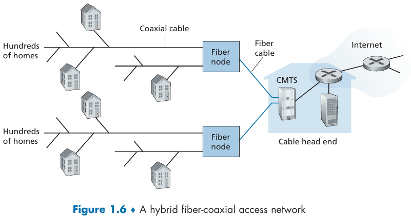
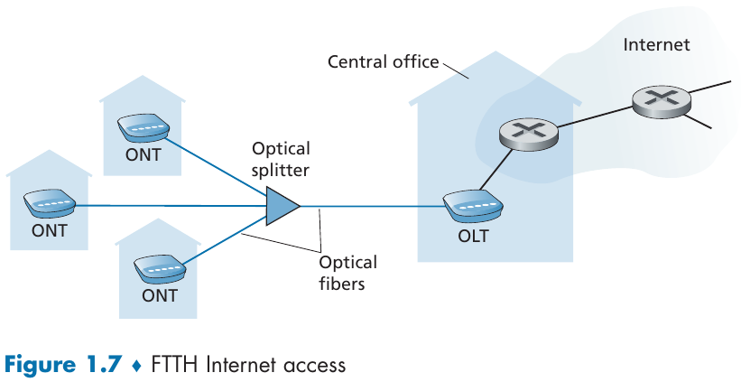
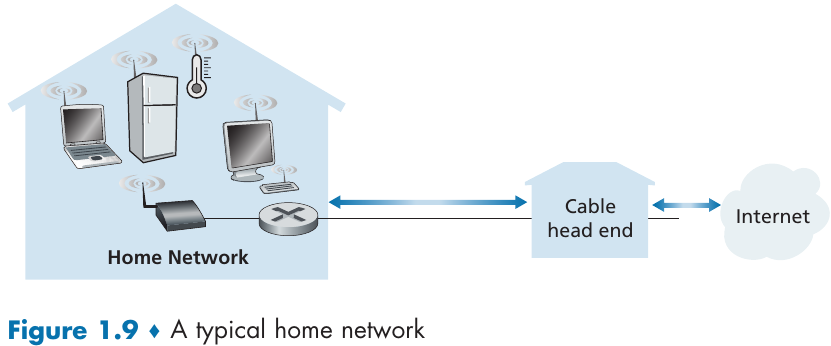

- [Chapter 1: Computer Networks and the Internet](#chapter-1-computer-networks-and-the-internet)
  - [1.1 What is the Internet?](#11-what-is-the-internet)
    - [1.1.1 A Nuts-and-Bolts Description](#111-a-nuts-and-bolts-description)
    - [1.1.2 A Services Description](#112-a-services-description)
    - [1.1.3 What is a Protocol?](#113-what-is-a-protocol)
      - [Network Protocols](#network-protocols)
  - [1.2 The Network Edge](#12-the-network-edge)
    - [1.2.1 Access Networks](#121-access-networks)
      - [Home Access: DSL, Cable, FTTH, and 5G Fixed Wireless](#home-access-dsl-cable-ftth-and-5g-fixed-wireless)
      - [Access in the Enterprise (and the Home): Ethernet and WiFi](#access-in-the-enterprise-and-the-home-ethernet-and-wifi)
    - [1.2.2 Physical Media](#122-physical-media)
      - [Twisted-Pair Copper Wire](#twisted-pair-copper-wire)
      - [Coaxial Cable](#coaxial-cable)
      - [Fiber Optics](#fiber-optics)
      - [Terrestrial Radio Channels](#terrestrial-radio-channels)
      - [Satellite Radio Channels](#satellite-radio-channels)

---
# Chapter 1: Computer Networks and the Internet

## 1.1 What is the Internet?

There are different ways to define the internet, two possible approaches are:
- A nuts-and-bolts description (hardware and software components);
- A networking infrastructure that provides services to distributed applications;

### 1.1.1 A Nuts-and-Bolts Description

> The Internet is a computer network that interconnects billions of computing devices throughout the world.

> _Indeed, the term computer network is beginning to sound a bit dated, given the many nontraditional devices that are being hooked up to the Internet._

End systems (aka, _hosts_) are connected together by a network of communication links and packet switches. Different links might have different **transmission rates**, which are measured in bits/second.

Data is transmitted between end systems through _packets_ (segments of data with headers), which are reassembled by the target end system to the original data.

A _packet switch_ takes a packet arriving in one of its incoming communication links and forwards that packet to one of its outgoings links. **Routers** and **link-layers switches** are examples of such switches. The sequence of communication links taken by a packet is known as **route** or **path**.

End systems access the Internet through **Internet Service Providers (ISPs)**. Each ISP is a network of packet switches and communication links.

> The Internet is all about connecting end systems to each other, so the ISPs that provide access to end systems must also be interconnected. These lower-
tier ISPs are thus interconnected through national and international upper-tier ISPs and these upper-tier ISPs are connected directly to each other.

Upper-tier ISPs usually consists of high-speed routers interconnected with high-speed fiber-optic links. Each ISP network is managed independently, runs the IP protocol, and conforms to certain naming and address conventions.

End systems, packet switches, and other pieces of the Internet run **protocols** that control the sending and receiving of information within the Internet. **The Transmission Control Protocol (TCP)** and the **Internet Protocol (IP)** are two of the most important protocols in the Internet. The IP protocol specifies the format of the packets that are sent and received among routers and end systems. The Internet’s principal protocols are collectively known as **TCP/IP**.

> Given the importance of protocols to the Internet, it’s important that everyone agree on what each and every protocol does, so that people can create systems and products that interoperate.

> Internet standards are developed by the Internet Engineering Task Force (IETF) [IETF 2020]. The IETF standards documents are called requests for comments (RFCs). RFCs started out as general requests for comments (hence the name) to resolve network and protocol design problems that faced the precursor to the Internet [Allman 2011]. RFCs tend to be quite technical and detailed. They define protocols such as TCP, IP, HTTP (for the Web), and SMTP (for e-mail). There are currently nearly 9000 RFCs. Other bodies also specify standards for network components, most notably for network links. The IEEE 802 LAN Standards Committee [IEEE 802 2020], for example, specifies the Ethernet and wireless WiFi standards.

### 1.1.2 A Services Description

>  Internet applications include mobile
smartphone and tablet applications, including Internet messaging, mapping with real-time road-traffic information, music streaming movie and television streaming, online social media, video conferencing, multi-person games, and location-based recommendation systems.

The applications are said to be **distributed applications**, since they involve multiple end systems that exchange data with each other. Importantly, Internet applications run on end systems—they do not run in the packet switches in the network core. Although packet switches facilitate the exchange of data among end systems, they are not concerned with the application that is the source or sink of data. An alternative way of describing the Internet is answering the following:

> How does one program running on one end system instruct the Internet to deliver data to another program running on another end system?

End systems attached to the Internet provide a **socket interface** that specifies how a program running on one end system asks the Internet infrastructure to deliver data to a specific destination program running on another end system. This Internet socket interface is a set of rules that the sending program must follow so that the Internet can deliver the data to the destination program. 

### 1.1.3 What is a Protocol?

Putting simply, a _protocol_ defines a set of "rules" or actions that must be taken to accomplish some task.

> [...] it takes two (or more) communicating entities running the same protocol in order to accomplish a task.

#### Network Protocols

> All activity in the Internet that involves two or more communicating remote entities is governed by a protocol.

> A **protocol** defines the format and the order of messages exchanged between two or more communicating entities, as well as the actions taken on the transmission and/or receipt of a message or other event. 

The Internet, and computer networks in general, make extensive use of protocols. Different protocols are used to accomplish different communication tasks.

## 1.2 The Network Edge

The network edge consists of end systems. Hosts are sometimes divided in **clients** and **servers**. Most of the servers reside in large **data centers**.

> Internet companies such as Google, Microsoft, Amazon, and Alibaba have built massive data centers, each housing tens to hundreds of thousands of hosts. These data centers are not only connected to the Internet [...] but also internally include complex computer networks that interconnect the data center's hosts. The data centers are the engines behind the Internet applications that we use on a
daily basis.

### 1.2.1 Access Networks

Access networks connects end systems to the first router (aka, _edge router_) on a path from the end system to any other distant end system.

In the following subsections, a few types of access networks are considered.

#### Home Access: DSL, Cable, FTTH, and 5G Fixed Wireless

> Today, the two most prevalent types of broadband residential access are **digital subscriber lines (DSL)** and cable.

> The DSL standards define multiple transmission rates, including downstream transmission rates of 24 Mbs and 52 Mbs, and upstream rates of 3.5 Mbps and 16 Mbps; the newest standard provides for aggregate upstream plus downstream rates of 1 Gbps [ITU 2014]

While DSL makes use of the telco’s (_telephone company_) existing local telephone infrastructure, **cable Internet access** makes use of the cable television company's existing cable television infrastructure.

> Cable internet access requires special modems, called cable modems. As with a DSL modem, the cable modem is typically an external device and connects to the home PC through an Ethernet port.
 
Cable Internet access is a shared broadcast medium, thus every packet sent by the head end travels downstream on every link to every home and every packet sent by a home travels on the upstream channel to the head end.

Another possibility for residential broadband access if **fiber to the home (FTTH)**. It provides an optical fiber path from the CO directly to the home, which enable Internet access rates in the gigabits per second range.

Commonly, each fiber leaving the central office is shared by many homes; it is not until it gets relatively close to the homes that it is split into individual customer-specific fibers.

Active Optical Networks (AONs) and Passive Optical Networks (PONs) are competing optical-distribution network architectures.

Yet another possibility is **5G fixed wireless**, which provides residential access without cables by using beam-forming technology (data is sent wirelessly from a provider's base station to a modem in the home).

#### Access in the Enterprise (and the Home): Ethernet and WiFi

> On corporate and university campuses, and increasingly in home settings, a local area network (LAN) is used to connect an end system to the edge router. Although there are many types of LAN technologies, Ethernet is by far the most prevalent access technology in corporate, university, and home networks.
 

Ethernet users use twisted-pair copper wire to connect to an Ethernet
switch [...] The Ethernet switch, or a network of such interconnected switches, is then in turn connected into the larger Internet.

However, it is also possible to access the Internet in a wireless LAN setting (where packets are sent/received by an access point connected to the enterprise's network).

### 1.2.2 Physical Media

> A **physical medium** can take many shapes and forms and does not have to be of the same type for each transmitter-receiver pair along the path.

Physical media fall into two categories:

- Guided Media: waves are guided along a solid medium (e.g., fiber-optic cable, twisted-pair copper wire, coaxial cable).
- Unguided Media: waves propagate in the atmosphere and in outer space (e.g., wireless LAN or a digital satellite channel).

> The actual cost of the physical link (copper wire, fiber-optic cable, and so on) is often relatively minor compared with other networking costs. In particular, the labor cost associated with the installation of the physical link can be orders of magnitude higher than the cost of the material.

#### Twisted-Pair Copper Wire

> Twisted pair consists of two insulated copper wires, each about 1 mm thick, arranged in a regular spiral pattern. The wires are twisted together to reduce the electrical interference from similar pairs close by.

> Unshielded twisted pair (UTP) is commonly used for computer networks within a building, that is, for LANs.

#### Coaxial Cable

> Like twisted pair, coaxial cable consists of two copper conductors, but the two conductors are concentric rather than parallel. With this construction and special insulation and shielding, coaxial cable can achieve high data transmission rates.

> Coaxial cable can be used as a **guided shared medium**. Specifically, a number of end systems can be connected directly to the cable, with each of the end systems receiving whatever is sent by the other end systems.

#### Fiber Optics

> An optical fiber is a thin, flexible medium that conducts pulses of light, with each pulse representing a bit. A single optical fiber can support tremendous bit rates, up to tens or even hundreds of gigabits per second. 

#### Terrestrial Radio Channels

> Radio channels carry signals in the electromagnetic spectrum. They are an attractive medium because they require no physical wire to be installed, can penetrate  walls, provide connectivity to a mobile user, and can potentially carry a signal for long distances.

#### Satellite Radio Channels

> A communication satellite links two or more Earth-based microwave transmitter/receivers, known as ground stations. The satellite receives transmissions on one frequency band, regenerates the signal using a repeater, and transmits the signal on another frequency. Two types of satellites are used in communications: **geostationary satellites** and **low-earth orbiting (LEO) satellites**.