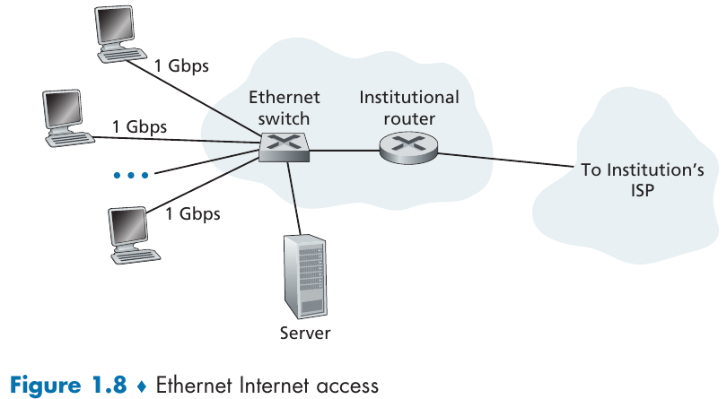

- [Chapter 1: Computer Networks and the Internet](#chapter-1-computer-networks-and-the-internet)
  - [1.1 What is the Internet?](#11-what-is-the-internet)
    - [1.1.1 A Nuts-and-Bolts Description](#111-a-nuts-and-bolts-description)
    - [1.1.2 A Services Description](#112-a-services-description)
    - [1.1.3 What is a Protocol?](#113-what-is-a-protocol)
      - [Network Protocols](#network-protocols)
  - [1.2 The Network Edge](#12-the-network-edge)
    - [1.2.1 Access Networks](#121-access-networks)
      - [Home Access: DSL, Cable, FTTH, and 5G Fixed Wireless](#home-access-dsl-cable-ftth-and-5g-fixed-wireless)
      - [Access in the Enterprise (and the Home): Ethernet and WiFi](#access-in-the-enterprise-and-the-home-ethernet-and-wifi)
    - [1.2.2 Physical Media](#122-physical-media)
      - [Twisted-Pair Copper Wire](#twisted-pair-copper-wire)
      - [Coaxial Cable](#coaxial-cable)
      - [Fiber Optics](#fiber-optics)
      - [Terrestrial Radio Channels](#terrestrial-radio-channels)
      - [Satellite Radio Channels](#satellite-radio-channels)
  - [1.3 The Network Core](#13-the-network-core)
    - [1.3.1 Packet Switching](#131-packet-switching)
      - [Store-and-Forward Transmission](#store-and-forward-transmission)
      - [Queuing Delay and Packet Loss](#queuing-delay-and-packet-loss)
      - [Forwarding Tables and Routing Protocols](#forwarding-tables-and-routing-protocols)
    - [1.3.2 Circuit Switching](#132-circuit-switching)
      - [Multiplexing in Circuit-Switched Networks](#multiplexing-in-circuit-switched-networks)
      - [Packet Switching Versus Circuit Switching](#packet-switching-versus-circuit-switching)
    - [1.3.3  A Network of Networks](#133--a-network-of-networks)
  - [1.5 Protocol Layers and Their Service Models](#15-protocol-layers-and-their-service-models)
    - [1.5.1 Layered Architecture](#151-layered-architecture)
      - [Protocol Layering](#protocol-layering)
      - [Application Layer](#application-layer)
      - [Transport Layer](#transport-layer)
      - [Network Layer](#network-layer)
      - [Link Layer](#link-layer)
      - [Physical Layer](#physical-layer)
    - [1.5.2 Encapsulation](#152-encapsulation)

---
# Chapter 1: Computer Networks and the Internet

## 1.1 What is the Internet?

There are different ways to define the internet, two possible approaches are:
- A nuts-and-bolts description (hardware and software components);
- A networking infrastructure that provides services to distributed applications;

### 1.1.1 A Nuts-and-Bolts Description

> The Internet is a computer network that interconnects billions of computing devices throughout the world.

> _Indeed, the term computer network is beginning to sound a bit dated, given the many nontraditional devices that are being hooked up to the Internet._

End systems (aka, _hosts_) are connected together by a network of communication links and packet switches. Different links might have different **transmission rates**, which are measured in bits/second.

Data is transmitted between end systems through _packets_ (segments of data with headers), which are reassembled by the target end system to the original data.

A _packet switch_ takes a packet arriving in one of its incoming communication links and forwards that packet to one of its outgoings links. **Routers** and **link-layers switches** are examples of such switches. The sequence of communication links taken by a packet is known as **route** or **path**.

End systems access the Internet through **Internet Service Providers (ISPs)**. Each ISP is a network of packet switches and communication links.

> The Internet is all about connecting end systems to each other, so the ISPs that provide access to end systems must also be interconnected. These lower-
tier ISPs are thus interconnected through national and international upper-tier ISPs and these upper-tier ISPs are connected directly to each other.

Upper-tier ISPs usually consists of high-speed routers interconnected with high-speed fiber-optic links. Each ISP network is managed independently, runs the IP protocol, and conforms to certain naming and address conventions.

End systems, packet switches, and other pieces of the Internet run **protocols** that control the sending and receiving of information within the Internet. **The Transmission Control Protocol (TCP)** and the **Internet Protocol (IP)** are two of the most important protocols in the Internet. The IP protocol specifies the format of the packets that are sent and received among routers and end systems. The Internet’s principal protocols are collectively known as **TCP/IP**.

> Given the importance of protocols to the Internet, it’s important that everyone agree on what each and every protocol does, so that people can create systems and products that interoperate.

> Internet standards are developed by the Internet Engineering Task Force (IETF) [IETF 2020]. The IETF standards documents are called requests for comments (RFCs). RFCs started out as general requests for comments (hence the name) to resolve network and protocol design problems that faced the precursor to the Internet [Allman 2011]. RFCs tend to be quite technical and detailed. They define protocols such as TCP, IP, HTTP (for the Web), and SMTP (for e-mail). There are currently nearly 9000 RFCs. Other bodies also specify standards for network components, most notably for network links. The IEEE 802 LAN Standards Committee [IEEE 802 2020], for example, specifies the Ethernet and wireless WiFi standards.

### 1.1.2 A Services Description

>  Internet applications include mobile
smartphone and tablet applications, including Internet messaging, mapping with real-time road-traffic information, music streaming movie and television streaming, online social media, video conferencing, multi-person games, and location-based recommendation systems.

The applications are said to be **distributed applications**, since they involve multiple end systems that exchange data with each other. Importantly, Internet applications run on end systems—they do not run in the packet switches in the network core. Although packet switches facilitate the exchange of data among end systems, they are not concerned with the application that is the source or sink of data. An alternative way of describing the Internet is answering the following:

> How does one program running on one end system instruct the Internet to deliver data to another program running on another end system?

End systems attached to the Internet provide a **socket interface** that specifies how a program running on one end system asks the Internet infrastructure to deliver data to a specific destination program running on another end system. This Internet socket interface is a set of rules that the sending program must follow so that the Internet can deliver the data to the destination program. 

### 1.1.3 What is a Protocol?

Putting simply, a _protocol_ defines a set of "rules" or actions that must be taken to accomplish some task.

> [...] it takes two (or more) communicating entities running the same protocol in order to accomplish a task.

#### Network Protocols

> All activity in the Internet that involves two or more communicating remote entities is governed by a protocol.

> A **protocol** defines the format and the order of messages exchanged between two or more communicating entities, as well as the actions taken on the transmission and/or receipt of a message or other event. 

The Internet, and computer networks in general, make extensive use of protocols. Different protocols are used to accomplish different communication tasks.

## 1.2 The Network Edge

The network edge consists of end systems. Hosts are sometimes divided in **clients** and **servers**. Most of the servers reside in large **data centers**.

> Internet companies such as Google, Microsoft, Amazon, and Alibaba have built massive data centers, each housing tens to hundreds of thousands of hosts. These data centers are not only connected to the Internet [...] but also internally include complex computer networks that interconnect the data center's hosts. The data centers are the engines behind the Internet applications that we use on a
daily basis.

### 1.2.1 Access Networks

Access networks connects end systems to the first router (aka, _edge router_) on a path from the end system to any other distant end system.

In the following subsections, a few types of access networks are considered.

#### Home Access: DSL, Cable, FTTH, and 5G Fixed Wireless

> Today, the two most prevalent types of broadband residential access are **digital subscriber lines (DSL)** and **cable**.

> The DSL standards define multiple transmission rates, including downstream transmission rates of 24 Mbs and 52 Mbs, and upstream rates of 3.5 Mbps and 16 Mbps; the newest standard provides for aggregate upstream plus downstream rates of 1 Gbps [ITU 2014]

While DSL makes use of the telco’s (_telephone company_) existing local telephone infrastructure, **cable Internet access** makes use of the cable television company's existing cable television infrastructure.

> Cable internet access requires special modems, called cable modems. As with a DSL modem, the cable modem is typically an external device and connects to the home PC through an Ethernet port.
 
Cable Internet access is a shared broadcast medium, thus every packet sent by the head end travels downstream on every link to every home and every packet sent by a home travels on the upstream channel to the head end.

Another possibility for residential broadband access if **fiber to the home (FTTH)**. It provides an optical fiber path from the CO directly to the home, which enable Internet access rates in the gigabits per second range.

Commonly, each fiber leaving the central office is shared by many homes; it is not until it gets relatively close to the homes that it is split into individual customer-specific fibers.

Active Optical Networks (AONs) and Passive Optical Networks (PONs) are competing optical-distribution network architectures.

Yet another possibility is **5G fixed wireless**, which provides residential access without cables by using beam-forming technology (data is sent wirelessly from a provider's base station to a modem in the home).

#### Access in the Enterprise (and the Home): Ethernet and WiFi

> On corporate and university campuses, and increasingly in home settings, a local area network (LAN) is used to connect an end system to the edge router. Although there are many types of LAN technologies, Ethernet is by far the most prevalent access technology in corporate, university, and home networks.
 

Ethernet users use twisted-pair copper wire to connect to an Ethernet
switch [...] The Ethernet switch, or a network of such interconnected switches, is then in turn connected into the larger Internet.

However, it is also possible to access the Internet in a wireless LAN setting (where packets are sent/received by an access point connected to the enterprise's network).

### 1.2.2 Physical Media

> A **physical medium** can take many shapes and forms and does not have to be of the same type for each transmitter-receiver pair along the path.

Physical media fall into two categories:

- Guided Media: waves are guided along a solid medium (e.g., fiber-optic cable, twisted-pair copper wire, coaxial cable).
- Unguided Media: waves propagate in the atmosphere and in outer space (e.g., wireless LAN or a digital satellite channel).

> The actual cost of the physical link (copper wire, fiber-optic cable, and so on) is often relatively minor compared with other networking costs. In particular, the labor cost associated with the installation of the physical link can be orders of magnitude higher than the cost of the material.

#### Twisted-Pair Copper Wire

> Twisted pair consists of two insulated copper wires, each about 1 mm thick, arranged in a regular spiral pattern. The wires are twisted together to reduce the electrical interference from similar pairs close by.

> Unshielded twisted pair (UTP) is commonly used for computer networks within a building, that is, for LANs.

#### Coaxial Cable

> Like twisted pair, coaxial cable consists of two copper conductors, but the two conductors are concentric rather than parallel. With this construction and special insulation and shielding, coaxial cable can achieve high data transmission rates.

> Coaxial cable can be used as a **guided shared medium**. Specifically, a number of end systems can be connected directly to the cable, with each of the end systems receiving whatever is sent by the other end systems.

#### Fiber Optics

> An optical fiber is a thin, flexible medium that conducts pulses of light, with each pulse representing a bit. A single optical fiber can support tremendous bit rates, up to tens or even hundreds of gigabits per second. 

#### Terrestrial Radio Channels

> Radio channels carry signals in the electromagnetic spectrum. They are an attractive medium because they require no physical wire to be installed, can penetrate  walls, provide connectivity to a mobile user, and can potentially carry a signal for long distances.

#### Satellite Radio Channels

> A communication satellite links two or more Earth-based microwave transmitter/receivers, known as ground stations. The satellite receives transmissions on one frequency band, regenerates the signal using a repeater, and transmits the signal on another frequency. Two types of satellites are used in communications: **geostationary satellites** and **low-earth orbiting (LEO) satellites**.

## 1.3 The Network Core

The Internet's core is a mesh of packet switches and links that interconnects end systems.

### 1.3.1 Packet Switching

> In a network application, end systems exchange **messages** with each other.

Messages can contain anything, ranging from control functions to data (e.g., e-mail message, images, audio). In order to exchange messages, end system actually send **packets** (smaller chunk of datas) through the network. Between source and destination, each packet travels through communication links and **packet switches**.

> Packets are transmitted over each communication link at a rate equal to the full transmission rate of the link. So, if a source end system or a packet switch is sending a packet of $L$ bits over a link with transmission rate $R$ bits/sec, then the time to transmit the packet is $L/R$ seconds.

#### Store-and-Forward Transmission

> Store-and-forward transmission means that the packet switch must receive the entire packet before it can begin to transmit the first bit of the packet onto the
outbound link.

#### Queuing Delay and Packet Loss

Packet switches usually have multiple links attached to it, for every link it has an **output buffer** (or **output queue**) to store packets that the switch is about to send into that link.

If an arriving packet needs to be transmitted onto a link but it is busy with the transmission of another packet, the arriving packet must wait in the output buffer.

Thus, in addition to the store-and-forward delays, packets suffer from output buffer **queuing delays**. Since memory is limited, the output buffer might be completely full with other packets, **packet loss** will occur (either the arriving packet or one of the queued packets will be dropped).

#### Forwarding Tables and Routing Protocols

> Packet forwarding is done differently in different types of computer networks.

In the Internet, every system has an address called **IP address**. When a host want to send another end system, the sources includes the destination's IP address in the packet's header.

Every router has a **forwarding table** that maps destinations addresses to the router's outbound links.

> [...] the Internet has a number of special routing protocols that are used to automatically set the forwarding tables. A routing protocol may, for example, determine the shortest path from each router to each destination and use the shortest path results to configure the forwarding tables in the routers.

### 1.3.2 Circuit Switching

> There are two fundamental approaches to moving data through a network of links and switches: **circuit switching** and **packet switching**.

> In circuit-switched networks, the resources needed along a path (buffers, link transmission rate) to provide for communication between the end systems are reserved for the duration of the communication session between the end systems.

#### Multiplexing in Circuit-Switched Networks

> A **circuit** in a link is implemented with either **frequency-division multiplexing (FDM)** or **time-division multiplexing (TDM)**.

In a FDM link, the frequency spectrum of a link is divided up among the connections established across the link. It dedicates a frequency band to each connection for the duration of the connection.

> In telephone networks, this frequency band typically has a width of 4 kHz [...] The width of the band is called [...] **bandwidth**. 

In a TDM link, time is divided into frames of fixed duration, and each frame is divided into a fixed number of time slots. It dedicates one time slot in every frame for a given connection.

> Proponents of packet switching have always argued that circuit switching is wasteful because the dedicated circuits are idle during **silent periods**.

#### Packet Switching Versus Circuit Switching

> Critics of packet switching have often argued that packet switching is not suitable for real-time services (for example, telephone calls and video conference calls) because of its variable and unpredictable end-to-end delays (due primarily to variable and unpredictable queuing delays).

> Proponents of packet switching argue that (1) it offers better sharing of transmission capacity than circuit switching and (2) it is simpler, more efficient, and less costly to implement than circuit switching.

> 
> [...] the crucial difference between the two forms of sharing a link’s transmission rate among multiple data streams. Circuit switching pre-allocates use of the transmission link regardless of demand, with allocated but unneeded link time going unused. Packet switching on the other hand allocates link use on demand.

### 1.3.3  A Network of Networks

> Over the years, the network of networks that forms the Internet has evolved into a very complex structure. Much of this evolution is driven by economics and national policy, rather than by performance considerations.

> [...] In reality, although some ISPs
do have impressive global coverage and do directly connect with many access ISPs, no ISP has presence in each and every city in the world. Instead, in any given region, there may be a **regional ISP** to which the access ISPs in the region connect. Each regional ISP then connects to **tier-1 ISPs**.

> To build a network that more closely resembles today’s Internet, we must add points of presence (PoPs), multi-homing, peering, and Internet exchange points (IXPs) to the hierarchical Network Structure 3.

A **PoP** is a group of one or more routers (at the same location) in the provider's network where customer ISPs can connect into the provider ISP.

Any ISP (except tier-1) may choose to **multi-home**, that is, to connect to two or more provider ISPs.

> [...] customer ISPs pay their provider ISPs to obtain global Internet interconnectivity. The amount that a customer ISP pays a provider ISP reflects the amount of traffic it exchanges with the provider.

A pair of nearby ISPs in the same level of the hierarchy can **peer**, that is, directly connect their networks together so that all traffic between them passes over the direct connection rather than through upstream intermediaries.

An **Internet Exchange Point (IXP)** is a meeting point where multiple ISPs can peer together.

> We refer to this  ecosystem—consisting of access ISPs, regional ISPs, tier-1 ISPs, PoPs, multi-homing, peering, and IXPs—as Network Structure 4.

Today's Internet Network Structure consists of tiered ISPs, PoPs, peering, multi-homing, IXPs and **content-provider networks**. Such content-providers (e.g., Google) try to bypass tier-1 ISPs through peering and IXPs.

> In summary, today’s Internet—a network of networks—is complex, consisting of a dozen or so tier-1 ISPs and hundreds of thousands of lower-tier ISPs. The ISPs are diverse in their coverage, with some spanning multiple continents and oceans, and others limited to narrow geographic regions. The lower-tier ISPs connect to the higher-tier ISPs, and the higher-tier ISPs interconnect with one another. Users and content providers are customers of lower-tier ISPs, and lower-tier ISPs are customers of higher-tier ISPs. In recent years, major content providers have also created their own networks and connect directly into lower-tier ISPs where possible.

## 1.5 Protocol Layers and Their Service Models

### 1.5.1 Layered Architecture

> A layered architecture allows us to discuss a well-defined, specific part of a large and complex system.

#### Protocol Layering

> To provide structure to the design of network protocols, network designers organize protocols—and the network hardware and software that implement the protocols—in **layers**.

> A protocol layer can be implemented in software, in hardware, or in a combination of the two. 

> When taken together, the protocols of the various layers are called the **protocol stack**. The Internet protocol stack consists of five layers: the physical, link, network,
transport, and application layer.

#### Application Layer

> The application layer is where network applications and their application-layer protocols reside. The Internet’s application layer includes many protocols, such as the HTTP protocol (which provides for Web document request and transfer), SMTP (which provides for the transfer of e-mail messages), and FTP (which provides for the transfer of files between two end systems). 
 
The domain name system (DNS) is also in this layer. An Application-layer protocol is distributed over multiple end system, with the application in the end systems exchanging packets of information (called **messages** in this layer) using the same protocol.

#### Transport Layer

> The Internet’s transport layer transports application-layer messages between application endpoints. In the Internet, there are two transport protocols, **TCP** and **UDP**.

TCP provides a connection-oriented service to its applications, including guaranteed delivery, flow control, congestion-control and "message breaking" (i.e., breaking long messages into shorter segments).

UDP provides a connectionless service to its applications with no reliability, no flow control, and no congestion control. Transport-layer packets are referred as **segments**.

#### Network Layer

> The Internet’s network layer is responsible for moving network-layer packets known as **datagrams** from one host to another. The Internet transport-layer protocol (TCP or UDP) in a source host passes a transport-layer segment and a destination address to the network layer.

This layer includes the IP protocol, which defines the fields in the datagram as well as how end system and routers act on these fields. It also contains routing protocols that determine the routes the datagrams take between sources and destinations.

It is important to note that there's one one IP protocol but many routing protocols. It is also called the **IP layer**.

#### Link Layer

> The Internet’s network layer routes a datagram through a series of routers between the source and destination. To move a packet from one node (host or router) to the next node in the route, the network layer relies on the services of the link layer.

>  In particular, at each node, the network layer passes the datagram down to the link layer, which delivers the datagram to the next node along the route. At this next node, the link layer passes the datagram up to the network layer.

The services provided by this layer depend on the specific link-layer protocol employed over the link.

Example of link-layer protocols include Ethernet, WiFI, and the cable access network's DOCSIS protocol. Link-layer packets can be referred as **frames**.

#### Physical Layer

> While the job of the link layer is to move entire frames from one network element to an adjacent network element, the job of the physical layer is to move the individual bits within the frame from one node to the next.

The protocol in this layers are link dependent and further depende on the actual transmission medium of the link.

### 1.5.2 Encapsulation

> Similar to end systems, routers and link-layer switches organize their networking hardware and software into layers. But routers and link-layer switches do not implement all of the layers in the protocol stack; they typically implement only the bottom layers. 

> At each layer, a packet has two types of fields: header fields and a **payload field**. The payload is typically a packet from the layer above

