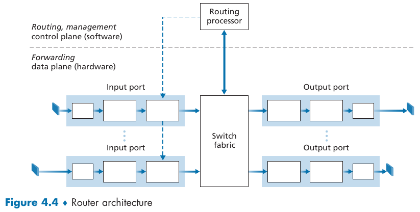
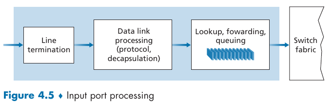
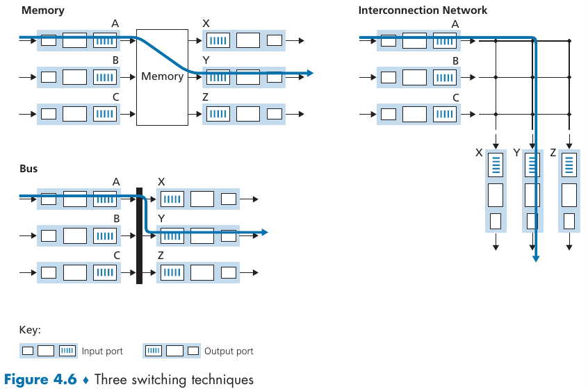
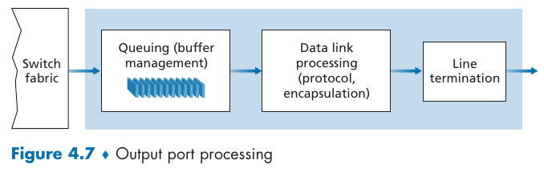
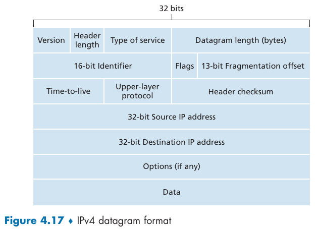
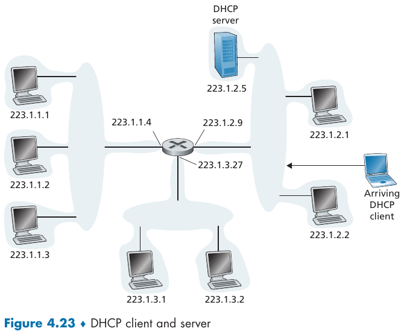
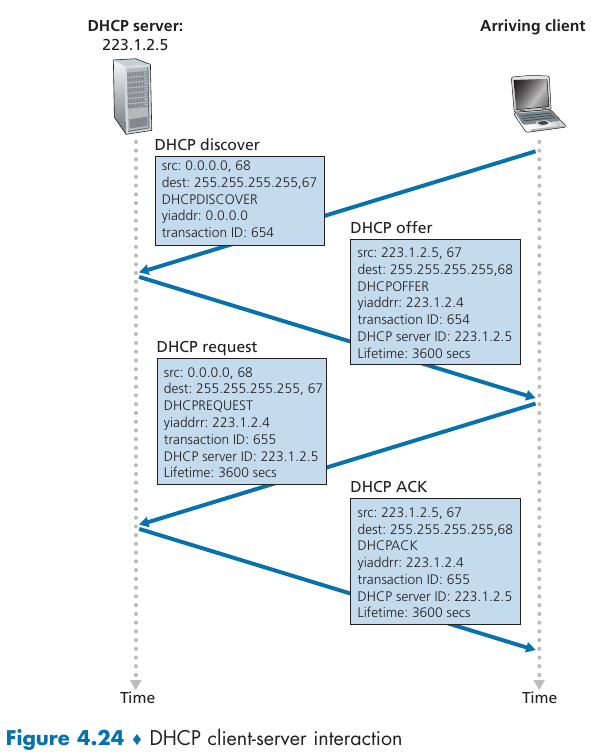
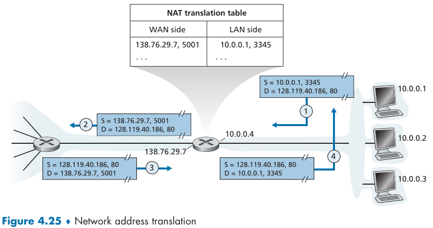
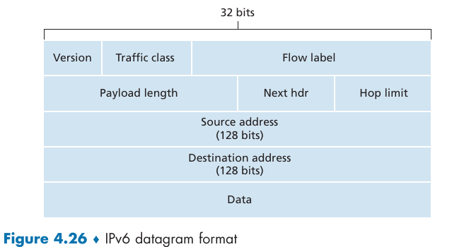
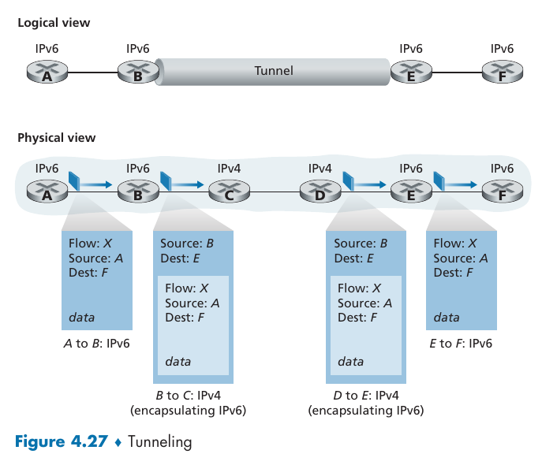

- [Chapter 4: The Network Layer: Data Plane](#chapter-4-the-network-layer-data-plane)
  - [4.2 What's inside a Router?](#42-whats-inside-a-router)
    - [4.2.1 Input Port Processing and Destination-Based Forwarding](#421-input-port-processing-and-destination-based-forwarding)
    - [4.2.2 Switching](#422-switching)
    - [4.2.3 Output Port Processing](#423-output-port-processing)
  - [4.3 The Internet Protocol (IP): IPv4, Addressing, IPv6, and More](#43-the-internet-protocol-ip-ipv4-addressing-ipv6-and-more)
    - [4.3.1 IPv4 Datagram Format](#431-ipv4-datagram-format)
    - [4.3.2 IPv4 Addressing](#432-ipv4-addressing)
      - [Obtaining a Block of Addresses](#obtaining-a-block-of-addresses)
      - [Obtaining a Host Address: The Dynamic Host Configuration Protocol](#obtaining-a-host-address-the-dynamic-host-configuration-protocol)
    - [4.3.3 Network Address Translation (NAT)](#433-network-address-translation-nat)
    - [4.3.4 IPv6](#434-ipv6)
      - [Transitioning from IPv4 to IPv6](#transitioning-from-ipv4-to-ipv6)

---
# Chapter 4: The Network Layer: Data Plane

> There is a piece of the network layer in each and every host and router in the network. Because of this, network-layer protocols are among the most challenging in the protocol stack.
> 
>  The network layer can be decomposed into two interacting parts, the **data plane** (per-router functions, datagram forwarding inside the router) and the **control plane** (network-wide, datagram forwarding between routers).

## 4.2 What's inside a Router?

> An **input port** perform several functions: (1) physical layer function of terminating an incoming physical link at a router; (2) link-layer functions needed to interoperate with the link layer at the other side of the incoming link; (3) lookup function to determine the router output port to which the arriving packet will be forwarded.
> 
> The **switching fabric** connects the router's input ports to its output ports.
> 
> An **output port** stores packets received from the switching fabric and transmits these packets on the outgoing link by performing the necessary link-layer and physical-layer functions.
> 
> The **routing processor** performs control-plane functions. In traditional routers, it executes the routing protocols, maintains routing tables and attached link state information, and computes the forwarding table for the router.  In SDN routers, the routing processor is responsible for communicating with the remote controller in order to (among other activities) receive forwarding table entries computed by the remote controller, and install these entries in the router’s input ports.

### 4.2.1 Input Port Processing and Destination-Based Forwarding

### 4.2.2 Switching

### 4.2.3 Output Port Processing

## 4.3 The Internet Protocol (IP): IPv4, Addressing, IPv6, and More

### 4.3.1 IPv4 Datagram Format

> **Version number**: 4 bits; Identify the IP protocol version of the datagram.
> 
> **Header length**: IPv4 datagrams can contain a variable number of options, 4 bits for identifying where the payload actually begins.
> 
> **Type of service (TOS)**: 8 bits; enables to distinguish between IP datagrams.
> 
> **Datagram length**: 16 bits; total length of the IP datagram (header + data).
> 
> **Identifier, flags, fragmentation offset**: related to IP fragmentation, when a large IP datagram is broken into several smaller ones to be independently forwarded to the destination. 
> 
> **Time-to-live (TTL)**: ensure that datagrams don't circulate forever.
> 
> **Protocol**: used only when an IP datagram reaches its final destination, indicates transport-layer specific protocol to which the data should be passed.
> 
> **Header checksum**: aids detection of bit errors in an IP datagram.
> 
> **Source and destination IP addresses**: 32 bits; when a source creates a datagram it insets its IP address into the source and inserts the destination IP address.
> 
> **Options**: allow the IP header to be extended.
> 
> **Data (payload)**: transport-layer segment or other types of datas (e.g., ICMP messages).

### 4.3.2 IPv4 Addressing

> A host typically has only a single link into the network; when IP in the host wants to send a datagram, it does so over this link. The boundary between the host and the physical link is called an **interface**.
> 
> A router has multiple interfaces, one for each of its links. Because every host and router is capable of sending and receiving IP datagrams, IP requires each host and router interface to have its own IP address. 
> 
> Thus, an IP address is technically associated with an interface, rather than with the host or router containing that interface.

Each IP address is 32 bits long, and are usually written in **dotted-decimal notation** (e.g., 192.168.0.1). Every interface in the global Internet must have an IP address that is globally unique (except for interface behind NATs).

> To determine the subnets, detach each interface from its host or router, creating islands of isolated networks, with interfaces terminating the end points of the isolated networks. Each of these isolated networks is called a **subnet**.

There's a useful notation for indicating the subnet IP address (**subnet mask**): `A.B.C.D/X` where `X` is the number of bits of the dotted-decimal notation that makes the subnet address (shared by all interfaces in that subnet).

> The Internet’s address assignment strategy is known as **Classless Interdomain Routing (CIDR)**, it generalizes the notion of subnet addressing. . As with subnet addressing, the 32-bit IP address is divided into two parts and again has the dotted-decimal form `a.b.c.d/x`, where `x` indicates the number of bits in the first part of the address.
>
> The `x` most significant bits of an address of this form constitute the network portion of the IP address, and are often referred to as the **prefix** of the address.

> The IP broadcast address `255.255.255.255` enables to send a datagram to all hosts on the same subnet. Router optionally send the message to neighboring subnets as well.

#### Obtaining a Block of Addresses

> In order to obtain a block of IP addresses for use within an organization’s subnet, a network administrator might first contact its ISP, which would provide addresses from a larger block of addresses that had already been allocated to the ISP.
> 
> However, IP addresses are managed under the authority of the Internet Corporation for Assigned Names and Numbers (ICANN). The role of this organization is not only to allocate IP addresses, but also to manage the DNS root servers.

#### Obtaining a Host Address: The Dynamic Host Configuration Protocol

> Once an organization has obtained a block of addresses, it can assign individual IP addresses to the host and router interfaces in its organization. A system administrator will typically manually configure the IP addresses into the router.
> 
> Host addresses can also be configured manually, but typically this is done using the **Dynamic Host Configuration Protocol (DHCP)**, a client-server zeroconf protocol that automatically allocates an IP address for a network interface.

### 4.3.3 Network Address Translation (NAT)

> Given our discussion about Internet addresses and the IPv4 datagram format, we’re now well aware that every IP-capable device needs an IP address.

> **Network Address Translation (NAT)** enables the usage of *private network* IP address space (or a realm with *private addresses*) for communicating over the Internet.
> 
> The idea is for only the router to have a public (globally unique) IP address and all other host have a prive IP address. Thus, all incoming datagrams are sent to the router which passes it to the hosts inside the network through a **NAT translation table** that combines both the IP address and ports (where each host in the network is assigned to one port).

### 4.3.4 IPv6

#### Transitioning from IPv4 to IPv6

> Now that we have seen the technical details of IPv6, let us consider a very practical matter: How will the public Internet, which is based on IPv4, be transitioned to IPv6? The problem is that while new IPv6-capable systems can be made backward-compatible, that is, can send, route, and receive IPv4 datagrams, already deployed IPv4-capable systems are not capable of handling IPv6 datagrams. Several options are possible [Huston 2011b, RFC 4213].
> 
> The approach to IPv4-to-IPv6 transition that has been most widely adopted in practice involves **tunneling**.

