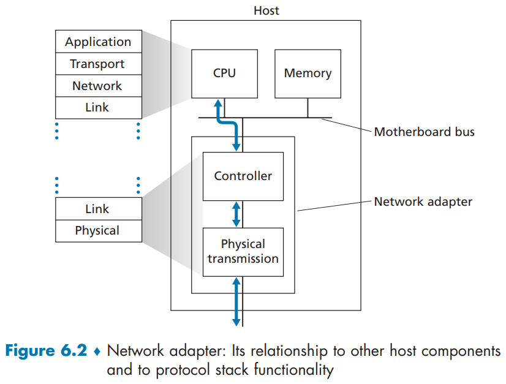
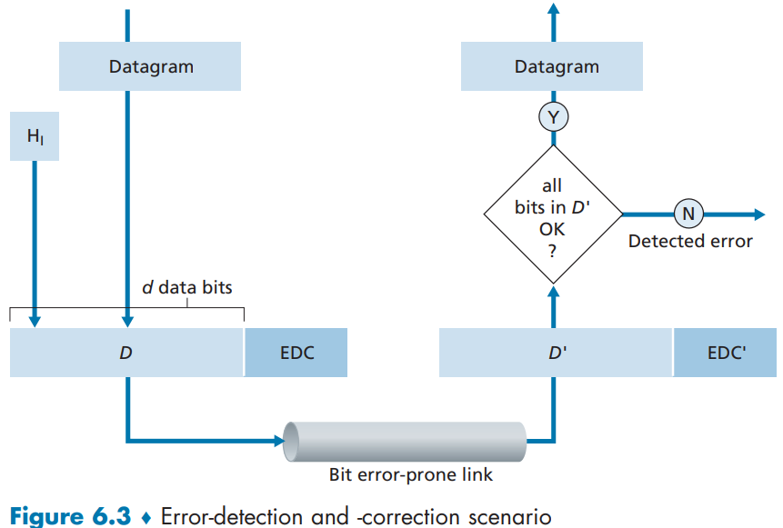
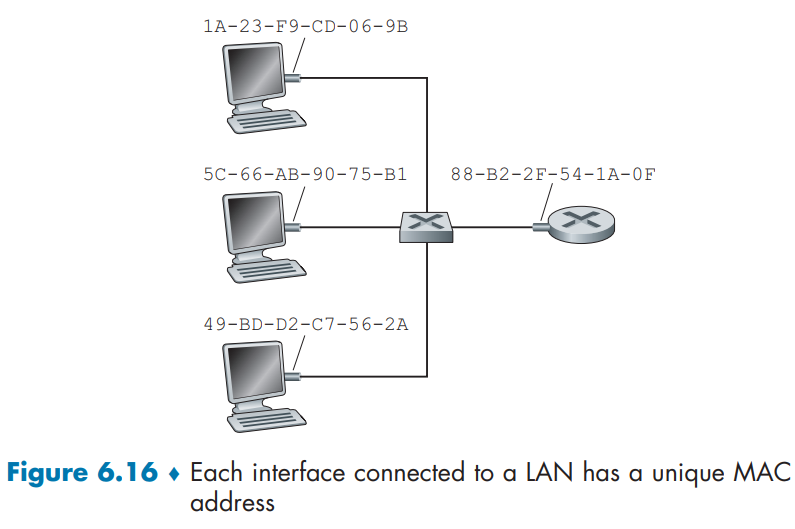

- [Chapter 6: The Link Layer and LANs](#chapter-6-the-link-layer-and-lans)
  - [6.1 Introduction to the Link Layer](#61-introduction-to-the-link-layer)
    - [6.1.1 The Services Provided by the Link Layer](#611-the-services-provided-by-the-link-layer)
    - [6.1.2 Where is the Link Layer Implemented?](#612-where-is-the-link-layer-implemented)
  - [6.2 Error-Detection and Correction Techniques](#62-error-detection-and-correction-techniques)
    - [6.2.1 Parity Checks](#621-parity-checks)
    - [6.2.2 Checksumming Methods](#622-checksumming-methods)
    - [6.2.3 Cyclic Redundancy Check (CRC)](#623-cyclic-redundancy-check-crc)
  - [6.3 Multiple Access Links and Protocols](#63-multiple-access-links-and-protocols)
  - [6.4 Switched Local Area Networks](#64-switched-local-area-networks)
    - [6.4.1 Link-layer Addressing and ARP](#641-link-layer-addressing-and-arp)
      - [MAC Addresses](#mac-addresses)
      - [Address Resolution Protocol (ARP)](#address-resolution-protocol-arp)
      - [Sending a Datagram off the Subnet](#sending-a-datagram-off-the-subnet)

---
# Chapter 6: The Link Layer and LANs

> Between two hosts, *datagrams* travel over a series of communication links (wired, wireless, etc) starting at the sender passing through a series of packet switches (switches and routers) and ending at the destination.

## 6.1 Introduction to the Link Layer

> Any device that runs a link-layer protocol is called a **node**. The communication channels that connect adjacent nodes along the path are called **links**.
> 
> Over a given link, a transmitting node encapsulates the datagram in a **link-layer frame** and transmits this frame into the link.

### 6.1.1 The Services Provided by the Link Layer

- *Framing*: a frame consists of a data field, in which the network-layer datagram is inserted, and a number of header fields. The specification of a frame is specified by the link-layer protocol.
- *Link access*: A *medium access control* (MAC) protocol specified the rule by which a frame is transmitted onto the link. For point-to-point links that have a single sender and a single receiver, the MAC protocol is simply to send the frame whenever the link is idle. However, when multiple nodes share a single broadcast link, the MAC protocol coordinate the frame transmission.
- *Reliable delivery*: Link-layer protocols can provide reliable delivery of datagrams across the link through acknowledgment and retransmissions.
- *Error detection and correction*

### 6.1.2 Where is the Link Layer Implemented?

> For the most part, the link layer is implemented on a chip called the **network adapter** (or, **network interface controller**). Thus, most of a link-layer controller's functionality is implemented in hardware. However, some higher-level functionalities are achieved through software that runs in the host's CPU. In summary, the link-layer is a combination of hardware and software.

## 6.2 Error-Detection and Correction Techniques

The link layer provides bit-level error detection and correction in a frame. However, it is still possible to have **undetected bit errors**. Thus, ut us important to choose a scheme that keeps the probability of such occurrences small.

### 6.2.1 Parity Checks

The simplest form of error detection is to use a single **parity bit**. That is, to include an additional bit such that the total number of 1s is even/odd. However, this approach is not robust enough to keep undetected errors with small probability.

It is possible to generalize this approach to a two-dimensional detection, in which bits of the frame are divided into rows and column, and a parity bit is added for both rows and columns.

> The ability of the receiver to both detect and correct error is known as **forward error correction (FEC)**.

### 6.2.2 Checksumming Methods

> In checksumming techniques, the bits in a frame are treated as a sequence of $k$-bit integers. Thus, a simple approach is to sum all integers in a frame and use the result as the error-detection bits. However, such methods are usually not used in the link-layer.

### 6.2.3 Cyclic Redundancy Check (CRC)

CRC is preferred over checksumming for the link-layer since this layer has dedicated hardware and can run more complex operations.

## 6.3 Multiple Access Links and Protocols

A **point-to-point link** consists of a single sender at one end of the links and a single receiver at the other end of the link. The point-to-point protocol (PPP) and high-level data link control (HDLC) are protocols for this type of link.

A **broadcast link** can have multiple sending and receiving nodes, all connected to the same shared channel. Ethernet and wireless LANs are example of broadcast link-layer technologies. The **multiple access problem** deals with the problem of coordinating multiple sending and receiving nodes over with a shared link.

In general, multiple access protocols can be categorized in:

  - **Channel partitioning protocols**
    - TDM
    - FDM
    - CDMA
  - **Random access protocols**
    - ALOHA
    - Carrier Sense Multiple Access (CSMA)
    - Carrier Sense Multiple Access with Collision Detection (CSMA/CD)
  - **Taking-turns protocols**

## 6.4 Switched Local Area Networks

### 6.4.1 Link-layer Addressing and ARP

> Hosts and routers have link-layer addresses.

#### MAC Addresses

In truth, network adapters have link-layer addresses. Thus, if a host o router has multiple NICs, it will have multiple link-layer addresses associated with it.

> Link-layer switches don't have link-layer addresses associated with their interfaces that connect to hosts and routers. 
> 
> The job of link-layer switches is to carry datagrams between hosts and routers, without the host/router having to explicitly address the frame to the intervening switch.

> A link-layer address is variously called **LAN address**, a **physical address** or a **MAC address**.
> 
> For most LANs, the MAC address is 6 bytes long. No two network adapters have the same MAC address.

#### Address Resolution Protocol (ARP)

Since there is both network-layer addresses and link-layer addresses, there's a need to translate between them. For the Internet, this is the job of the **Address Resolution Protocol (ARP)**. 

ARP takes any IP address in the same LAN as input and returns the corresponding MAC address. That it is, it resolves an IP address to a MAC address.

In a LAN, each host and router has an **ARP table** in its memory. Each entry in the table also has a time-to-live (TTL) value, which indicates when each mapping will be deleted. 

New entries can be inserted into the ARP table through ARP query packets broadcasted to the subnet. Thus, ARP tables can be built automatically when needed.

#### Sending a Datagram off the Subnet

