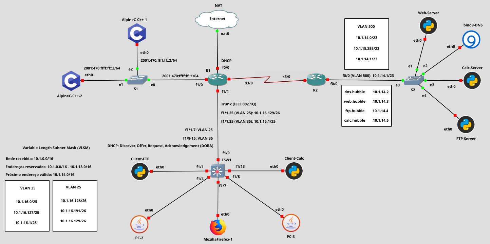

- [Projeto 2ªVA](#projeto-2ªva)
  - [1. Layout: roteadores, switches, hosts](#1-layout-roteadores-switches-hosts)
  - [2. Roteamento: OSPF vs RIP?](#2-roteamento-ospf-vs-rip)
    - [Configuração do OSPF para o C7200](#configuração-do-ospf-para-o-c7200)
  - [2. Servidor DNS](#2-servidor-dns)
  - [3. Servidor WEB](#3-servidor-web)
  - [4. Client/Server](#4-clientserver)
    - [Adicional: servidor FTP](#adicional-servidor-ftp)
  - [5.  Configuração do Firewall para o C7200](#5--configuração-do-firewall-para-o-c7200)
  - [Máscaras Wildcard](#máscaras-wildcard)

---
# Projeto 2ªVA

## 1. Layout: roteadores, switches, hosts



- Estamos usando uma interface serial pois devemos considerar que os roteadores não estão na mesma LAN (dessa forma, estamos utilizando uma WAN).

1. Agora, precisamos fazer a configuração da VLAN com 500 hosts (VLAN500).
2. Por simplicidade, vamos considerar que apenas a VLAN500 se conecta com o roteador R2. 
3. Assim, só precisamos configurar os endereços IP de cada um dos hosts de forma individual.
    | IP address | Servidor | 
    | --- | --- |
    | 10.1.14.2 /23 | DNS |
    | 10.1.14.3 /23 | WEB (página) |
    | 10.1.14.4 /23 | FTTP |
    | 10.1.14.5 /23 | HTTP (calculadora) |
   - [Mais detalhes na documentação da CISCO](https://www.cisco.com/c/en/us/td/docs/ios/12_2sb/12_2sba/feature/guide/sbhcpsm.html)
   - [Mais detalhes na documentação da CISCO](https://www.cisco.com/c/en/us/td/docs/ios-xml/ios/ipaddr_dhcp/configuration/15-mt/dhcp-15-mt-book/config-dhcp-server.html#GUID-68D87544-7C6F-48C9-9DFE-56F5B7E4A89D)
4. Agora, podemos configurar o roteador R2.
   - `conf t`
   - `int FastEthernet 0/0`
   - `ip address 10.1.14.1 255.255.254.0`
   - `no sh`
   - `end`

## 2. Roteamento: OSPF vs RIP?

> Ambos são viáveis e possuem mais de uma versão. Em particular, o RIPv1 não pode ser utilizado pois não consegue lidar com sub-redes IP.
> 
> O RIP precisa continuamente enviar informações sobre o roteamento nos canais de comunicação, já o OSPF só envia quando alguma atualização ocorre na rede.
> 
> O RIP foi feito para trabalhar em redes de tamanho moderado, já o OSPF consegue trabalhar em redes maiores.
> 
> Mais informações que podem auxiliar na escolha: https://www.ibm.com/docs/en/zos/2.1.0?topic=terminology-interior-gateway-protocols

Inicialmente, vamos escolher o **OSPFv2** (apesar dele possuir uma configuração um pouco mais complicada) por ele só compartilhar informações sobre o roteamento quando a topologia da rede é alterada. Ademais, vamos utilizar a versão 2 pois só estamos trabalhando com redes IPv4.

### Configuração do OSPF para o C7200

> Referências:
> - https://www.cisco.com/c/en/us/support/docs/ip/open-shortest-path-first-ospf/7039-1.html
> - https://www.cisco.com/c/en/us/td/docs/ios-xml/ios/iproute_ospf/configuration/xe-16/iro-xe-16-book/iro-cfg.html
> - https://www.dltec.com.br/blog/cisco/configurando-o-ospf-single-area-para-ccnas/
> - https://www.cisco.com/c/en/us/support/docs/ip/open-shortest-path-first-ospf/13687-15.html
> - https://www.cisco.com/c/en/us/td/docs/ios-xml/ios/iproute_ospf/configuration/xe-3e/iro-xe-3e-book/iro-mode-ospfv2.pdf
> - https://www.cisco.com/c/en/us/support/docs/ip/open-shortest-path-first-ospf/47868-ospfdb9.html
> - https://study-ccna.com/ospf-default-information-originate/

> *The OSPF protocol is based on link-state technology, which is a departure from the Bellman-Ford vector based algorithms used in traditional Internet routing protocols such as RIP. OSPF has introduced new concepts such as authentication of routing updates, Variable Length Subnet Masks (VLSM), route summarization, and so forth.*

> *OSPF uses flooding to exchange link-state updates between routers. Any change in routing information is flooded to all routers in the network. Areas are introduced to put a boundary on the explosion of link-state updates. Flooding and calculation of the Dijkstra algorithm on a router is limited to changes within an area.*

- **Quais/quantas áreas devemos possuir?** Precisamos apenas de de backbone, visto que nossa topologia é extremamente simples.
- Nos roteadores CISCO, o OSPF é habilitado apenas nas interfaces configuradas utilizando o comando `network {IP} {WILDCARD} area {N}`.

1. Inicialmente, vamos configurar o roteador `R2`. Iremos utilizar OSPF.
   1. A primeira etapa é entrar no modo de configuração: `conf t`
   2. Agora, devemos declarar a interface `s3/0` como não numerada.
      - `int Serial 3/0`
      - `ip address 10.1.1.0 255.255.255.254`
      - `encapsulation ppp`: o PPP (Point-to-Point Protocol) é um protocolo que permite a comunicação direta entre dois roteadores.
      - `no sh`
      - `exit`
   3. Depois, entrar na configuração do OSPF: 
      - `router ospf {PROCESS_ID}` ( valor do `PROCESS_ID` não precisa ser o mesmo para os demais roteadores, irei selecionar o valor `1`).
      - `network 10.1.14.0 0.0.1.255 area 0`
      - `network 10.1.1.0 0.0.0.1 area 0`
      - `end`
2. Agora, podemos realizar o mesmo processo no roteador `R1`.
   - A única diferença, são: o IP da interface serial (`10.1.1.1 255.255.255.254`) e as redes do OSPF (devemos usar ambas VLANs).
   - Ademais, também precisamos indicar que esse roteador possui a rota padrão (*Gateway Last Resort*): `default-information originate`
   - Adicionalmente, podemos colocar a interface serial desse roteador como sendo dentro do NAT (`ip nat inside`). 

## 2. Servidor DNS

1. Configuração inicial das zonas:

  | Zona | Descrição | Tipo |
  | --- | --- | --- |
  | `hubble` | Zona principal/direta; Determina o domínio dos servidores | master |
  | `0.14.1.10.in-addr.arpa` | DNS reverso | master |

2. Configuração da zona direta:
  
  | Domínio | Descrição | Endereço |
  | --- | --- | --- |
  | `dns.hubble` | Servidor DNS | `10.1.14.2` |
  | `ftp.hubble` | Servidor FTP | `10.1.14.4` |
  | `web.hubble` | Servidor WEB | `10.1.14.3` |
  | `calc.hubble`| Servidor HTTP | `10.1.14.5` | 

3. Configuração da zona reversa:

  | Endereço | Domínio |
  | --- | --- |
  | `4` | `ftp.hubble.` |
  | `3` | `web.hubble.` |
  | `5` | `calc.hubble` | 

4. Configuração dos forwarders: podemos usar os do Google (8.8.8.8 ou 8.8.4.4).
   - Observação: precisamos adicionar a opção `allow-query { any; };` para utilização. 
5. Agora, basta configurar o servidor DHCP para utilizar o IP do servidor DNS configurado.
   - Acessamos cada uma das pools: `ip dhcp pool {ID}`
   - Atualizamos o DNS server: `dns-server 10.1.14.2`
   - `end`


## 3. Servidor WEB

Por simplicidade, vamos utilizar Python + Flask para servir uma página Web extremamente simples com um único texto: "Olá! Esse é um servidor WEB para o Projeto Hubble".

```python
from flask import Flask

app = Flask(__name__)

@app.route("/")
def home():
   return "<p>Olá! Esse é um servidor WEB para o Projeto Hubble</p>"

```

## 4. Client/Server

```python
import socket

# Criação de um socket IPv4 
s = socket.socket(socket.AF_INET, socket.SOCK_STREAM)

# Tornando ele público com o IP do host
s.bind(('', 80))

# Permitir apenas uma conexão com clientes
s.listen(1)

# Loop do servidor
# Aguarda uma conexão, realiza uma operação
#  e retorna o resultado
while True:
   c, addr = s.accept()

   with c:
      print(f"Connected to {addr}")
      while True:
         data = c.recv(1024)
         if not data:
            break

         v = str(data, 'utf-8').split(" ")
         n1 = int(v[0])
         n2 = int(v[1])
         c.send(f'{n1 + n2}'.encode(encoding='utf-8'))
         print('Sent answer')
```

```python
import argparse
import socket

parser = argparse.ArgumentParser(description='Somar inteiros.')
parser.add_argument('v1', type=int, help='Número inteiro 1')
parser.add_argument('v2', type=int, help='Número inteiro 2')

args = parser.parse_args()

# Criação de um socket IPv4 
s = socket.socket(socket.AF_INET, socket.SOCK_STREAM)

# Conectando com o servidor
s.connect(('calc.hubble', 80))

# Enviar uma mensagem ao servidor
send = f'{args.v1} {args.v2}'
print(f'Enviando mensagem: {send}')
s.sendall(send.encode(encoding='utf-8'))

# Fazer a leitura dos dados
data = str(s.recv(1024), 'utf-8')
print(f'Mensagem recebida: {data}')

# Fechar a conexão
s.close()
print('Conexão encerrada')

```

### Adicional: servidor FTP

```python
from pyftpdlib.authorizers import DummyAuthorizer
from pyftpdlib.handlers import FTPHandler
from pyftpdlib.servers import FTPServer

authorizer = DummyAuthorizer()
authorizer.add_user("carlos", "password", "/app/carlos/", perm="elradfmwMT")

handler = FTPHandler
handler.authorizer = authorizer

server = FTPServer(("", 21), handler)
server.serve_forever()
```

```python
import argparse
from ftplib import FTP

parser = argparse.ArgumentParser(description='Acessar um servidor FTP')
parser.add_argument('user', type=str, help='Nome de usuário')
parser.add_argument('password', type=str, help='Senha')
parser.add_argument('down_file', type=str, help='Arquivo do servidor FTP para ser lido')
parser.add_argument('up_file', type=str, help='Arquivo para ser enviado ao servidor FTP')

args = parser.parse_args()

ftp = FTP('ftp.hubble')
ftp.login(user=args.user, passwd=args.password)

print('Arquivos no servidor: ')
print(ftp.retrlines('LIST'))

if args.down_file != 'None':
   with open(f'/app/{args.down_file}', 'wb') as f:
      ftp.retrbinary(f'RETR {args.down_file.split("/")[-1]}', f.write)

if args.up_file != 'None':
  with open(f'/app/{args.up_file}', 'rb') as f:
        ftp.storbinary(f'STOR {args.up_file.split("/")[-1]}', f) 

ftp.quit()

```

## 5.  Configuração do Firewall para o C7200

> - https://www.cisco.com/c/en/us/support/docs/security/ios-firewall/23602-confaccesslists.html
> - https://www.cisco.com/c/en/us/td/docs/ios-xml/ios/sec_data_acl/configuration/xe-3s/sec-data-acl-xe-3s-book/sec-create-ip-apply.html

Vamos utilizar uma *Extended Access List* pois ela permite comparar não apenas os endereços de origem, mas os endereços de destino. Assim, temos uma maior liberdade para definir o *Firewall*

1. Criação da lista de acesso estendida
   - `conf t`
   - `ip access-list extended FIREWALL`
2. Bloqueio ICMP ao servidor DNS
   - `deny icmp any 10.1.14.2 0.0.0.0`
3. Bloqueio da VLAN25 ao servidor HTTP (TCP)
   - `deny ip 10.1.16.128 0.0.0.63 10.1.14.5 0.0.0.0` 
4. Bloqueio da VLAN35 ao servidor FTP
   - `deny ip 10.1.16.0 0.0.0.127 10.1.14.4 0.0.0.0` 
5. Permitir o tráfego dos demais
   - `permit ip any any` 
6. Finalização: `end` + `wr`
7. Fazer interface utilizar essa lista de acesso
   - `conf t` + `int Serial 3/0` + `ip access-group FIREWALL in`

---

## Máscaras Wildcard

> A wildcard mask is a mask of bits that indicates which parts of an IP address are available for examination. In the Cisco IOS, they are used in several places, for example:
> 
> - To indicate the size of a network or subnet for some routing protocols, such as OSPF.
> - To indicate what IP addresses should be permitted or denied in access control lists (ACLs).
> 
> A wildcard mask can be thought of as an inverted subnet mask. For example, a subnet mask of 255.255.255.0 (binary equivalent = `11111111.11111111.11111111.00000000`) inverts to a wildcard mask of `0.0.0.255` (binary equivalent = `00000000.00000000.00000000.11111111`).
>
> A wild card mask is a matching rule. The rule for a wildcard mask is:
>
> - `0` means that the equivalent bit must match
> - `1` means that the equivalent bit does not matter
>
> Any wildcard bit-pattern can be masked for examination. For example, a wildcard mask of `0.0.0.254` (binary equivalent = `00000000.00000000.00000000.11111110`) applied to IP address `10.10.10.2` (`00001010.00001010.00001010.00000010`) will match even-numbered IP addresses `10.10.10.0`, `10.10.10.2`, `10.10.10.4`, `10.10.10.6` etc. Same mask applied to `10.10.10.1` (`00001010.00001010.00001010.00000001`) will match odd-numbered IP addresses `10.10.10.1`, `10.10.10.3`, `10.10.10.5` etc. 