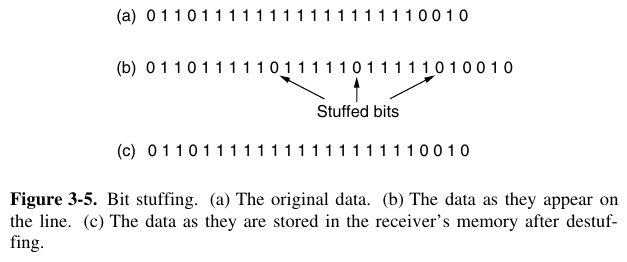

- [Chapter 3: The Data Link Layer](#chapter-3-the-data-link-layer)
- [3.1 Data Link Layer Design Issues](#31-data-link-layer-design-issues)
    - [3.1.1 Services Provided to the Network Layer](#311-services-provided-to-the-network-layer)
    - [3.1.2 Framing](#312-framing)
    - [3.1.3 Error Control](#313-error-control)
    - [3.1.4 Flow Control](#314-flow-control)
  - [3.2 Error Detection and Correction](#32-error-detection-and-correction)
    - [3.2.1 Error-Correcting Codes](#321-error-correcting-codes)
    - [3.2.2 Error-Detecting Codes](#322-error-detecting-codes)
  - [3.3 Elementary Data Link Protocols](#33-elementary-data-link-protocols)
  - [3.6 Summary](#36-summary)

---
# Chapter 3: The Data Link Layer

> This layer deals with efficient communication of **frames** (rather than individual bits, as in the physical layer) between two adjacent machines.

# 3.1 Data Link Layer Design Issues

> The data link layer uses the services of the physical layer to send and receive bits over communication channels. It provides: (1) a well-defined service interface for the network layer; (2) error detection and correction for transmission errors; (3) data flow control.

The data link layer takes packets from the network layer and encapsulates them into **frames** for transmission. Each frame contains a header, a payload (actual message) field for the packet, and a frame trailer.

### 3.1.1 Services Provided to the Network Layer

> The main service is transferring data from the network layer on the source host to the network layer of the destination host.

The actual services provided are protocol-dependent, but in general there are 3 possibilites:

1. **Unacknowledged connectionless service**: the host send independent frames to the destination without having the destination host to acknowledge them. For instance, Ethernet provides such services. It is usually used when error rates are low.
2. **Acknowledged connectionless service**: each frame is individually sent and individually acknowledged. The IEEE 802.11 (WiFI) provides such service. It is useful over unreliable channels.
3. **Acknowledged connection-oriented service**: the source and destination establish a connection before any data is transferred. Each frame sent over the connection is numbered, and the data link guarantees that each frame sent is indeed received. Furthermore, it guarantees that each frame is received exactly once and that all frames are received in the right order.
   - In this type of service, transfers go through 3 distinct phases: (1) establishing connection; (2) frames are transmitted; (3) connection is released.

### 3.1.2 Framing

> To provide service to the network layer, the data link layer must use the service provided to it by the physical layer. What the physical layer does is accept a raw bit stream and attempt to deliver it to the destination.
> 
> The usual approach is for the data link layer to break up the bit stream into discrete frames, compute a short token called a checksum for each frame, and include the checksum in the frame when it is transmitted.

Breaking up the bit stream into frames is more difficult than it appears. There are many methods for framing:
  1. **Byte Count**: a field in the header specifies the number of bytes in the frame. This method is prone to transmission errors with difficult correction, thus it's rarely used.
     - 
  2. **Flag bytes with byte stuffing**: every frame starts and end with special bytes (**flag byte**). When a flag byte occurs in the data, using a escape byte can distinguish it from the actual flag (**byte stuffing**).
     -  
  3. **Flag bits with bit stuffing**: similarly to the previous, but using bits instead of bytes, since some protocols have varying size of frames (e.g., High-level Data Link Control protocol).
     - 
  4. **Physical layer coding violation**: shortcut from the physical layer, using the codes violation to delimit frames.

> In practice, many data link protocols use a combination of these methods for safety.
> 
> For instance, the Ethernet and 802.11 have the frame beginning with a pattern called **preamble**, to allow the receiver to prepare for an incoming packet. The preamble is then followed by a length to locate the end of the frame.

### 3.1.3 Error Control

> Once the problem of framing has been resolved, how do we make sure all frames are delivered to the network layer at the destination and in the proper order?

> The usual way to ensure reliable delivery is to provide the sender with some feedback about what is happening at the other end of the line. Typically, the protocol calls for the receiver to send back special control frames bearing positive or negative acknowledgements about the incoming frames.
> 
> However, there might be cases where the receiver won't react at all (e.g., noise burst). Thus, timers are introduced in the link layer (estimate time for data travel, processing, and feedback).
> 
> Additionally, it is usually important to include sequence numbers to outgoing frames to distinguish retransmissions from original.

### 3.1.4 Flow Control

> Another important design issue that occurs in the data link layer (and higher layers as well) is what to do with a sender that systematically wants to transmit frames faster than the receiver can accept them. 
> 
>  Two approaches
are commonly used: **feedback-based flow control**, the receiver sends back information to the sender giving it permission to send more data, or at least telling the sender how the receiver is doing;**rate-based flow control**, the protocol has a built-in mechanism that limits the rate at which senders may transmit data, without using feedback from the receiver.

## 3.2 Error Detection and Correction

In general, there are two approaches: 
  1. **Error-correcting codes** (also called Forward Error Correction, **FEC**): add redundant information for the receiver to deduce what the information transmitted must have been. 
  2. **Error-detecting codes**: add redundant information for the receiver to deduce that an error has occurred and request retransmission.

> Each of these techniques occupies a different ecological niche. On channels that are highly reliable, such as fiber, it is cheaper to use an error-detecting code and just retransmit the occasional block found to be faulty. However, on channels such as wireless links that make many errors, it is better to add redundancy to each block so that the receiver is able to figure out what the originally transmitted block was. FEC is used on noisy channels because retransmissions are just as likely to be in error as the first transmission.

### 3.2.1 Error-Correcting Codes

1. Hamming codes
2. Binary convolutional codes
3. Reed-Solomon codes
4. Low-Density Parity Check codes

> All of these codes add redundancy to the information that is sent. A frame consists of $m$ data (i.e., message) bits and $r$ redundant (i.e. check) bits. In a **block code**, the $r$ check bits are computed solely as a function of the $m$ data bits with which they are associated, as though the $m$ bits were looked up in a large table to find their corresponding $r$ check bits. In a **systematic code**, the $m$ data bits are sent directly, along with the check bits, rather than being encoded themselves before they are sent. In a **linear code**, the $r$ check bits are computed as a linear function of the $m$ data bits. Exclusive OR (XOR) or modulo 2 addition is a popular choice. This means that encoding can be done with operations such as matrix multiplications or simple logic circuits.

### 3.2.2 Error-Detecting Codes

> Error-correcting codes are widely used on wireless links, which are notoriously noisy and error prone when compared to optical fibers. However, over fiber or high-quality copper, the error rate is much lower, so error detection and retransmission is usually more efficient there for dealing with the occasional error.
> 
> We will examine three different error-detecting codes. They are all linear, systematic block codes.

1. **Parity**: 
2. **Checksums**:
3. **Cyclic Redundancy Checks (CRCs)**:

## 3.3 Elementary Data Link Protocols

> To start with, we assume that the physical layer, data link layer, and network layer are independent processes that communicate by passing messages back and forth.
> 
> The physical layer process and some of the data link layer process run on dedicate hardware called a **NIC(Network Interface Card)**. The rest of the link layer process and the network layer process run on the main CPU as part of the operating system, with the software for the link layer process often taking the form of a **device driver**.
> 
> Another key assumption is that machine A wants to send a long stream of data to machine B, using a reliable, connection-oriented service.
 

## 3.6 Summary

> The Internet uses PPP as the main data link protocol over point-to-point lines. It provides a connectionless unacknowledged service, using flag bytes to delimit frames and a CRC for error detection. It is used to carry packets across a range of links, including SONET links in wide-area networks and ADSL links for the home.