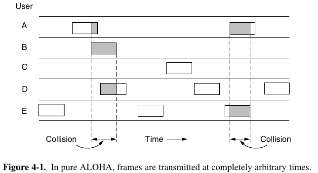
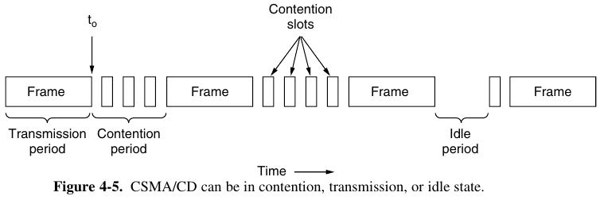
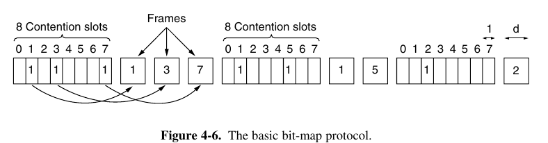
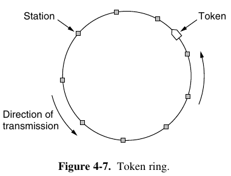
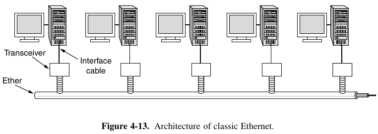
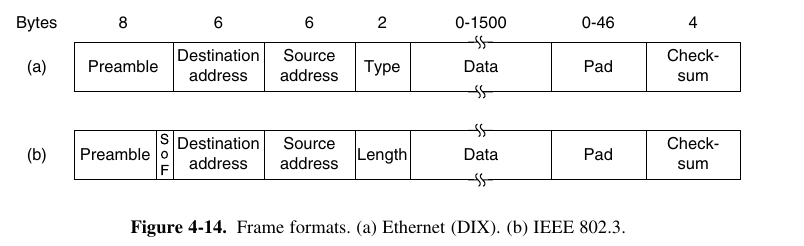
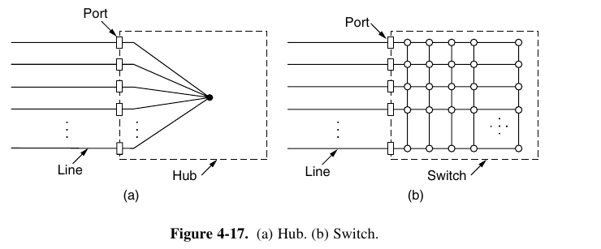
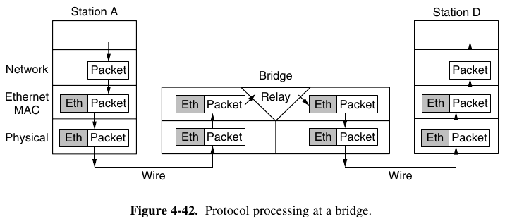
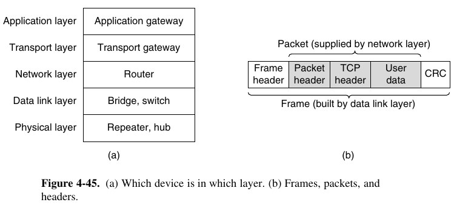

- [Chapter 4: The Medium Access Control Sublayer](#chapter-4-the-medium-access-control-sublayer)
  - [4.1 The Channel Allocation Problem](#41-the-channel-allocation-problem)
    - [4.1.1 Static Channel Allocation](#411-static-channel-allocation)
    - [4.1.2 Assumptions for Dynamic Channel Allocation](#412-assumptions-for-dynamic-channel-allocation)
  - [4.2 Multiple Access Protocols](#42-multiple-access-protocols)
    - [4.2.1 ALOHA](#421-aloha)
    - [4.2.2 Carrier Sense Multiple Access Protocols](#422-carrier-sense-multiple-access-protocols)
      - [CSMA with Collision Detection](#csma-with-collision-detection)
    - [4.2.3 Collision-Free Protocols](#423-collision-free-protocols)
    - [4.2.5 Wireless LAN Protocols](#425-wireless-lan-protocols)
  - [4.3 Ethernet](#43-ethernet)
    - [4.3.1 Classic Ethernet Physical Layer](#431-classic-ethernet-physical-layer)
    - [4.3.2 Classic Ethernet MAC Sublayer Protocol](#432-classic-ethernet-mac-sublayer-protocol)
    - [4.3.4 Switched Ethernet](#434-switched-ethernet)
  - [4.8 Data Link Layer Switching](#48-data-link-layer-switching)
    - [4.8.2 Learning Bridges](#482-learning-bridges)
    - [4.8.4 Repeaters, Hubs, Bridges, Switches, Routers, and Gateways](#484-repeaters-hubs-bridges-switches-routers-and-gateways)

---
# Chapter 4: The Medium Access Control Sublayer

> Network links can be divided into two categories: those using point-to-point connections and those using broadcast channels.
> 
> In any broadcast network,the key issue is how to determine who gets to use the channel when there is competition for it.
> 
> In the literature, broadcast channels are sometimes referred to as **multiaccess channels** or **random access channels**.
> 
> The protocols used to determine who goes next on a multiaccess channel belong to a sublayer of the data link layer called the **MAC (Medium Access Control)** sublayer.
> 
> The MAC sublayer is especially important in LANs, particularly wireless ones because wireless is naturally a broadcast channel. WANs, in contrast, use point-to-point links, except for satellite networks.

## 4.1 The Channel Allocation Problem

### 4.1.1 Static Channel Allocation

> The traditional way of allocating a single channel, such as a telephone trunk, among multiple competing users is to chop up its capacity by using one of the multiplexing schemes, such as FDM (Frequency Division Multiplexing).

### 4.1.2 Assumptions for Dynamic Channel Allocation

1. **Independent Traffic**:  The model consists of N independent stations, each with a program or user that generates frames for transmission.
2. **Single Channel**: A single channel is available for all communication. All stations can transmit on it and all can receive from it. 
3. **Observable Collisions**: If two frames are transmitted simultaneously, they overlap in time and the resulting signal is garbled. This event is called a collision. All stations can detect that a collision has occurred. 
4. **Continuous or Slotted Time**: Time may be assumed continuous, in which case frame transmission can begin at any instant. Alternatively, time may be slotted or divided into discrete intervals (called slots).
5. **Carrier Sense or No Carrier Sense**: With the carrier sense assumption, stations can tell if the channel is in use before trying to use it. If there is no carrier sense, stations cannot sense the channel before trying to use it. They just go ahead and transmit.

## 4.2 Multiple Access Protocols

### 4.2.1 ALOHA

- Pure ALOHA: The basic idea of an ALOHA system is simple: let users transmit whenever they have data to be sent. There will be collisions, of course, and the colliding frames will be damaged. Senders need some way to find out if this is the case. In the ALOHA system, after each station has sent its frame to the central computer, this computer rebroadcasts the frame to all of the stations. A sending station can thus listen for the broadcast from the hub to see if its frame has gotten through. In other systems, such as wired LANs, the sender might be able to listen for collisions while transmitting.
  - 
- Slotted ALOHA: same idea as ALOHA, but uses discrete time to send frames.

### 4.2.2 Carrier Sense Multiple Access Protocols

> Protocols in which stations listen for a carrier (i.e., a transmission) and act accordingly are called carrier sense protocols.

#### CSMA with Collision Detection

> Persistent and  onpersistent CSMA protocols are definitely an improvement over ALOHA because they ensure that no station begins to transmit while the channel is busy. However, if two stations sense the channel to be idle and begin transmitting simultaneously, their signals will still collide. Another improvement is for the stations to quickly detect the collision and abruptly stop transmitting, (rather than finishing them) since they are irretrievably garbled anyway. This strategy saves time and bandwidth and is know as **CSMA/CD (CSMA with Collision Detection)**.

### 4.2.3 Collision-Free Protocols

> Although collisions do not occur with CSMA/CD once a station has unambiguously captured the channel, they can still occur during the contention period.
> 
> Protocols in which the desire to transmit is broadcast before the actual transmission are called **reservation protocols**.
> 
> 

- **Basic bit-map Protocol**: 
- **Token passing**: 
- **Binary countdown**

### 4.2.5 Wireless LAN Protocols

> A common configuration for a wireless LAN is an office building with access points (APs) strategically placed around the building. The APs are wired together using copper or fiber and provide connectivity to the stations that talk to them.

## 4.3 Ethernet

> Many of the designs for personal, local, and metropolitan area networks have been standardized under the name of IEEE 802. The IEEE 802.3 defines the Ethernet.

>  Two kinds of Ethernet exist: **classic Ethernet**, which solves the multiple access problem using the techniques we have studied in this chapter; and **switched Ethernet**, in which devices called switches are used to connect different computers.
> 
>  In practice, only switched Ethernet is used nowadays.

### 4.3.1 Classic Ethernet Physical Layer

### 4.3.2 Classic Ethernet MAC Sublayer Protocol

> When a frame is sent to a group address, all the stations in the group receive it. Sending to a group of stations is called **multicasting**. The special address consisting of all 1 bits is reserved for **broadcasting**.
> 
> An interesting feature of station source addresses is that they are globally unique, assigned centrally by IEEE to ensure that no two stations anywhere in the world have the same address. 

> Classic Ethernet uses the 1-persistent CSMA/CD algorithm. This descriptor just means that stations sense the medium when they have a frame to send and send the frame as soon as the medium becomes idle. They monitor the channel for collisions as they send. If there is a collision, they abort the transmission with a short jam signal and retransmit after a random interval.

### 4.3.4 Switched Ethernet

> Ethernet soon began to evolve away from the single long cable architecture of classic Ethernet. The problems associated with finding breaks or loose connections drove it toward a different kind of wiring pattern, in which each station has a dedicated cable running to a central **hub**. A hub simply connects all the attached wires electrically, as if they were soldered together.
> 
> However, hubs do not increase capacity because they are logically equivalent to the single long cable of classic Ethernet. As more and more stations are added, each station gets a decreasing share of the fixed capacity.
> 
> Fortunately, there is an another way to deal with increased load: **switched Ethernet**. The heart of this system is a **switch** containing a high-speed backplane that connects all of the ports.
> 
> Switches only output frames to the ports for which those frames are destined. When a switch port receives an Ethernet frame from a station, the switch checks the Ethernet addresses to see which port the frame is destined for. This step requires the switch to be able to work out which ports correspond to which addresses.

## 4.8 Data Link Layer Switching

> Many organizations have multiple LANs and wish to connect them. Would it not be convenient if we could just join the LANs together to make a larger LAN? In fact, we can do this when the connections are made with devices called **bridges** (Ethernet switches provide such functionalities and beyond).
> 
> Bridges operate in the data link layer, so they examine the data link layer addresses to forward frames. Since they are not supposed to examine the payload field of the frames they forward, they can handle IP packets as well as other kinds of packets.
> 
>  In contrast, **routers** examine the addresses in packets and route based on them, so they only work with the protocols that they were designed to handle.

### 4.8.2 Learning Bridges

> Each bridge operates in promiscuous mode, that is, it accepts every frame transmitted by the stations attached to each of its ports.
> 
>  The bridge must decide whether to forward or discard each frame, and, if the former, on which port to output the frame. This decision is made by using the destination address.
> 
> A simple way to implement this scheme is to have a big (hash) table inside the bridge. When the bridges are first plugged in, all the hash tables are empty so they use a flooding algorithm: every incoming frame for an unknown destination is output on all the ports to which the bridge is connected except the one it arrived on. The algorithm used by the bridges is **backward learning**.
> 
> Bridges can also clean their hash tables periodically for handling dynamic topologies.

### 4.8.4 Repeaters, Hubs, Bridges, Switches, Routers, and Gateways

> The key to understanding these devices is to realize that they operate in different layers.
> 
> In a typical scenario, the user generates some data to be sent to a remote machine. Those data are passed to the transport layer, which then adds a header (for example, a TCP header) and passes the resulting unit down to the network layer. The network layer adds its own header to form a network layer packet (e.g., an IP packet).
> 
> At the bottom, in the physical layer, we find the **repeaters**:  analog devices that work with signals on the cables to which they are connected, a signal appearing on one cable is cleaned up, amplified, and put out on another cable.
> 
> A **hub**, also a physical layer device, has a number of input lines that it joins electrically. Frames arriving on any of the lines are sent out on all the others. If two frames arrive at the same time, they will collide, just as on a coaxial cable.
> 
> **Bridges** and **Switches** operate on the link layer. 
> 
> A **bridge** connects two or more LANs. Like a hub, a modern bridge has multiple ports. Unlike in a hub, each port is isolated to be its own collision domain; if the port has a full-duplex point-to-point line, the CSMA/CD algorithm is not needed. When a frame arrives, the bridge extracts the destination address from the frame header and looks it up in a table to see where to send the frame.
> 
> Switches are modern bridges by another name. The differences are more to do with marketing than technical issues. However, "switch" is also used as a general term. With a bridge, the functionality is clear. On the other hand, a switch may refer to an Ethernet switch or a completely different kind of device that makes forwarding decisions, such as a telephone switch.
> 
> A **router**, a network-layer device, receives a packet, strips off its frame header and trailer, and passes the payload field to the routing software. This software uses the packet header to choose an output line.

