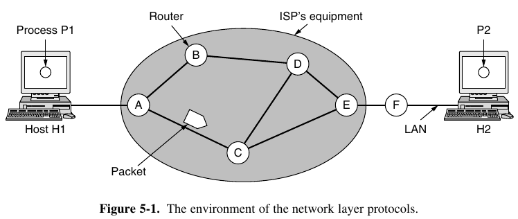
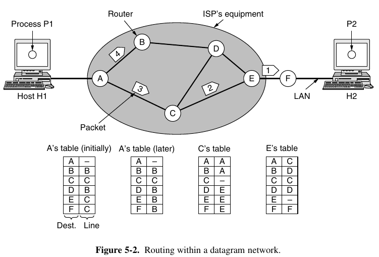
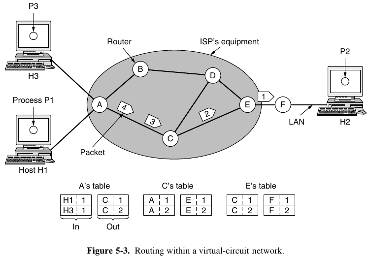
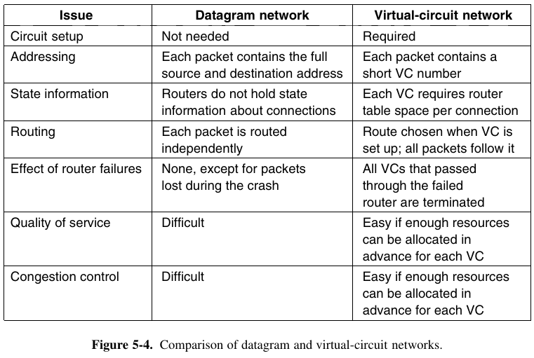

- [Chapter 5: The Network Layer](#chapter-5-the-network-layer)
  - [5.1 Network Layer Design Issues](#51-network-layer-design-issues)
    - [5.1.1 Store-and-Forward Packet Switching](#511-store-and-forward-packet-switching)
    - [5.1.2 Services Provided to the Transport Layer](#512-services-provided-to-the-transport-layer)
    - [5.1.3 Implementation of Connectionless Service](#513-implementation-of-connectionless-service)
    - [5.1.4 Implementation of Connection-Oriented Service](#514-implementation-of-connection-oriented-service)
    - [5.1.5 Comparison of Virtual-Circuit and Datagram Networks](#515-comparison-of-virtual-circuit-and-datagram-networks)

--
# Chapter 5: The Network Layer

> The network layer is concerned with getting packets from the source all the way to the destination. Getting to the destination may require making many hops at intermediate routers along the way. This function clearly contrasts with that of the data link layer, which has the more modest goal of just moving frames from one end of a wire to the other.

## 5.1 Network Layer Design Issues

### 5.1.1 Store-and-Forward Packet Switching

> A host with a packet to send transmits it to the nearest router, either on its own LAN or over a point-to-point link to the ISP. The packet is stored there until it has fully arrived and the link has finished its processing by verifying the checksum. Then it is forwarded to the next router along the path until it reaches the destination host, where it is delivered. This mechanism is **store-and-forward packet switching**.

### 5.1.2 Services Provided to the Transport Layer

The services provided by the network layer to the transport layer should have these goals:

1. The services should be independent of the router technology;
2. The transport layer should be shielded from the number, type, and topology of the routers present;
3. The network addresses made available to the transport layer should use a uniform numbering plan, even across LANs and WANs.

Given this general plan, designers have a lot of freedom in writing detailed specifications of the services to be offered to the transport layer. Thus, some discussions take place. Mainly, whether the network layer should provide connection-oriented service or connectionless service.

> One camp (represented by the Internet community) argues that the routers’ job is moving packets around and nothing else. In this view, the network is inherently unreliable, no matter how it is designed. Therefore, the hosts should accept this fact and do error control (i.e., error detection and correction) and flow control themselves.
> 
> This viewpoint leads to the conclusion that the network service should be connectionless, with primitives `SEND PACKET` and `RECEIVE PACKET` and little else.

> The other camp (represented by the telephone companies) argues that the network should provide a reliable, connection-oriented service.  In this view, quality of service is the dominant factor, and without connections in the network, quality of service is very difficult to achieve, especially for real-time traffic such as voice and video.

> If connectionless service is offered, packets are injected into the network individually and routed independently of each other. In this context, the packets are called **datagrams** and the network is called a **datagram network**.
> 
> If connection-oriented service is used, a path from the source router all the way to the destination router must be established before any
data packets can be sent. This connection is called a **VC (virtual circuit)** and the network is called a **virtual-circuit network**.

### 5.1.3 Implementation of Connectionless Service

> The algorithm that manages the tables and makes the routing decisions is called the **routing algorithm**.
> 
> The IP is the dominant example of a connectionless network service.

### 5.1.4 Implementation of Connection-Oriented Service

> The idea behind virtual circuits is to avoid having to choose a new route for every packet sent, instead, , when a connection is established, a route from the source machine to the destination machine is chosen as part of the connection setup and stored in tables inside the routers. With connection-oriented service, each packet carries an identifier telling which virtual circuit it belongs to.

### 5.1.5 Comparison of Virtual-Circuit and Datagram Networks

> Inside the network, several trade-offs exist between virtual circuits and datagrams. One trade-off is setup time versus address parsing time. Using virtual circuits requires a setup phase, which takes time and consumes resources. However, once this price is paid, figuring out what to do with a data packet in a virtual-circuit network is easy: the router just uses the circuit number to index into a table to find out where the packet goes. In a datagram network, no setup is needed but a more complicated lookup procedure is required to locate the entry for the destination.

