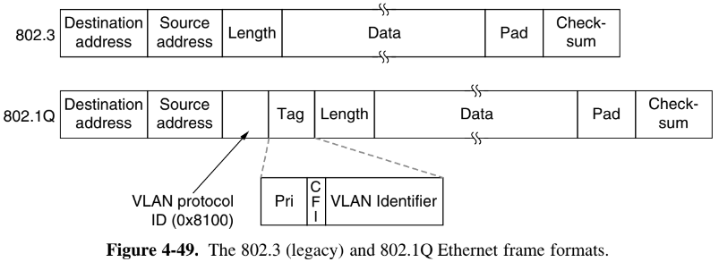

# Virtual Lan: VLANs

> As normas IEEE 802.1Q padronizam o uso de VLANs em redes Ethernet que seguem o padrão IEEE 802.3, nesse padrão são definidos *VLAN tagging* para frames Ethernet bem como *bridges* e *switches* que são capazes de lidar com esses novos pacotes.
> 
> Ademais, outras soluções existem para implementação de VLANs, como, por exemplo, o VLAN Trunking Protocol (VTP) uma solução proprietária da CISCO para propagar a definição de VLANs sobre toda LAN. Nessa solução, os diferentes switches conseguem ser sincronizados de forma automática para propagar as definições de VLAN utilizando o IEEE 802.1Q.

Referências:

- https://en.wikipedia.org/wiki/VLAN
- https://en.wikipedia.org/wiki/IEEE_802.1Q

## Tanenbaum (2011)

> *In the early days of local area networking, thick yellow cables snaked through the cable ducts of many office buildings. Every computer they passed was plugged in. No thought was given to which computer belonged on which LAN. All the people in adjacent offices were put on the same LAN, whether they belonged together or not.*

> VLANs are based on VLAN-aware switches. To set up a VLAN-based network, the network administrator decides how many VLANs there will be, which computers will be on which VLAN, and what the VLANs will be called.

### The IEEE 802.1Q Standard

O padrão IEEE 802.1Q altera a estrutura do quadro Ethernet para permitir que *VLAN tags* fossem passadas em seu cabeçalho. Entretanto, para fazer uso desse campo, as *bridges* e *switches* precisam ser *VLAN Aware*.

> Because there can be computers (and switches) that are not VLAN aware, the first VLAN-aware bridge to touch a frame adds VLAN fields and the last one down the road removes them.

> Additionally, the bridge can use the higher-layer protocol to select the color. In this way, frames arriving on a port might be placed in different VLANs depending on whether they carry IP packets or PPP frames.

> As we mentioned above, when a tagged frame arrives at a VLAN-aware switch, the switch uses the VLAN identifier as an index into a table to find out which ports to send it on.
> 
> VLAN-aware bridges can also autoconfigure themselves based on observing the tags that come by. If a frame tagged as VLAN 4 comes in on port 3, apparently some machine on port 3 is on VLAN 4. The 802.1Q standard explains how to build the tables dynamically, mostly by referencing appropriate portions of the 802.1D standard.

## VLAN Trunking Protocol (VTP)

> https://www.youtube.com/watch?v=Nlyx5lFQR34&ab_channel=CertBros
> 
> https://en.wikipedia.org/wiki/VLAN_Trunking_Protocol
> 
> https://www.ciscopress.com/articles/article.asp?p=29803&seqNum=3 

VTP permite que múltiplos switches compartilhem informações sobre a configuração das VLANs utilizadas. A ideia, é que cada switch mantenha uma tabela com a configuração das VLANs e um número de *provisão* (*provision*), assim, quando um switch atualiza sua tabela esse número é incrementado.

> *In the context of Ethernet VLANs, Cisco uses the term Ethernet trunking to mean carrying multiple VLANs through a single network link through the use of a trunking protocol.[7] To allow for multiple VLANs on one link, frames from individual VLANs must be identified. The most common and preferred method, IEEE 802.1Q adds a tag to the Ethernet frame, labeling it as belonging to a certain VLAN. Since 802.1Q is an open standard, it is the only option in an environment with multiple-vendor equipment. Cisco also has a (now deprecated) proprietary trunking protocol called Inter-Switch Link which encapsulates the Ethernet frame with its own container, which labels the frame as belonging to a specific VLAN. 3Com used proprietary Virtual LAN Trunking (VLT) before 802.1Q was defined.[8]*

No VTP, algumas informações são compartilhadas entre os switches de tempos em tempos:

- Summary Advertisement
- Subset Advertisements

Existem alguns modos que os switches podem ser configurados no VTP:

- VTP Server Mode: pode criar VLANs, enviar updates e notificações do VTP database.
- VTP Client Mode: não podem criar VLANs, mas podem enviar updates e notificações para outros switches.
- VTP Transparent Mode: podem criar VLANs locais, não envia atualizações e updates próprios, mas pode enviar de outros switches que recebeu.

Requisitos:

- Todos os links precisam ser *trunks* para enviar as tags de VLAN;
- Todos switches precisam ter o mesmo *VTP domain name*;
- Todos os switches precisam ter a mesma senha VTP (se for utilizada, opcional);

> VLANs are local to each switch's database, and VLAN information is not passed between switches.
>
> Trunk links provide VLAN identification for frames traveling between switches.
>
> Cisco switches have two Ethernet trunking mechanisms: ISL and IEEE 802.1Q.
>
> Certain types of switches can negotiate trunk links.
>
> Trunks carry traffic from all VLANs to and from the switch by default but can be configured to carry only specified VLAN traffic.
>
> Trunk links must be configured to allow trunking on each end of the link.

