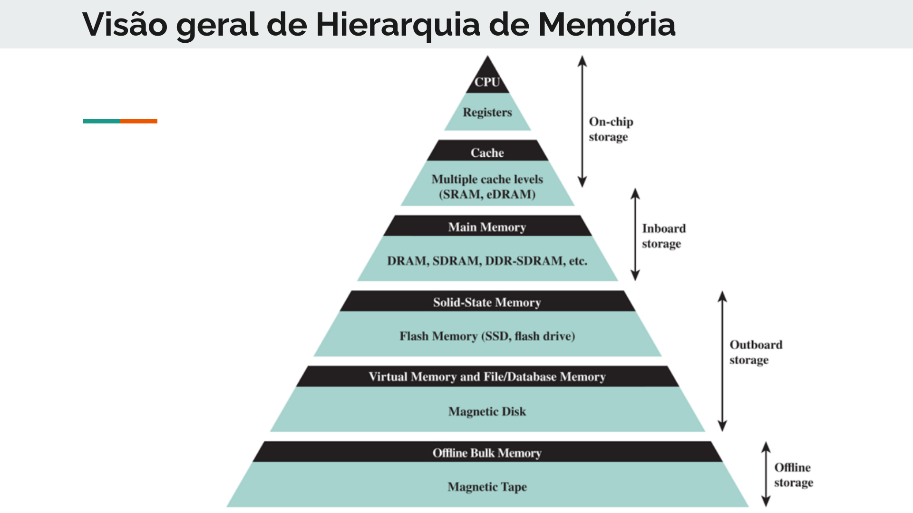
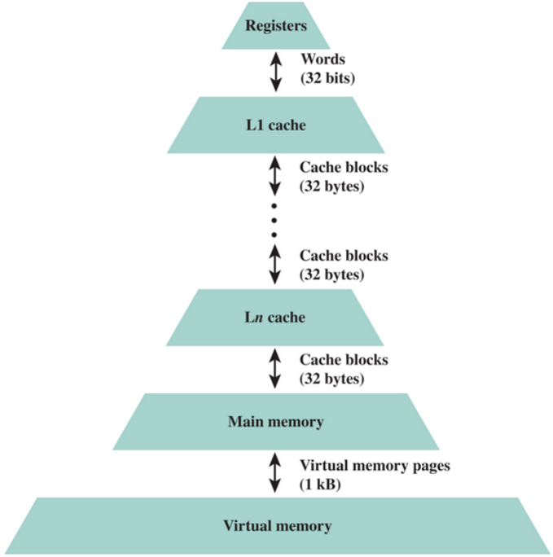
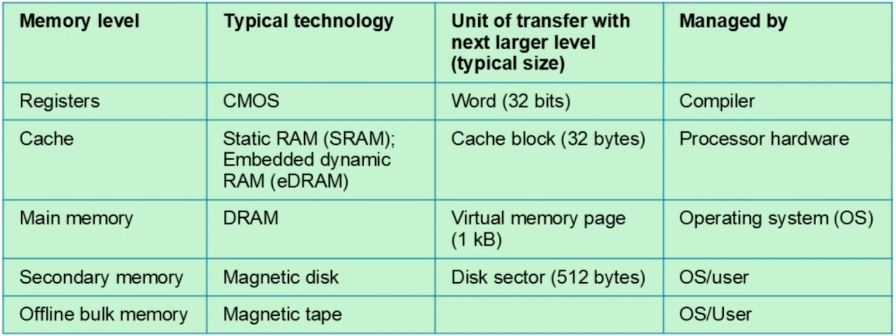

# 2ªVA

- Lista de exercícios para 2ª parte;
- Projeto final MIPS em Verilog;
- Seminário com temas variados;

> https://github.com/jmahler/mips-cpu

# Hierarquia de Memória

- Até agora, vimos: instruções e processador.
- Agora, vamos ver como funciona a *memória* propriamente dita (para o processador, tudo é uma grande *array*).
- A tecnologia atual não permite que existem memórias muito rápidas e pouco custosas;
  - Quanto mais rápido a memória, maior o custo para seu uso.
- As noções de hierarquia de memória auxiliam a compreender essas ideias.
- Analogia: biblioteca e livros
  - Lendo um livro, preciso de algo que não tem nele;
  - Vamos procurar um novo livro que tenha o que precisamos;
  - Agora, temos 2 livros na mesa;
  - Assim, conseguimos migrar de um livro para outro com maior facilidade;
  - Todavia, a mesa não tem tamanho infinito;
  - Achar o que está na mesa é rápido, trocar/procurar novos livros é mais devagar;
  - Mesa: memória rápida;
  - Estante: memória lenta;
  - Hierarquia: Mesa > Prateleira > Biblioteca > Armazém;
  - Podemos adicionar vários níveis intermediários;

## Visão Geral

- **Word** (palavra): unidades naturais de organização da memória. Normalmente, quantidade de bits de um inteiro ou tamanho de uma instrução do processador.
- **Unidades endereçáveis**: em alguns sistemas, a unidade endereçável é a palavra. Em outros, também deve existir um endereçamento a nível de byte. No MIPS, a unidade endereçável é o byte.
- **Unidades de transferência**: números de bits lidos ou escritos na memória por vez.
  - Não necessariamente igual a palavra ou unidade endereçável;
  - Para memória externa, temos *blocos* maiores que palavras;
- Tipos de Acesso:
  - *Acesso Sequencial*: memória organizada em unidade de dados, chamadas de *registros*. O acesso deve ser feito em uma sequência liner específica (primeiro `A`, depois `B`, para chegar finalmente em `C`).
  - *Acesso Aleatório*: cada local endereçável possui um mecanismos de endereçamento exclusivo e fisicamente conectado. Memória principal e cache possuem essa forma de acesso.
  - *Acesso Direto*: blocos ou registros individuais têm um endereço único baseado na localização física. Internamente, esses blocos possuem acesso sequencial. A ideia é que vizinhanças possuam endereço próprio mas um dado em específico é acessado sequencialmente.
- A hierarquia de memória se baseia em alguns princípios:
  > **Princípio da Localidade**: *um programa acessa uma porção relativamente pequena do espaço endereçável em um instante qualquer*.
  > 
  > Esse princípio surge das estruturais simples e naturais de programas (e.g., loops).
  > 
  > Além disso, instruções são normalmente sequenciais. Dados também possuem alta localidade espacial.

  - *Localidade Temporal*: se um item é referenciado, ele tenderá a ser referenciado novamente.
  - *Localidade Espacial*: se um item é referenciado, itens da vizinhança endereçável tendem a ser referenciados também.

  > **Princípio da Inclusão**: *todos os itens de informação são originalmente armazenados em $M_n$, onde $n$ é o nível mais distante do processador*.

  > **Princípio da Coerência**: *as cópias da mesma unidade de dados em níveis de memória adjacentes devem ser consistentes*.
  > 
  > Coerência pode ser mantida tanto pelo *processador* quanto pelo *OS*/*Compilador*/*Programador*.

  - *Coerência Vertical*: se um núcleo fizer uma alteração em um bloco em uma memória de nível superior, a memória do nível anterior precisa ser atualizada antes de outro núcleo solicitá-la.
  - *Coerência Horizontal*: se um núcleo faz um alteração em um bloco também utilizado por outro núcleo, eles devem ser avisados. 

> O nível mais distante do processador que armazena os *dados*. Assim, níveis superiores apenas tem acesso a um subconjunto desses dados por vez.
> 
> Entretanto, os dados apenas trafegam entre níveis adjacentes. Assim, compreender o funcionamento entre dois níveis quaisquer podem ser generalizados entre os demais (apenas com maior/menor granularidade e tempo).

## Conceitos Fundamentais

- A unidade mínima de informação que pode estar presente ou não na hierarquia de dois níveis é chamada de *block* ou *line*.
- Se os dados buscados pelo processador estão no nível superior, temos um *hit*. Do contrário, temos um *miss*.
  - *Hit rate* é a fração de acessos à memória encontrados no nível superior.
  - *Miss rate* é a taxa de de acessos à memória não encontrados no nível superior.
- O tempo de acerto (*hit time*) é o tempo para acessar o nível superior da hierarquia.
- A penalidade de falta (*miss penalty*) é o tempo para substituir um bloco no nível superior com o bloco desejado no nível inferior somado ao tempo para entregar esse bloco ao processador.

## Modelo de Desempenho

Para expressar o tempo médio de acesso entre dois níveis, fazemos: 

> $T_s = T_1 + (1 - H) \times T_2$, onde $T_s$ é o tempo médio de acesso do sistema, $T_i$ é o tempo de acesso para $M_i$, $H$ é o *hit rate*.

Ja para o custo médio desse modelo de memória (combinando os 2 níveis, pode ser em termos de diferentes características de custo), fazemos:

> $C_s = \frac{C_1S_1 + C_2S_2}{S_1 + S_2}$, onde $C_i$ é o custo médio por bit para a memória $M_i$ e $S_i$ é o tamanho de $M_i$.
> 
> Gostaríamos que $C_s \approx C_2$ (custo médio ), visto que $C_1 >> C_2$, para conseguirmos esses resultados precisamos que $S_1 << S_2$. 

Além disso, também queremos $T_s \approx T_1$, ou seja, precisamos que $H \approx 1$ (mais próximo de 1).

Ou seja, temos um problema com 2 objetivos. Precisamos de memórias de nível superior com custo similar aos das inferiores, ao mesmo tempo que a taxa de acerto é mais rápido.

Podemos fixar um $H$ razoável para determinar $S_1$ de acordo com 2 pontos:

- Grau de localidade;
- Software que executa a organização do sistema de memória;
- Outros;

## Tecnologias de Memória

- CMOS (*Complementary Metal-Oxide Semicondutor*)
- SRAM (*Static random access memory*)
- DRAM (*Dynamic random access memory*)
- FLASH
  - NAND Flash
  - NOR Flash
- Discos e Fitas magnéticas

### SRAM

- Modelo simples de acesso a dados;
- Geralmente uma única porta de acesso para leitura ou escrita;
- Volátil e enquanto energia for aplicada retém os dados;
- Requer 4-6 transistores por bit para ser implementada;

> Transistor: elemento semicondutor, substitui as válvulas.
>  
