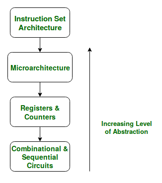
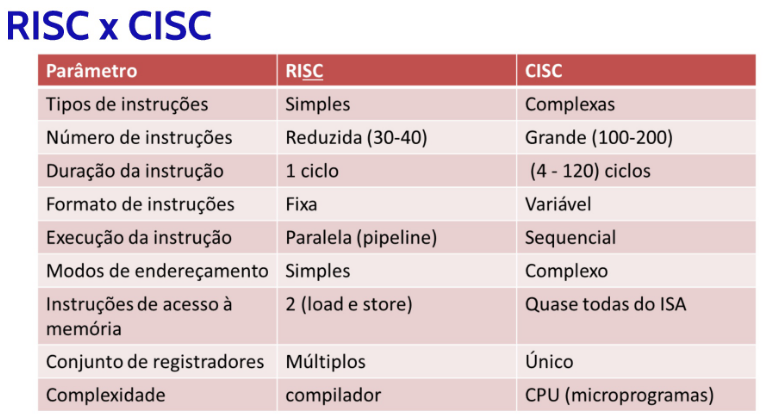
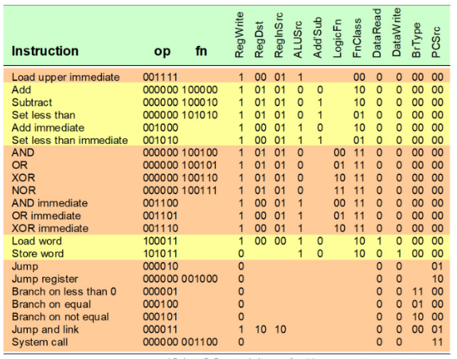
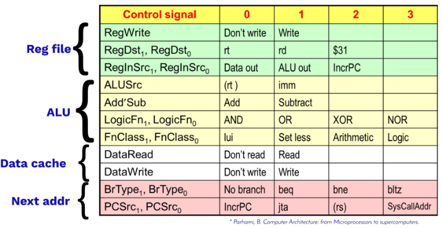
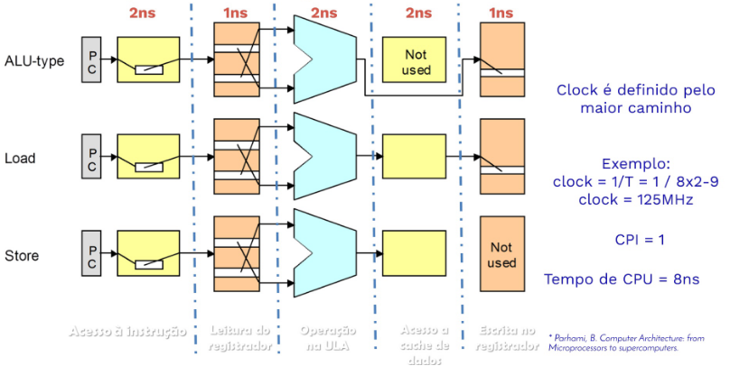
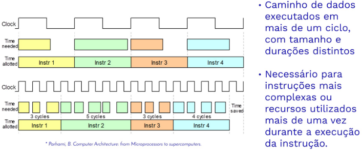

# Aula 06 - Caminho de Dados

## Ideias para Arquitetura de Computadores

1. Projetar pensando na Lei de Moore: projetos computacionais mudam rapidamente;
2. Usar abstrações para simplificar o projeto;
3. Fazer casos comuns mais rápidos;
4. Desempenho por **paralelismo**: operações em paralelo aumentam o desempenho;
5. Desempenho por **pipeline**: padrão de paralelismo prevalente na computação;
6. Desempenho por **predição**: algumas vezes é mais rápido iniciar algo previsto que esperar a certeza para iniciar a execução;
7. Hierarquia de Memória: memórias mais rápidas (mais caras, menor quantidade) e memórias mais lentas (mais baratas, maior quantidade);
8. Confiabilidade via **redundância**: adicionar componentes redundantes pode ajudar na detecção/correção de falhas;

## Responsabilidades do Processador

O processador possui algumas responsabilidades:

- Controle;
- Caminho de Dados;
- Controle de Registradores;
- Acesso à Memória;

> *A datapath is a collection of functional units such as arithmetic logic units or multipliers that perform data processing operations, registers, and buses.* **(Wikipedia, Datapath)**
> 
> *The control unit (CU) is a component of a computer's central processing unit (CPU) that directs the operation of the processor. A CU typically uses a binary decoder to convert coded instructions into timing and control signals that direct the operation of the other units (memory, arithmetic logic unit and input and output devices, etc.).* **(Wikipedia, Control Unit)**

## Instruction Set Architecture

> *An Instruction Set Architecture (ISA) is part of the abstract model of a computer that defines how the CPU is controlled by the software. The ISA acts as an interface between the hardware and the software, specifying both what the processor is capable of doing as well as how it gets done.* **(ARM, Glossary ISA)**

- RISC: Reduced Instruction Set Computing
  - Conjunto pequeno de instruções;
  - Instruções e opcodes com tamanho fixo (e.g., 32 bits);
  - Instruções simples e muito usadas;
  - Menor complexidade do processador;
  - Instruções com formato simples;
  - Endereçamento simples (reg-reg, acesso a memória através de instruções);
  - Exemplos: ARM, MIPS, Spark, PowerPC;
- CISC: Complex Instruction Set Computing
  - Vários formatos de instruções e tamanhos diferentes;
  - Instruções convenientes e poderosas;
  - Maior complexidade do processador;
  - Instruções específicas para diferentes casos;
  - Programas ocupam menos espaço em memória;
  - Endereçamento flexível (reg-reg, reg-mem, mem-mem);
  - Exemplos: 6800, x86;

Todavia, existem arquiteturas híbridas. Normalmente, com CISC e um módulo extra RISC. Assim, instruções comuns são executadas diretamente pelo hardware, enquanto instruções complexas são executadas através de micro-programas.

## Ciclo de Instrução

1. **Buscar Instrução**: ler a próxima instrução esperada em um buffer;
2. **Decodificar Instrução**: determinar opcode, obter endereço dos operandos;
3. **Carregar Operando**: se estivar na memória, carregá-los;
4. **Execução**: efetuar operação indicada na ALU;
5. **Armazenar Resultados**: salvar resultados na memória;

## Elementos Combinacionais

- Elementos operacionais como ALU e portas lógicas;
- Lógica combinacional transforma dados durante o ciclo do clock;

## Elementos Sequenciais

- Elementos de memória (e.g., registrados e memória);

## Arquitetura Monociclo

- Cada instrução gasta 1 ciclo de clock para ser executada;
- Apenas lógica combinacional é utilizada na implementação da instrução;
- Não existem estados intermediários;

## Caminho de Dados

- Unidades funcionais para operar sobre os dados ou conter esses dados dentro do processador;
- No MIPS, temos:
  - Program Counter (PC);
  - Cache de Instruções e Dados;
  - Banco de Registradores;
  - Arithmetic Logic Unit (ALU, ou ULA);

### Program Counter

- Registrador contendo o endereço da instrução do programa sendo executada;
- Existem algumas formas de atualizar o próximo PC:
  - Padrão, Desvio, Jump, JR, Endereço de Rotina;

### Banco de Registradores

- Conjunto de registradores que armazenam operandos e sinais de controle;
- O registrador armazena dados em um circuito:
  - Usando o sinal de clock para determinar quando atualizar o valor armazenado;
  - Edge Triggered: atualiza quando o clock muda de LOW para HIGH;

### Sinais de Controle

## Desempenho

- Tempo de Resposta: tempo total para o computador executar uma tarefa;
- Clock: tempo de execução de um ciclo no processador;
- Throughput: número de tarefas completadas por unidade de tempo;
- Millions of Instructions per Second (MIPS)
- Millions of Floating-Point Operations per Second (MFLOPS)
- CPI: número médio de ciclos de clock por instrução para um programa ou fragmento de programa;
- Tempo de CPU: tempo real que a CPU gasta calculando para uma tarefa específica;

## Desempenho Arquitetura Monociclo

## Arquitetura multiciclo

## Monociclo vs Multiciclo

- Monociclo
  - Cada instrução gasta 1 ciclo de clock;
  - Toda atualização de estado é realizada ao final do ciclo de clock;
  - Instrução com maior tempo de execução determina o clock;
- Multiciclo
  - Processamento da instrução dividido em vários estágios
  - Atualização de estados realizados em vários pontos durante a execução;
  - O estágio mais lento determina o clock;

## Como melhorar o desempenho?

- Sobrepor a execução de várias instruções em um projeto de ciclo único, começando a próxima instrução antes da anterior ser finalizada: **Pipeline** e **Superpipeline**.
- Utilizar caminhos de dados múltiplos e independentes que podem aceitar diversas instruções lidas de uma só vez: **Superescalar**.