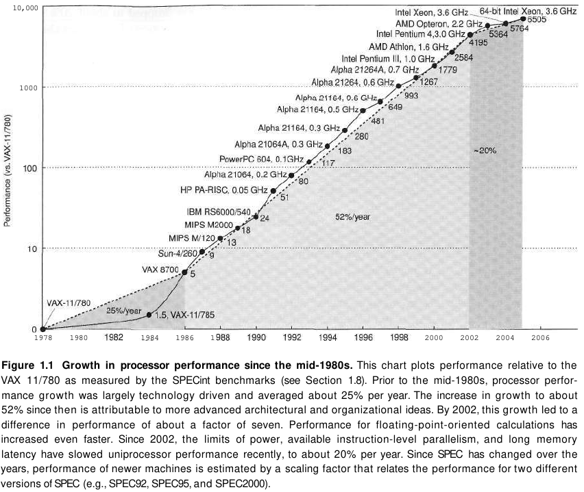
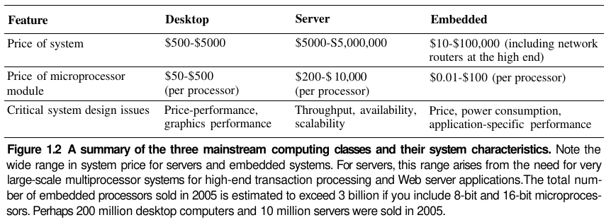

- [Chapter 1: Fundamentals of Computer Design](#chapter-1-fundamentals-of-computer-design)
  - [1.1 Introduction](#11-introduction)
  - [1.2 Classes of Computers](#12-classes-of-computers)
    - [Desktop Computing](#desktop-computing)
    - [Servers](#servers)
    - [Embedded Computers](#embedded-computers)
    - [1.3 Defining Computer Architecture](#13-defining-computer-architecture)
      - [Instruction Set Architecture](#instruction-set-architecture)

---
# Chapter 1: Fundamentals of Computer Design

## 1.1 Introduction

> Although technological improvements have been fairly steady, progress arising from better computer architectures has been much less consistent.

**RISC** (Reduced Instruction Set Computer) architectures focused attention on the exploitation of instruction-level parallelism (initially through pipelines and later by multiple instruction issue) and use of caches.

> These innovations led to a renaissance in computer design, which emphasized both architectural innovation and efficient use of technology improvements.

> Since 2002, processor performance improvement has dropped to about 20% per year due to the triple hurdles of maximum power dissipation of air-cooled chips, little instruction-level parallelism left to exploit efficiently, and almost unchanged memory latency.

> [...] This signals a historic switch from relying solely on instruction- level parallelism (ILP) [...] to thread-level parallelism (TLP) and data-level parallelism (DLP).

> Whereas the compiler and hardware conspire to exploit ILP implicitly without the programmer's attention, TLP and DLP are explicitly parallel, requiring the programmer to write parallel code to gain performance.

## 1.2 Classes of Computers

### Desktop Computing

> [...] the desktop market tends to be driven to optimize *price-performance*. This combination of performance (measured primarily in terms of compute performance and graphics performance) and price of a system is what matters most to customers in this market, and hence to computer designers.

### Servers

> As the shift to desktop computing occurred, the role of servers grew to provide larger-scale and more reliable file and computing services.

> For servers, different characteristics are important. First, dependability is critical. [...] A second key feature of server systems is scalability. [...] Lastly, servers are designed for efficient throughput.

> A related category is supercomputers. They are the most expensive computers, costing tens of millions of dollars, and they emphasize floating-point performance. Clusters of desktop computers [...] have largely overtaken this class of computer. As clusters grow in popularity, the number of conventional supercomputers is shrinking, as are the number of companies who make them.

### Embedded Computers

> Embedded computers are the fastest growing portion of the computer market. These devices range from everyday machines [...] to handheld digital devices [...] to video games and digital set-top boxes.

> Although the range of computing power in the embedded computing market is very large, price is a key factor in the design of computers for this space

### 1.3 Defining Computer Architecture

> The task the computer designer faces is a complex one: Determine what attributes are important for a new computer, then design a computer to maximize performance while staying within cost, power, and availability constraints.
> 
> This task has many aspects, including instruction set design, functional organization, logic design, and implementation. The implementation may encompass inte-
grated circuit design, packaging, power, and cooling.

> In the past, the term computer architecture often referred only to instruction set design. Other aspects of computer design were called implementation, often insinuating that implementation is uninteresting or less challenging.

#### Instruction Set Architecture

> We use the term instruction set architecture (ISA) to refer to the actual programmer-visible instruction set in this book. The ISA serves as the boundary between the software and hardware.

> Class of ISA—Nearly all ISAs today are classified as general-purpose register architectures, where the operands are either registers or memory locations
> 
>  Memory addressing—Virtually all desktop and server computers, including the 80x86 and MIPS, use byte addressing to access memory operands.
> 
> Addressing modes—In addition to specifying registers and constant operands, addressing modes specify the address of a memory object.

