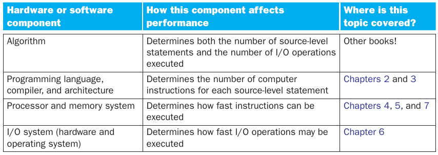
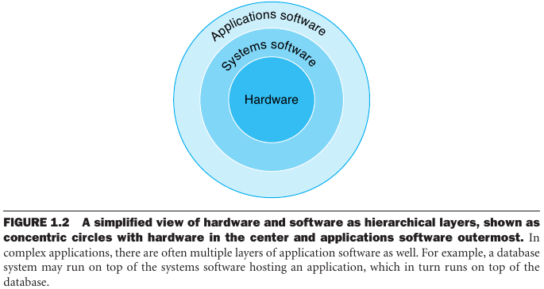
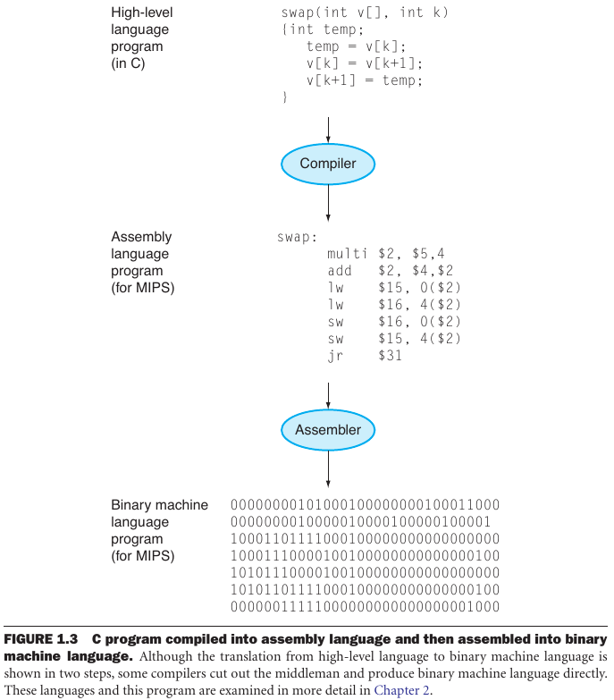
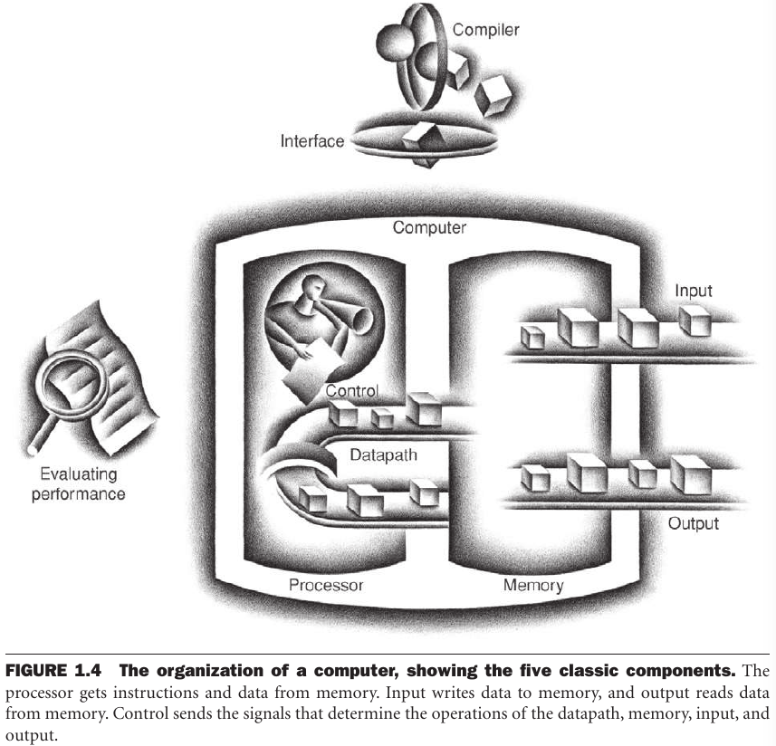

- [Chapter 1: Computer Abstractions and Technology](#chapter-1-computer-abstractions-and-technology)
  - [1.1 Introduction](#11-introduction)
    - [Classes of Computing Applications and Their Characteristics](#classes-of-computing-applications-and-their-characteristics)
    - [Understanding Performance](#understanding-performance)
  - [1.2 Below Your Program](#12-below-your-program)
    - [From a High-Level Language to the Language of Hardware](#from-a-high-level-language-to-the-language-of-hardware)
  - [1.3 Under the Covers](#13-under-the-covers)
  - [1.4 Performance](#14-performance)
    - [Defining Performance](#defining-performance)
    - [Measuring Performance](#measuring-performance)

---
# Chapter 1: Computer Abstractions and Technology

## 1.1 Introduction

> Programmers who seek to build
competitive versions of compilers, operating systems, databases, and even applications will therefore need to increase their knowledge of computer organization.

### Classes of Computing Applications and Their Characteristics

> **Desktop computers** emphasize delivery of good performance to single users at low cost and usually execute third-party software. The evolution of many
computing technologies is driven by this class of computing.

> **Servers** are the modern form of what were once mainframes, minicomputers, and supercomputers, and are usually accessed only via a network. Servers are oriented to carrying large workloads [...] or handling many small jobs.

> **Embedded computers** are the largest class of computers and span the widest range of applications and performance. Embedded applications often have unique application requirements that combine a minimum performance with stringent limitations on cost or power.

### Understanding Performance

## 1.2 Below Your Program

> [...]  the hardware in a computer can only execute extremely simple low-level instructions. To go from a complex application to the simple instructions involves several layers of software that interpret or translate high-level operations into simple computer instructions.

System software can either be an **operation system** or a **compiler**.

### From a High-Level Language to the Language of Hardware

> To actually speak to electronic hardware, you need to send electrical signals. The easiest signals for computers to understand are on and off, and so the computer alphabet is just two letters.

An **assembler** is a program that translates symbolic version of instructions into their binary version. The language recognized by an assembler is called **assembly language**. The actual language understood by the machine (binary) is the **machine language**.

**High level programming languages** enable to write programs closer to natural language than assembly language.

> High-level programming languages offer several important benefits. First, they allow the programmer to think in a more natural language [...] Moreover, they allow languages to be designed according to their intended use.

## 1.3 Under the Covers

>  The underlying hardware in any computer performs the same basic functions: inputting data, outputting data, processing data, and storing data.

> The five classic components of a computer are **input**, **output**, **memory**, **datapath**, and **control**, with the last two sometimes combined and called the **processor**.

> [...]  the **instruction set architecture**, or simply **architecture**, of a computer, includes anything programmers need to know to make a binary machine language program work correctly, including instructions, I/O devices, and so on. 

> The combination of the basic instruction set and the operating system interface provided for application programmers is called the **application binary interface (ABI)**.

> Both hardware and software consist of hierarchical layers, with each lower layer hiding details from the level above. This principle of abstraction is the way both hardware designers and software designers cope with the complexity of computer systems. One key interface between the levels of abstraction is the instruction set architecture—the interface between the hardware and low-level software. This abstract interface enables many implementations of varying cost and performance to run identical software.

## 1.4 Performance

> Assessing the performance of computers can be quite challenging. The scale and intricacy of modern software systems, together with the wide range of performance improvement techniques employed by hardware designers, have made performance assessment much more difficult.
 
### Defining Performance

> As an individual computer user, you are interested in reducing **response time**—the time between the start and completion of a task—also referred to as **execution time**.

> Datacenter managers are often interested in increasing **throughput** or **bandwidth**—the total amount of work done in a given time.

### Measuring Performance

> Time is the measure of computer performance: the computer that performs the same amount of work in the least time is the fastest. Program execution time is measured in seconds per program. However, time can be defined in different ways, depending on what we count.

**Wall clock time**, **response time** or **elapsed time**, is the total time to complete a task (including I/O, disk access, memory access, etc).

> **CPU execution time** or simply **CPU time** [...] is the time the CPU spends computing for this task and does not include time spent waiting for I/O or running other programs.

CPU time can be further divided into **user CPU time** (time spent in the program) and **system CPU time** (time spent by the system on behalf of the program).

> [...] computer designers may want to think about a computer by using a measure that relates to how fast the hardware can perform basic functions.

**Clock cycles** (or ticks, clock ticks, clock periods, clocks, cycles) are discrete time intervals that determines when events take place in the hardware.

> Designers refer to the length of a clock period both as the time for a complete clock cycle (e.g., 250 picoseconds, or 250 ps) and as the clock rate (e.g., 4 gigahertz, or 4 GHz), which is the inverse of the clock period.

**Clock cycles per instruction (CPI)** is the average number of clock cycles required to execute an instruction.

$\text{CPU time} = \text{Instruction count} \times \text{CPI} \times \text{Clock cycle time}$