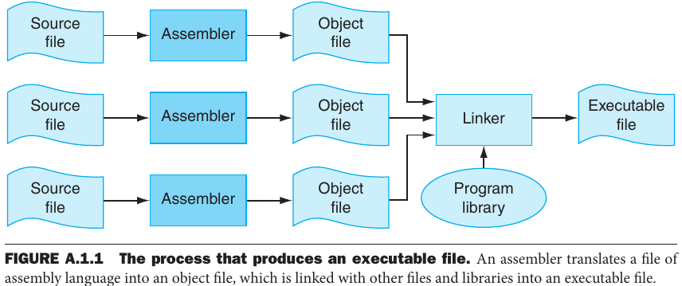
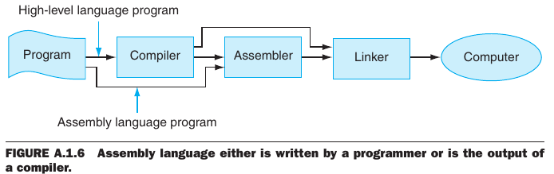

- [Appendix A: Assemblers, Linkers, and the SPIM Simulator](#appendix-a-assemblers-linkers-and-the-spim-simulator)
  - [A.1 Introduction](#a1-introduction)
    - [When to Use Assembly Language](#when-to-use-assembly-language)
    - [Drawbacks of Assembly Language](#drawbacks-of-assembly-language)
  - [A.2 Assemblers](#a2-assemblers)

---
# Appendix A: Assemblers, Linkers, and the SPIM Simulator

## A.1 Introduction

> *Assembly language* is the symbolic representation of a computer's binary encoding. It is more readable than machine language, because it uses symbols instead of bits. In addition, it enables the use of *labels* to identify and name particular memory words that hold instructions or data.

> An **assembler** translates assembly language into binary instructions. **Macros** enable the programmer to extend the assembly language by defining new operations.

> An assembler reads a single assembly language source file and produces an object file, which consists of machine instructions and bookkeeping information that enables to combine several object files into a program.

>  *The code in a module cannot be executed when it contains **unresolved references** to labels in other object files or libraries. Another tool, called a **linker**, combines a collection of object and library files into an executable file, which a computer can run.*

>  Names that  begin with a period, for example `.data` and `.globl`, are **assembler directives** that tell the assembler how to translate a program but do not produce machine instructions.  Names followed by a colon, such as `str:` or `main:`, are labels that name the next memory location.

### When to Use Assembly Language

> The primary reason to program in assembly language, as opposed to an available high-level language, is that the speed or size of a program is critically important.

### Drawbacks of Assembly Language

> Assembly language has many disadvantages that strongly argue against its widespread use. Perhaps its major disadvantage is that programs written in assembly language are inherently machine-specific and must be totally rewritten to run on another computer architecture. 

## A.2 Assemblers

> An assembler translates a file of assembly language statements into a file of binary machine instructions and binary data. The translation process has two major parts. The first step is to find memory locations with labels so that the relationship between symbolic names and addresses is known when instructions are translated. The second step is to translate each assembly statement by combining the numeric equivalents of opcodes, register specifiers, and labels into a legal instruction.

> Unlike names in most high-level languages, assembly labels may be used before they are defined through **forward reference**. If a line begins with a label, the assembler records in its **symbol table** the name of the label and the address of the memory word that the instruction occupies.