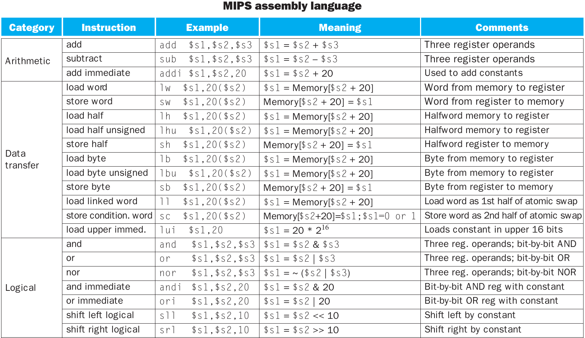
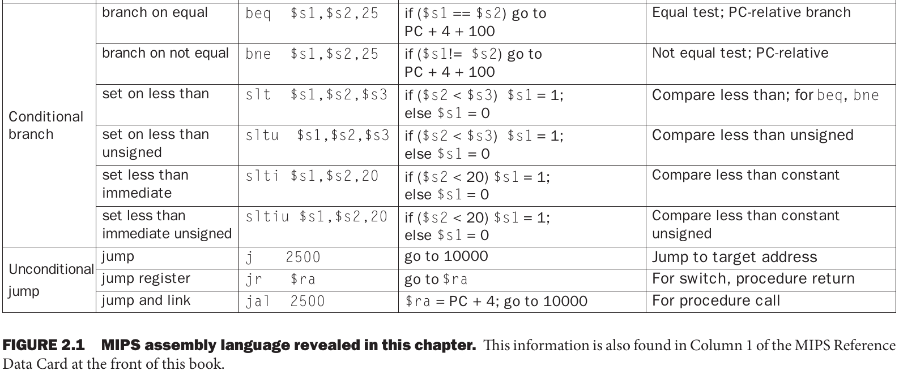
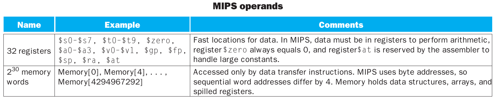
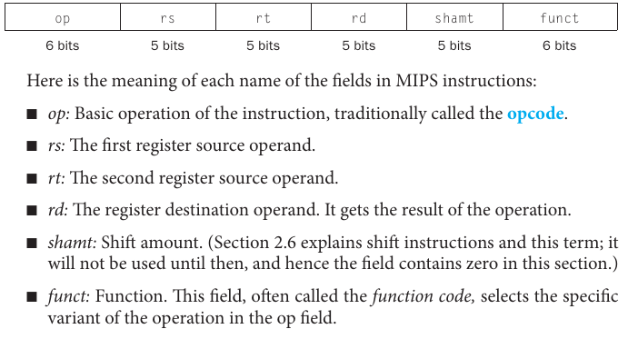
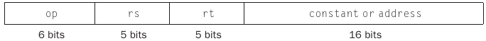
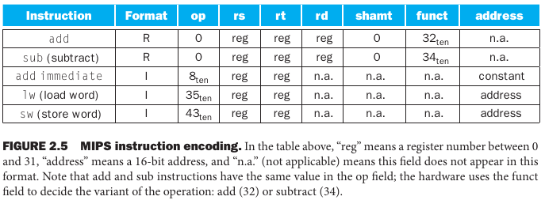
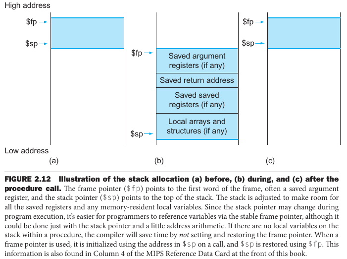
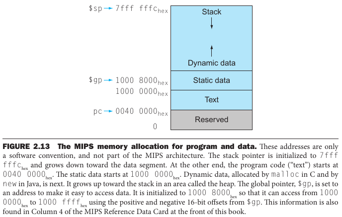
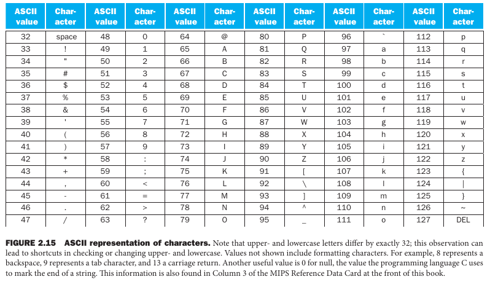
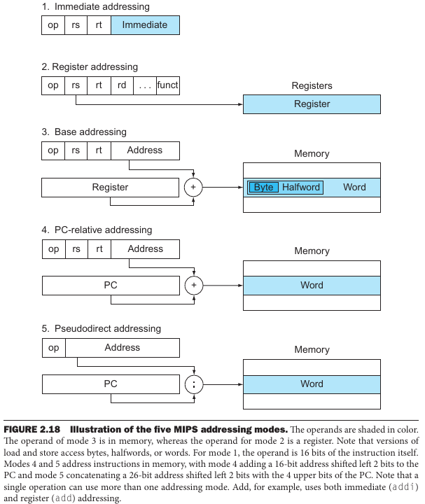

- [Chapter 2: Instructions: Language of the Computer](#chapter-2-instructions-language-of-the-computer)
  - [2.1 Introduction](#21-introduction)
  - [2.2. Operations of the Computer Hardware](#22-operations-of-the-computer-hardware)
  - [2.3 Operands of the Computer Hardware](#23-operands-of-the-computer-hardware)
    - [Memory Operands](#memory-operands)
  - [2.4 Signed and Unsigned Numbers](#24-signed-and-unsigned-numbers)
  - [2.5 Representing Instructions in the Computer](#25-representing-instructions-in-the-computer)
    - [MIPS Fields](#mips-fields)
  - [2.6 Logical Operations](#26-logical-operations)
  - [2.7 Instructions for Making Decisions](#27-instructions-for-making-decisions)
    - [Loops](#loops)
    - [Case/Switch Statement](#caseswitch-statement)
  - [2.8 Supporting Procedures in Computer Hardware](#28-supporting-procedures-in-computer-hardware)
      - [Using More Registers](#using-more-registers)
      - [Allocating Space for New Data on the Stack](#allocating-space-for-new-data-on-the-stack)
      - [Allocating Space for New Data on the Heap](#allocating-space-for-new-data-on-the-heap)
  - [2.9 Communicating with People](#29-communicating-with-people)
  - [2.10 MIPS Addressing for 32-bit Immediate and Addresses](#210-mips-addressing-for-32-bit-immediate-and-addresses)
    - [32-Bit Immediate Operands](#32-bit-immediate-operands)
    - [Addressing in Branches and Jumps](#addressing-in-branches-and-jumps)
    - [MIPS Addressing Mode Summary](#mips-addressing-mode-summary)
    - [Decoding Machine Language](#decoding-machine-language)

---
# Chapter 2: Instructions: Language of the Computer

## 2.1 Introduction

> This similarity of instruction sets occurs because all computers are constructed from hardware technologies based on similar underlying principles and because there are a few basic operations that all computers must provide. 

> **Stored-program concept** instruction and data of many types can be stored in memory as numbers, leading to the stored program computer.

## 2.2. Operations of the Computer Hardware

> *Design Principle 1*: Simplicity favors regularity.

## 2.3 Operands of the Computer Hardware

> Unlike programs in high-level languages, the operands of arithmetic instructions are restricted; they must be from a limited number of special locations built directly in hardware called **registers**.
>
> Registers are primitives used in hardware design that are also visible to the programmer when the computer is completed, so you can think of registers as the bricks of computer construction. 
> 
>  The size of a register in
the MIPS architecture is 32 bits; groups of 32 bits occur so frequently that they are given the name **word** in the MIPS architecture.

In the MIPS architecture, there are a limited number of registers (usually, 32).

> *Design Principle 2:* Smaller is faster.

### Memory Operands

MIPS arithmetic operations can only use register, since this number is limited it must access the main memory.

> [...] **Data transfer instructions** are used to access a word in memory by supplying the memory **address**.

> In addition to associating variables with registers, the compiler allocates data structures like arrays and structures to locations in memory. The compiler can then place the proper starting address into the data transfer instructions.

> In MIPS, words must start at addresses that are multiples of 4. This requirement is called an **alignment restriction** (data must ne aligned in memory on natural boundaries), and many architectures have it.

> Computers divide into those that use the address of the leftmost or “big end” byte as the word address versus those that use the rightmost or “little end” byte. 

## 2.4 Signed and Unsigned Numbers

> **Least significant bit** is the rightmost bit in a MIPS word.
>
> **Most significant bit** is the leftmost bit in a MIPS word.

> It’s up to the programming language, the operating system, and the program to determine what to do if overflow occurs.

## 2.5 Representing Instructions in the Computer

> Instructions are kept in the computer as a series of high and low electronic signals and may be represented as numbers. In fact, each piece of an instruction can be considered as an individual number, and placing these numbers side by side forms the instruction

> The **instruction format** is a form of representation of an instruction composed of fields of binary numbers.

> **Machine Language** is the binary representation used for communication within a computer system.

### MIPS Fields

> A problem occurs when an instruction needs longer fields than those shown above. For example, the load word instruction must specify two registers and a constant. If the address were to use one of the 5-bit fields in the format above, the constant within the load word instruction would be limited to only 25 or 32. This constant is used to select elements from arrays or data structures, and it often needs to be much larger than 32. This 5-bit field is too small to be useful.

> *Design Principle 3:* Good design demands good compromises.

> The compromise chosen by the MIPS designers is to keep all instructions the same length, thereby requiring different kinds of instruction formats for different kinds of instructions. For example, the format above is called **R-type** (for register) or **R-format**. A second type of instruction format is called **I-type** (for immediate) or **I-format** and is used by the immediate and data transfer instructions. The last type of instruction is called **J-format** (for jump instructions).

> Today’s computers are built on two key principles:
> 1. Instructions are represented as numbers.
> 2. Programs are stored in memory to be read or written, just like data.

## 2.6 Logical Operations

- Shifts
- AND
- OR
- NOT

## 2.7 Instructions for Making Decisions

> **Conditional branch** is an instruction that requires the comparison of two values and that allows for a subsequent transfer of control to a new address in the program based on the outcome of th comparison.

### Loops

Can be achieved with conditional branches and saving intermediary results.

### Case/Switch Statement

Can be achieved either with conditional branches or with a **jump address table**.

## 2.8 Supporting Procedures in Computer Hardware

Can be implemented with **jump-and-link** (`jal`) instructions. In general, the execution of a procedure is as follows:

1. The parameters are put in a place where the procedure can access them;
2. Control is transferred to the procedure;
3. Storage resources needed for the procedure are acquired;
4. The procedure performs the task;
5. The procedure put the resultas in place where the calling program can access;
6. Control is returned to the point of origin.

> In addition to allocating these registers, MIPS assembly language includes an instruction just for the procedures: it jumps to an address and simultaneously saves the address of the following instruction in register `$ra`.
> 
> Implicit in the stored-program idea is the need to have a register to hold the address of the current instruction being executed. For historical reasons, this register is almost always called the **program counter**, abbreviated PC in the MIPS architecture.

#### Using More Registers

The idea is to use the main memory with a **stack** and saving the **stack pointer** into the register `$sp`.

#### Allocating Space for New Data on the Stack

> The final complexity is that the stack is also used to store variables that are local to the procedure but do not fit in registers, such as local arrays or structures.
> 
>  The segment of the stack containing a procedure’s saved registers and local variables is called a procedure frame or activation record. 

#### Allocating Space for New Data on the Heap

> In addition to automatic variables that are local to procedures, C programmers need space in memory for static variables and for dynamic data structures.

> In the 2012 version, we can find the MIPS memory layout in details.

## 2.9 Communicating with People

> MIPS has load/store to bytes and halfwords.

## 2.10 MIPS Addressing for 32-bit Immediate and Addresses

> Although keeping all MIPS instructions 32 bits long simplifies the hardware, there are times where it would be convenient to have a 32-bit constant or 32-bit address.

### 32-Bit Immediate Operands

> Although constants are frequently short and fit into the 16-bit field, sometimes they are bigger. The MIPS instruction set includes the instruction load upper immediate (`lui`) specifically to set the upper 16 bits of a constant in a register, allowing a subsequent instruction to specify the lower 16 bits of the constant.

### Addressing in Branches and Jumps

> The MIPS jump instructions have the simplest addressing. They use the final MIPS instruction format, called the **J-type**, which consists of 6 bits for the operation field and the rest of the bits for the address field.

However, branching instructions only have 16 bits for address. Thus, MIPS provides multiple addressing modes.

### MIPS Addressing Mode Summary

1. **Immediate addressing**: the operand is a constant within the instruction itself;
2. **Register addressing**: the operand is a register;
3. **Base** or **displacement addressing**: the operand is at the memory location whose address is the sum of a register and a constant in the instruction;
4. **PC-relative addressing**: the branch address is the sum of the PC and a constant in the instruction;
5. **Pseudodirect addressing**: the jump address is the 26 bits of the instruction concatenated with the upper bits of the PC.

### Decoding Machine Language

> Sometimes you are forced to reverse-engineer machine language to create the original assembly language. One example is when looking at "core dump".