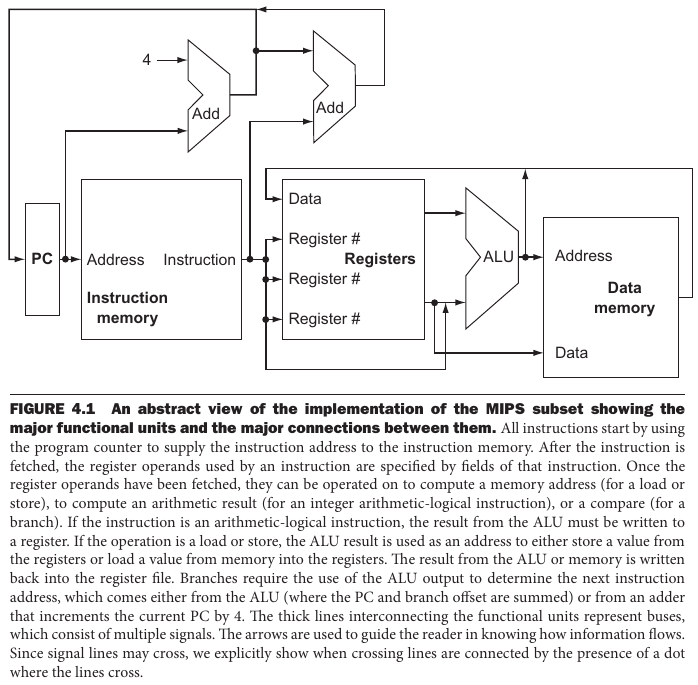
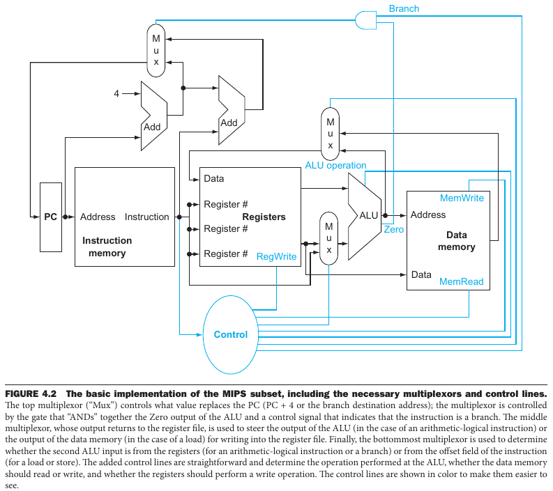

- [Chapter 4: The Processor](#chapter-4-the-processor)
  - [4.1 Introduction](#41-introduction)
    - [A Basic MIPS Implementation](#a-basic-mips-implementation)
    - [Overview](#overview)
  - [4.2 Logic Design Conventions](#42-logic-design-conventions)
  - [4.3 Building a Datapath](#43-building-a-datapath)

---
# Chapter 4: The Processor

## 4.1 Introduction

> Chapter 1 explains that the performance of a computer is determined by three key factors: instruction count, clock cycle time, and clock cycles per instruction (CPI). Chapter 2 explains that the compiler and the instruction set architecture determine the instruction count required for a given program. However, the implementation of the processor determines both the clock cycle time and the number of clock cycles per instruction. In this chapter, we construct the datapath and control unit for two different implementations of the MIPS instruction set.

### A Basic MIPS Implementation

In this example, only a subset of the MIPS instruction set is considered. Specifically:
  - The memory-reference instructions `lw` and `sw`;
  - The arithmetic-logic instruction `add`, `sub`, `and`, `or`, `slt`;
  - The branch instruction `beq`;
  - The jump instruction `j`;

### Overview

For every instruction:

1. Send the *program counter* (PC) to the memory that contains the code and fetch the instruction from that memory;
2. Read one or two registers, using the filed of the instructions to select them.
3. From here onward, the steps are instruction-dependent.

> Figure 4.1 shows the high-level view of a MIPS implementation, focusing on the various functional units and their interconnection. Although this figure shows most of the flow of data through the processor, it omits two important aspects of instruction execution: *multiplexing* (when data can come from different sources), and *control unit* (control units for different instructions). 

> Figure 4.2 shows the datapath of Figure 4.1 with the three required multiplexors added, as well as control lines for the major functional units. A control unit, which has the instruction as an input, is used to determine how to set the control lines for the functional units and two of the multiplexors.

## 4.2 Logic Design Conventions

> To discuss the design of a computer, we must decide how the hardware logic implementing the computer will operate and how the computer is clocked.

> The datapath elements in the MIPS implementation consist of two different types of logic elements: elements that operate on data values and elements that contain state. The elements that operate on data values are all **combinational**, which means that their outputs depend only on the current inputs. Given the same input, a combinational element always produces the same output. 
> 
> Other elements in the design are not combinational, but instead contain state. An element contains state if it has some internal storage. We call these elements **state elements** because, if we pulled the power plug on the computer, we could restart it accurately by loading the state elements with the values they contained before we pulled the plug.
> 
> Logic components that contain state are also called *sequential*, because their outputs depend on both their inputs and the contents of the internal state.

> A **clocking methodology** defines when signals can be read and when they can be written. A clocking methodology is designed to make hardware predictable.

## 4.3 Building a Datapath
