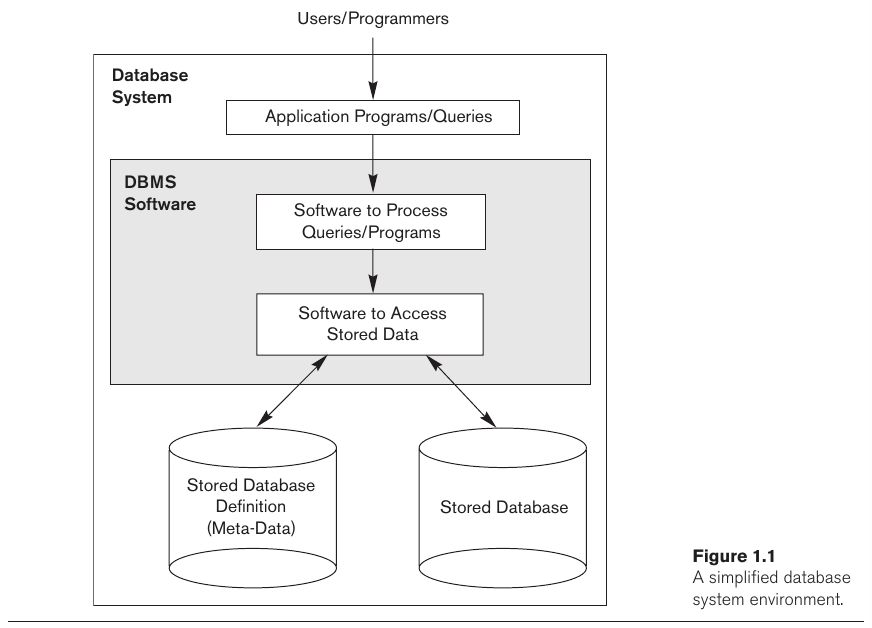

- [Chapter 1: Databases and Database Users](#chapter-1-databases-and-database-users)
  - [1.1 Introduction](#11-introduction)
  - [1.2 An Example](#12-an-example)
  - [1.3 Characteristics of the Database Approach](#13-characteristics-of-the-database-approach)
  - [1.4 Actors on the Scene](#14-actors-on-the-scene)
    - [1.4.1 Database Administrators](#141-database-administrators)
    - [1.4.2 Database Designers](#142-database-designers)
    - [1.4.3 End Users](#143-end-users)
    - [1.4.4 System Analysts and Application Programmers](#144-system-analysts-and-application-programmers)
  - [1.6 Advantages of Using the DBMS Approach](#16-advantages-of-using-the-dbms-approach)
  - [1.8 When Not to Use a DBMS](#18-when-not-to-use-a-dbms)

---
# Chapter 1: Databases and Database Users

## 1.1 Introduction

> A **database** is a collection of related *data*. 
> 
> **Data** can be thought as known facts that can be recorded and that have implicit meaning.

A database has the following implicit properties:

- It represents some aspects of the real world, sometimes called **miniworld** or **universe of discourse (UoD)**. Changes to the miniworld is reflected in the database;
- It is a logically coherent collection of data with some inherent meaning;
- It is designed, build, and populated with data for a specific purpose;
- It has an intended group of users and some preconceived applications in which these users are interested;

> A **database management system (DBMS)** is a computerized system that enables users to create and maintain a database.
> 
>  The DBMS is a general-purpose software system that facilitates the processes of *defining*, *constructing*, *manipulating*, and *sharing* databases among various users and applications.

- **Defining** a database involves specifying the data types, structures, and constraints of the data to be stored. The descriptive information of such choices is called **meta-data**.
- **Constructing** a database is the process of storing data on some storage medium that is controlled by the DBMS.
- **Manipulating** a database includes functions such as *queries*, *updates*, and *report*.
- **Sharing** a database allows multiple users and programs to access the database simultaneously.

> An application program accesses the database by sending queries or requests for data to the DBMS. A **query** typically causes some data to be retrieved; a **transaction** may cause some data to be read and some data to be written into the database.

DBMSs also **protects** (against hardware/software malfunction, system protection, and unauthorized access, security protection) the database  and **maintains** it for long periods of time.

> A **database system** is the database plus a DBMS.

## 1.2 An Example

> **Data records** consists of many data elements with actual values.
> 
> **Data elements** is part of a record and has a type.
> 
> **Data type** parte of a data element, defines the set of possible values and operations.

It is usually the case that different data record are related to each other.

Each DBMS accepts a *query language*, defining how to perform queries and transaction in the database.

To create a database, first one must define must define the *requirements* and *specifications*, in a phase called **requirements specification and analysis**. Then, a **conceptual design** is constructed (the model *Entity-Relationship* is one possibility). Lastly, comes the **physical design**, in which further specifications are provided for storing and accessing the database.

## 1.3 Characteristics of the Database Approach

> A number of characteristics distinguish the database approach from the much older approach of writing customized programs to access data stored in files. In traditional **file processing**, each user defines and implements the files needed for a specific software application as part of programming the application.

In the database approach, a single repository maintains data that is defined once and accessed repeatedly (queries, transactions and application programs). Other characteristics are:
  - **Self-describing nature**
    - The DBMS maintains the definition of the database stored in its catalog (**meta-data**);
    - In newer types of database systems (e.g., NOSQL systems), such information cabe stored directly into the data (i.e., **self-describing data**).
  - **Insulation between programs and data**
    - **Program-data independence**
    - **Program-operation independence**
  - **Data abstraction**
    - DBMS provides users with a **conceptual representation**, that doesn't include many details of how it is stored or how the operations are implemented;
    - Informally, a **data model** is a type of data abstraction used to provide such conceptual representation;
  - **Multiple views of data**
    - A **view** can be a subset of the database or it may contain **virtual data** that is derived from the database but is not explicitly stored.
  - **Multi-user transaction processing** and **Sharing of data**
    - The DBMS provides **concurrency control**;
    - A **transaction** is an executing program or process that includes one or more database accesses;
    - The DBMS must enforce several transaction properties, such as:
      - **Isolation** ensures that each transaction appears to execute in isolation;
      - **Atomicity** ensures that either all operations of a transaction are executed or none;

## 1.4 Actors on the Scene

### 1.4.1 Database Administrators

> In a database environ-
ment, the primary resource is the database itself, and the secondary resource is the DBMS and related software. Administering these resources is the responsibility of the database administrator (DBA). The DBA is responsible for authorizing access to the database, coordinating and monitoring its use, and acquiring software and hardware resources as needed. The DBA is accountable for problems such as security breaches and poor system response time.

### 1.4.2 Database Designers

> Database designers are responsible for identifying the data to be stored in the database and for choosing appropriate structures to represent and store this data. These tasks are mostly undertaken before the database is actually implemented and populated with data.

>  Database designers typically interact with each potential group of users and develop views of the database that meet the data and processing requirements of these groups. 

### 1.4.3 End Users

> **End users** are the people whose jobs require access to the database for querying, updating, and generating reports; the database primarily exists for their use.

- **Casual end users**: occasionally access the database, may need different information each time;
- **Naive** or **parametric end users**: constantly querying and updating the database using **canned transactions** (carefully programmed and tested);
- **Sophisticated end users**: engineers, scientists, business analysts and other familiar with the DBMS in order to implement their own applications;
- **Standalone users**: maintain personal databases by using ready-made packages;

### 1.4.4 System Analysts and Application Programmers

> **System analysts** determine the requirements of end users, especially naive and parametric end users, and develop specifications for standard canned transactions that meet these requirements.
> 
> **Application programmers** implement these specifications as programs; then they test, debug, document, and maintain these canned transactions.

## 1.6 Advantages of Using the DBMS Approach

- Controlling Redundancy
- Restricting Unauthorized Access
- Providing Persistent Storage for Program Objects
- Providing Storage Structures and Search Techniques for Efficient Query Processing
- Providing Backup and Recovery
- Providing Multiple User Interfaces
- Representing Complex Relationships among Data
- Enforcing Integrity Constraints
- Permitting Inferencing and Actions Using Rules and Triggers

## 1.8 When Not to Use a DBMS

- High initial investment in hardware, software, and training
- The generality that a DBMS provides for defining and processing data
- Overhead for providing security, concurrency control, recovery, and integrity functions
- Simple, well-defined database applications that are not expected to change at all
- Stringent, real-time requirements for some application programs that may not be met because of DBMS overhead
- Embedded systems with limited storage capacity, where a general-purpose DBMS would not fit
- No multiple-user access to data