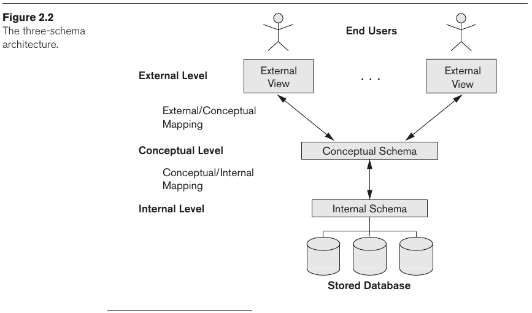
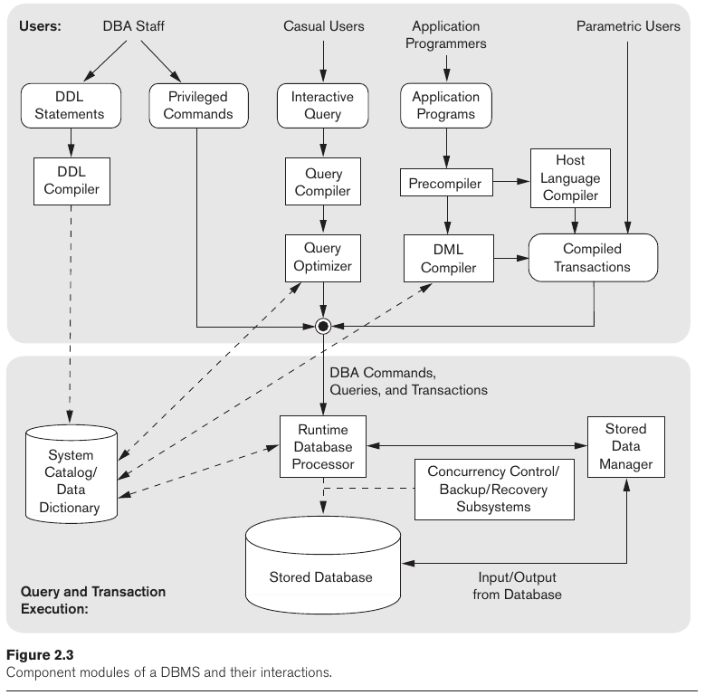
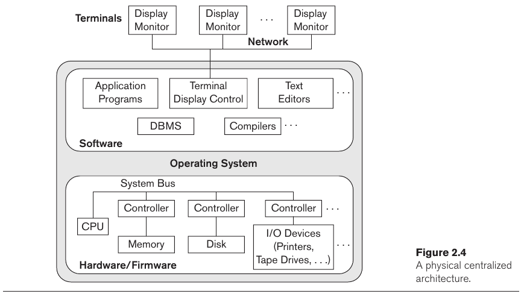
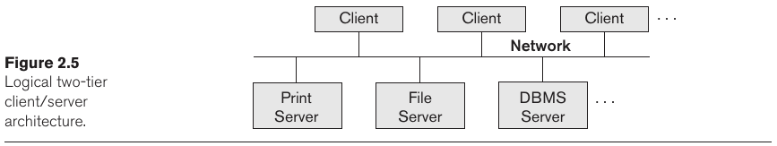
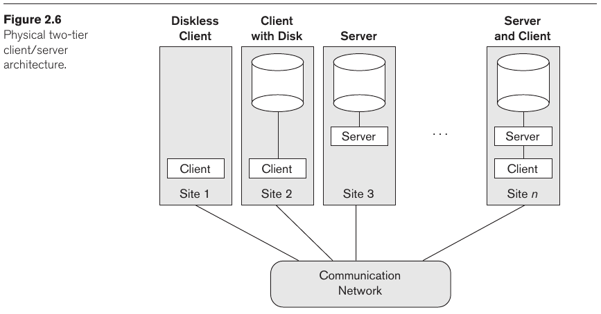
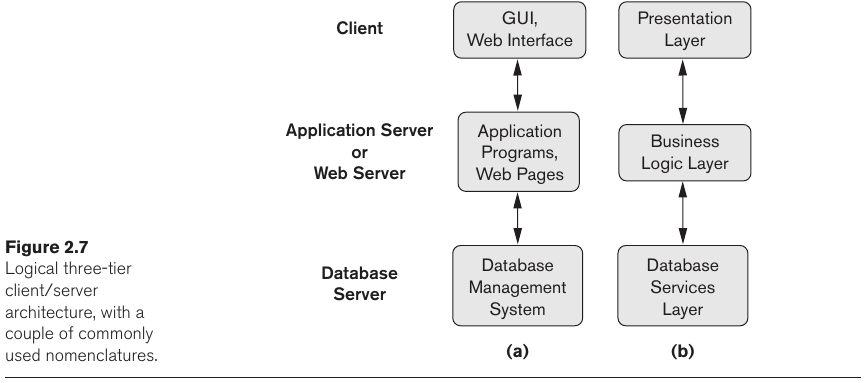

- [Chapter 2: Database System Concepts and Architecture](#chapter-2-database-system-concepts-and-architecture)
  - [2.1 Data Models, Schemas, and Instances](#21-data-models-schemas-and-instances)
    - [2.1.1 Categories of Data Models](#211-categories-of-data-models)
    - [2.1.2 Schemas, Instances, and Database State](#212-schemas-instances-and-database-state)
  - [2.2 Three-Schema Architecture and Data Independence](#22-three-schema-architecture-and-data-independence)
    - [2.2.1 The Three-Schema Architecture](#221-the-three-schema-architecture)
    - [2.2.2 Data Independence](#222-data-independence)
  - [2.3 Database Languages and Interfaces](#23-database-languages-and-interfaces)
    - [2.3.1 DBMS Languages](#231-dbms-languages)
    - [2.3.2 DBMS Interfaces](#232-dbms-interfaces)
  - [2.4 The Database System Environment](#24-the-database-system-environment)
    - [2.4.1 DBMS Component Modules](#241-dbms-component-modules)
    - [2.4.2 Database System Utilities](#242-database-system-utilities)
  - [2.5 Centralized and Client/Server Architectures for DBMSs](#25-centralized-and-clientserver-architectures-for-dbmss)
    - [2.5.1 Centralized DBMSs Architecture](#251-centralized-dbmss-architecture)
    - [2.5.2 Basic Client/Server Architecture](#252-basic-clientserver-architecture)
    - [2.5.3 Two-Tier Client/Server Architectures for DBMSs](#253-two-tier-clientserver-architectures-for-dbmss)
    - [2.5.4 Three-Tier and n-Tier Architectures for Web Applications](#254-three-tier-and-n-tier-architectures-for-web-applications)
  - [2.6 Classification of Database Management Systems](#26-classification-of-database-management-systems)

---
# Chapter 2: Database System Concepts and Architecture

> The architecture of DBMS packages has evolved from the early monolithic systems, where the whole DBMS software package was one tightly integrated system, to the modern DBMS packages that are modular in design with a client/server system architecture.

> The current **cloud computing** environments consist of thousands of large servers managing so-called **big data** for users on the Web.

## 2.1 Data Models, Schemas, and Instances

> **Data abstraction** generally refers to the suppression of details of data organization and storage, and the highlighting of the essential features for an improved understanding of data.
>
> A **data model**—a collection of concepts that can be used to describe the structure of a database—provides the necessary means to achieve this abstraction. 

Most **data models** also include a set of basic operations for specifying retrievals and updates on the data base.

It is also becoming common to include concepts in the data model to specify the **dynamic aspect** or **behavior** of a database application.

### 2.1.1 Categories of Data Models

> **High-level** or **conceptual data models** provide concepts that are close to the way many users perceive data, whereas **low-level** or **physical data models** provide concepts that describe the details of how data is stored on the computer storage media.

> [...] Between these two extremes is a class of **representational** (or **implementation**) data models, which provide concepts that may be easily understood by end users but that are not too far removed from the way data is organized in computer storage.

An **entity** represents a real-world object or concept. An **attribute** represents some property of interest that further describes an entity. A **relationship** among two or more entities represents an association among the entities.

> The **entity–relationship model** is a popular high-level conceptual data model.

> Representational or implementation data models are the models used most frequently in traditional commercial DBMSs. These include the widely used **relational data model**, as well as the so-called legacy data models—the **network** and **hierarchical models**—that have been widely used in the past.

> We can regard the **object data model** as an example of a new family of higher-level implementation data models that are closer to conceptual data models.

> Physical data models describe how data is stored as files in the computer by representing information such as record formats, record orderings, and access paths. An **access path** is a search structure that makes the search for particular database records efficient, such as *indexing* or *hashing*.

An **index** is an *access path* that allows direct access to data using an index term or keyword.

Another class of data model is known as **self-describing data models**, which combines the description of the data with the data values themselves.

### 2.1.2 Schemas, Instances, and Database State

> The description of a database is called the **database schema**, which is specified during database design and is not expected to change frequently. A displayed schema is called a **schema diagram**, which consists of *schema constructs*.

>  The data in the database at a particular moment in time is called a **database state** or **snapshot**. It is also called the current set of **occurrences** or **instances** in the database.

> The DBMS is partly responsible for ensuring that every state of the database is a valid state—that is, a state that satisfies the structure and constraints specified in the schema. 

>  The schema is sometimes called the **intension**, and a database state is called an **extension** of the schema.

## 2.2 Three-Schema Architecture and Data Independence

### 2.2.1 The Three-Schema Architecture

The goal of this architecture is to separe the user application from the physical database. In this architecture, schemas can be defined in three levels:

1. **Internal level** (**internal schema**): describes the physical storage structure of the database. The internal schema uses a physical data model and describes the details of data storage and access paths.
2. **Conceptual level** (**conceptual schema**): describes the structure of the whole database. It hides details of physical storage and focuses on entities, data types, relationships, user operations, and constraints.
3. **View level** or **external level** (**external schemas** or **user views**): describes parts of the database that a particular user groups is interested in.

> While **schemas** provides actual descriptions of databases, **data models** provide the tools and concepts to conceive such description.

> Notice that the three schemas are only descriptions of data; the actual data is stored at the physical level only. In the three-schema architecture, each user group refers to its own external schema. Hence, the DBMS must transform a request specified on an external schema into a request against the conceptual schema, and then into a request on the internal schema for processing over the stored database. 
>
> The processes of transforming
requests and results between levels are called **mappings**.

### 2.2.2 Data Independence

> The three-schema architecture can be used to further explain the concept of data independence, which can be defined as the capacity to change the schema at one level of a database system without having to change the schema at the next higher
level.

1. **Logical data independence** is the capacity to change the conceptual schema without having to change external schemas or application programas.
2. **Physical data independence** is the capacity to change the internal schema
without having to change the conceptual schema.

## 2.3 Database Languages and Interfaces

### 2.3.1 DBMS Languages

> Once the design of a database is completed and a DBMS is chosen to implement the database, the first step is to specify conceptual and internal schemas for the database and any mappings between the two

> In many DBMSs where no strict separation of levels is maintained, one language, called the **data definition language (DDL)**, is used by the DBA and by database designers to define both schemas.

> In DBMSs where a clear separation is maintained between the conceptual and internal levels, the DDL is used to specify the conceptual schema only. Another language, the **storage definition language (SDL)**, is used to specify the internal schema.

>  In most relational DBMSs today, there is no specific language that performs the role of SDL. Instead, the internal schema is specified by a combination of functions, parameters, and specifications related to storage of files.

> For a true three-schema architecture, we would need a third language, the **view definition language (VDL)**, to specify user views and their mappings to the conceptual schema, but in most DBMSs the DDL is used to define both conceptual and external schemas.

> Once the database schemas are compiled and the database is populated with data, users must have some means to manipulate the database. [...] The DBMS provides a set of operations or a language called the **data manipulation language (DML)** for these purposes.

> In current DBMSs, the preceding types of languages are usually not considered distinct languages; rather, a comprehensive integrated language is used that includes constructs for conceptual schema definition, view definition, and data manipulation. 
> 
> Storage definition is typically kept separate, since it is used for defining physical storage structures to fine-tune the performance of the database system.

For instance, SQL combines DDL, VDL, and DML, as well as statements for constraint specification and schema evolution. However, SQL doesn't support SDL.

There mainly two types of DMLs:

- **High-level** or **nonprocedural** DML can be used on its own to specify complex database operations concisely. They are also known as **set-at-a-time** or **set-oriented** DMLs.
  - When used in in a interactive manner, they are called **query languages**.
- **Low-level** or **procedural** DML must be embedded in a general-purpose programming language. They are also called **record-at-a-time** DMLs.
  - In this case, the general-purpose PL is called **host language** and the DML called **data sublanguage**.

### 2.3.2 DBMS Interfaces

- Menu-based Interfaces for Web Clients or Browsing
- Apps for Mobile Devices
- Forms-based Interfaces
- Graphical User Interfaces
- Natural Language Interfaces
- Keyword-based Database Search
- Speech Input and Output
- User-specific interfaces

## 2.4 The Database System Environment

### 2.4.1 DBMS Component Modules

> The database and the DBMS catalog are usually stored on disk. Access to the disk is controlled primarily by the operating system (OS), which schedules disk read/write. Many DBMSs have their own buffer management module to schedule disk read/write.
> 
> A higher-level stored data manager module of the DBMS controls access to DBMS information that is stored on disk, whether it is part of the database or the catalog.

>  the runtime database processor executes (1) the privileged commands, (2) the executable query plans, and (3) the canned transactions with runtime parameters. It works with the system catalog and may update it with statistics. It also works with the stored data manager, which in turn uses basic operating system services for carrying out low-level input/output (read/write) operations between the disk and main memory.

### 2.4.2 Database System Utilities

- **Loading**: load existing data files into the data base.
- **Backup**: backup copy of the database by dumping the entire database.
- **Database storage reorganization**: reorganize a set of database files into different file organizations and create new access paths to improve performance.
- **Performance monitoring**: monitors database usage and provides statistics to the DBA. 

## 2.5 Centralized and Client/Server Architectures for DBMSs

### 2.5.1 Centralized DBMSs Architecture

### 2.5.2 Basic Client/Server Architecture

### 2.5.3 Two-Tier Client/Server Architectures for DBMSs

> **Two-tier architectures**  [...] are distributed over two systems: client and server. The advantages of this architecture are its simplicity and seamless compatibility with existing systems.

### 2.5.4 Three-Tier and n-Tier Architectures for Web Applications

## 2.6 Classification of Database Management Systems

Classification by **data model**:

- **Relational data model**, known as **SQL systems**.
- **Object data model**.
- **Big data systems**, known as **key-value storage systems** and **NOSQL systems**, which uses multiple data models:
  - **Document-based**
  - **Graph-based**
  - **Column-based**
  - **Key-value data models**
- Legacy systems, based on the **hierarchical** and **network data models**.

Classification by number of users:

- **Single-user systems**
- **Multi-user systems**

Classification by number of sites over which the database is distributed:

- **Centralized**, single computer.
- **Distributed**, computers distributed over a computer network.
  - **Homogeneous**, use the same DBMS software at all sites;
  - **Heterogenous**, use different DBMS software.

Classification by cost. Classification by types of access path. Finally, **general purpose** or **special purpose**.

> The **relational data model** represents a database as a collection of tables, where each table can be stored as a separate file.
> 
> The **object data model** defines a database in terms of objects, their properties, and their operations. Objects with the same structure and behavior belong to a class, and classes are organized into hierarchies (or acyclic graphs).
> 
> The **key-value data model** associates a unique key with each value (which can be a record or object) and provides very fast access to avalue given its key.
> 
> The **document data model** is based on JSON (Java Script Object Notation) and stores the data as documents.
> 
> The **graph data model** stores objects as graph nodes and relationships among objects as directed graph edges.
> 
> The **column-based data models** store the columns of rows clustered on disk pages for fast access and allow multiple versions of the data.
> 
> The **network model** represents data as record types and also represents a limited type of 1:N relationship, called a set type.
> 
> The **hierarchical model** represents data as hierarchical tree structures.