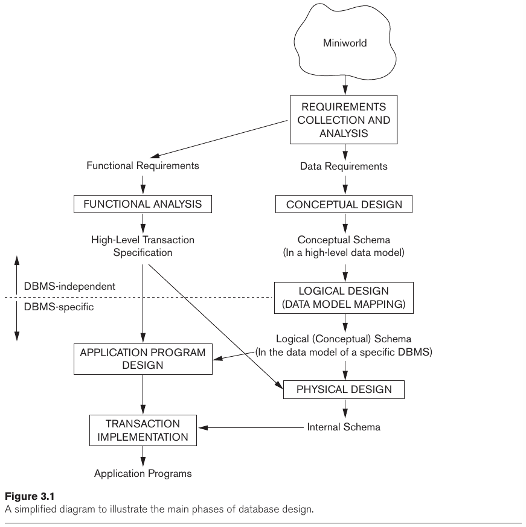

- [Chapter 3: Data Modeling Using the Entity-Relationship (ER) Model](#chapter-3-data-modeling-using-the-entity-relationship-er-model)
  - [3.1 Using High-Level Conceptual Data Models for Database Design](#31-using-high-level-conceptual-data-models-for-database-design)
  - [3.3 Entity Types, Entity Sets, Attributes and Keys](#33-entity-types-entity-sets-attributes-and-keys)
    - [3.3.1 Entities and Attributes](#331-entities-and-attributes)
    - [3.3.2 Entity Types, Entity Sets, Keys and Value Sets](#332-entity-types-entity-sets-keys-and-value-sets)
  - [3.4 Relationship Types, Relationship Sets, Roles, adn Structural Constraints](#34-relationship-types-relationship-sets-roles-adn-structural-constraints)
    - [3.4.1 Relationship Types, Sets, and Instances](#341-relationship-types-sets-and-instances)
    - [3.4.2 Relationship Degree, Role Names, and Recursive Relationships](#342-relationship-degree-role-names-and-recursive-relationships)
    - [3.4.3 Constraints on Binary Relationship Types](#343-constraints-on-binary-relationship-types)
    - [3.4.4 Attributes of Relationship Types](#344-attributes-of-relationship-types)
  - [3.5 Weak Entity Types](#35-weak-entity-types)

---
# Chapter 3: Data Modeling Using the Entity-Relationship (ER) Model

> Conceptual modeling is a very important phase in designing a successful **database application**.

## 3.1 Using High-Level Conceptual Data Models for Database Design

The database design process consists of many steps.

1. The **requirements collection and analysis** investigates the prospective database users to understand their needs and document the **data requirements**. It is also important to understand the **functional requirements** (**operations**/**transactions**).
2. The **conceptual design** is the step in which the **conceptual schema** is created using a high-level data model.
3. The **implementation** step uses a commercial DBMS with the conceptual schema to transform the high-level data model into the implementation data model (this step is called **logical design** or **data model mapping**).
4. The last step is the **physical design**, in which the internal storage structure, file organizations, indexes, access paths, and physical design parameters are specified.

## 3.3 Entity Types, Entity Sets, Attributes and Keys

> The ER model describes data as *entities*, *relationships*, and *attributes*.

### 3.3.1 Entities and Attributes

> An **entity** is a thing or object in the real world with independent existence.
> 
> Ever entity has **attributes**, which are the properties that describe it. In ER diagrams, attributes names are enclosed in ovals and are attached to its entity type by straight lines.

> **Composite attributes** can be divided into smaller subparts which represent more basic attributes with independent meanings. They can usually form a hierarchy.
> 
> **Atomic (simple) attributes** are not divisible and can be combined to form composite ones.

> **Single-valued** attributes have a single value for a particular entity.
> 
> **Multi-valued** attributes can have an arbitrary (bounded or not) number of values,

> A **derived attribute** is an attribute that is related to another one and can be obtained from it. A **stored attribute** is one that another attribute derives from.

> **Complex attributes** are nested representation of attributes that use `( )` for composite attributes and `{ }`for multi-valued attributes.

### 3.3.2 Entity Types, Entity Sets, Keys and Value Sets

> An **entity type** defines a collection of entities that have the same attributes. They are represented in ER diagrams with rectangular boxes. It describes the **schema** (**intension**) for a set of entities.
> 
> The collection of all entities of a particular entity type in the database at any point in time is called an **entity set** or **entity collection**. It is the **extension** of the entity type.

> **Key** or **uniqueness constraint** is a constraint applied to attributes. Such attributes (**key attributes**) have unique values for each entity in the entity set. It is possible that a **key** is a combination of multiple attributes. In the ER diagram, key attributes have its name underlined.
> 
> When an entity doesn't have at least one key, it is called a *weak entity*. In the ER model, there's no primary key.

> Each simple attribute of an entity type is associated with a **value set** (**domain**), which specifies the set of possible values that can be assigned to that attribute.

## 3.4 Relationship Types, Relationship Sets, Roles, adn Structural Constraints

### 3.4.1 Relationship Types, Sets, and Instances

> A **relationship type** $R$ among $n$ entity types $E_1, E_2, \dots, E_n$ defines a set of associations (**relationship set**) between entities from these entity types.

### 3.4.2 Relationship Degree, Role Names, and Recursive Relationships

> The **degree** (e.g., binary, ternary) of a relationship type is the number of participating entity types. 

> It is sometimes convenient to think of binary relationship types in terms of attributes. This concept of representing relationship types as attributes is used in a class of data models called **functional data models**.

> Each entity type that participates in a relationship type can have a **role name**, that signifies the role played by the entity type in this relationship type.
>
> Role names are not strictly necessary when the entity types participating in the relationship type are distinct. However when the same entity type participates more than once in the relationship type with different roles, the role name becomes essential.

> **Recursive relationship** or **self-referencing relationships** occurs when an entity type participates in a relationship type more than once.

### 3.4.3 Constraints on Binary Relationship Types

> Relationship types usually have certain constraints that limit the possible combinations of entities that may participate in the corresponding relation ship set.

> The **cardinality ratio** for a binary relationship specifies the maximum number of relationship instances that an entity can participate in.

> The **participation constraint** (a.k.a, **minimum cardinality constraint**) specifies whether the existence of an entity dependes on its being related to another entity via the relationship type.
> 
> It can be either **total**, where every entity must participate in the must be in the relationship type, or **partial**, some part of the entities must ne i the relationship type.

### 3.4.4 Attributes of Relationship Types

> Relationship types can also have attributes, similar of those of entity types.

## 3.5 Weak Entity Types

> Entity types that do not have key attributes are called **weak entity types**. In contrast, **regular entity types** that have key attributes are called **strong entity types**.

> Weak entity types are identified by being related (**identifying relationship**) to specific entities from another entity type (**identifying** or **owner entity type**) in combination with one of their attribute values.

> A weak entity type normally has a **partial key**, which is the attribute that can uniquely identify weak entities that are related to the same owner entity. 